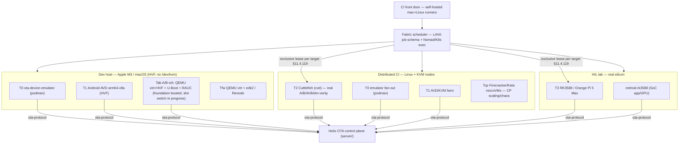

# Helix OTA — Emulation/Virtualization Test-Fabric — Architecture & Design

| Field | Value |
|---|---|
| Revision | 2 |
| Last modified | 2026-06-11T10:30:00Z |
| Status | active — T0 floor + Tab dev-host A/B-virt FOUNDATION built; Tab slot mechanism in progress |
| Status summary | The incorporation design for a LOCAL + DISTRIBUTED hardware-free test fabric, derived from the cited verdicts in [`../../research/emulation_infra/REPORT.md`](../../research/emulation_infra/REPORT.md) and the dev-host A/B-virt work in [`../../research/rk3588_emulator/REPORT.md`](../../research/rk3588_emulator/REPORT.md). Extends the `containers` submodule (§11.4.76) and the existing Tier-1/2/3 baseline in [`../EMULATED_DEVICE_TESTING.md`](../EMULATED_DEVICE_TESTING.md). Reconciles the macOS-M3 dev host vs the Linux-KVM CI tier as FACT (§11.4.6/§11.4.112). **Now partially built:** the T0 floor (shipped) plus a new **Tab dev-host A/B-virt tier** (QEMU virt+HVF + U-Boot bootcount/altbootcmd + RAUC dm-verity) whose FOUNDATION boots to live userspace (PROVEN); its real A/B slot switch / dm-verity / auto-rollback is **in progress**, gated on the in-flight `u-boot.bin` build — NOT proven (§11.4.6). |
| Authority | Operator mandate 2026-06-10 (hardware-free comprehensive emulation/VM/container fabric) |
| Related | [`../../research/emulation_infra/REPORT.md`](../../research/emulation_infra/REPORT.md); [`../../research/rk3588_emulator/REPORT.md`](../../research/rk3588_emulator/REPORT.md); TEST_COVERAGE_PLAN.md; SCHEMA.sql; ROADMAP.md; `containers/` submodule |

## 1. Goal & non-goals

**Goal.** A single fabric that boots/runs emulated, virtual, and (where wired) real
targets — locally on the dev host AND distributed across remote/CI nodes — so every
Helix OTA work item is testable WITHOUT a physical RK3588/Orange Pi on the operator's
desk. Anti-bluff is the spine: a tier never claims fidelity it does not have
(§11.4 / §11.4.107), and the tier boundaries below are stated as FACT precisely so
no tier silently over-claims.

**Non-goals.** (a) Reinventing container/VM machinery — every primitive is an
EXTENSION of `vasic-digital/containers` (§11.4.74/§11.4.76), never a re-implementation.
(b) Pretending the macOS-M3 host can run KVM-gated Android — it cannot (§3); that is an
honest host gap (§11.4.112), not a thing to fake.

## 2. Tier model (reconciled with EMULATED_DEVICE_TESTING.md)

| Tier | Fidelity | Tech (from REPORT verdicts) | Where it runs | What it proves |
|---|---|---|---|---|
| **T0 — protocol client** | wire/server flow only (no real apply) | existing `ota-device-emulator` (`server/internal/deviceemu`) on podman | **dev host + anywhere** | register→update-check→telemetry→delta→rollout→recall against a live control plane |
| **T1 — Android userspace** | real Android app/agent logic; NOT real A/B apply | Android **AVD arm64-v8a** (HVF local / KVM CI); Genymotion optional | **dev host (HVF, accelerated)** + Linux/KVM CI | `ota-android-agent`/bridge decision logic, ADB-driven UI/automation |
| **Tab — dev-host A/B-virt** (built; slot mechanism in progress) | **real U-Boot bootcount/altbootcmd A/B slot-switch + RAUC dm-verity + auto-rollback** on a generic aarch64 virt board (NOT the RK3588 SoC, NOT Android `update_engine`) | **QEMU `-machine virt` + HVF** aarch64 guest (Buildroot) + U-Boot + RAUC (`tests/emulator/ab_virt/`) | **dev host (HVF, accelerated)** | the real A/B slot-switch + rollback semantics on this Apple-Silicon host WITHOUT a KVM gate — closes part of the T0→T2 gap locally. **FOUNDATION boots to live userspace (PROVEN); the slot switch itself is authored-not-yet-run (§11.4.6, gated on the `u-boot.bin` build).** |
| **T2 — high-fidelity A/B** | **real `update_engine` A/B + AVB/dm-verity + auto-rollback** on virtual partitions | **Cuttlefish (`cvd`)** | **Linux+KVM CI only** (host-gated on M3) | the genuine Android OTA apply + rollback semantics short of real silicon |
| **T3 — real hardware** | vendor HAL + real U-Boot slot-switch + dm-verity on real partitions + Mali GPU | **RK3588/Orange Pi 5 Max behind LAVA**; `redroid-rk3588` adjacent (SoC app/GPU, no bootloader) | **HIL lab** | the only env exercising real silicon; flashes governed by §11.4.133 |
| **Tfw — firmware/Linux-target** | aarch64 UEFI/U-Boot/Linux boot (generic virt board, not RK3588 SoC) | **QEMU `-machine virt` + edk2** (existing `pkg/vm`); **Renode** future | **dev host (TCG)** + CI | U-Boot slot logic, future Linux/RTOS OS targets |
| **Tcp — control-plane isolation** | N/A (not a device) | **Firecracker / Kata / Cloud Hypervisor** microVMs; gVisor sandbox | Linux+KVM CI (gVisor needs no KVM) | scaling/DDoS/chaos/security of the Go control plane under real isolation |

Cross-cutting: **distributed fan-out** via **LAVA** (one job schema drives BOTH virtual
T0/T1/T2 and physical T3) and/or **Nomad** (heterogeneous scheduler for a mixed
container+QEMU+`cvd` fabric); **CI front door** via **our own** self-hosted mac+Linux
runners (GitHub-hosted Apple-Silicon runners do NOT expose HVF/nested-virt — FACT,
REPORT §5).

## 3. The host fact (FACT, §11.4.6 — drives every placement)

Dev host = **Apple M3 Pro / macOS 15.5 / arm64**, accel = **HVF**, **no `/dev/kvm`**, and
**M3 lacks hardware nested-virt** (M4+/macOS-15 only) — so KVM-gated Android (Cuttlefish,
redroid, K8s-STF emulator nodes, Firecracker/Kata/Cloud-Hypervisor) is **host-gated here,
NOT structurally impossible** (runs on a Linux-KVM box / M4+ / GCE nested-virt). The
fabric therefore places T2/Tcp on the **Linux+KVM CI tier**, and keeps T0 + T1(AVD-HVF) +
Tfw(QEMU-TCG) as the **locally-runnable** set. This split is asserted, never wished away.

## 4. Extension of the `containers` submodule (§11.4.74 extend-don't-reimplement)

**Reuse (already present):** `pkg/boot` + `pkg/compose` + `pkg/health` (on-demand boot +
readiness — the §11.4.76 on-demand-infra invariant the pgx integration test already
uses), `pkg/emulator` (AVD x86_64/arm64 + HVF/KVM accel gating + AVD-lock/orphan-qemu
reaping), `pkg/vm` (QEMU aarch64 `virt`+UEFI), `pkg/genymotion`.

**Tab dev-host A/B-virt (built — `tests/emulator/ab_virt/`):** the Tab tier reuses
**U-Boot** (bootcount/altbootcmd slot-select) and **RAUC** (dm-verity A/B update client)
upstream per §11.4.74 — neither reimplemented in-project — on top of `pkg/vm`'s QEMU
aarch64 `virt`+HVF boot. The guest image (Buildroot base + kernel) is built inside a named
podman aarch64 Linux container (this host is macOS); the 2-slot GPT disk assembler
(`assemble_ab_disk.sh`) + U-Boot `boot.cmd`/env (`uboot_ab/`) are authored. The base image
build (PWU-AB-0) and the live-userspace boot (PWU-AB-1 FOUNDATION) are DONE+PROVEN; the
slot-switch disk is gated on the in-flight `u-boot.bin` build (§11.4.6 — in progress).

**New primitives to ADD upstream (PR to `vasic-digital/containers`), never copied in-project:**
- `pkg/cuttlefish` — `cvd` lifecycle wrapper (fetch/launch/stop, `aosp_cf_arm64_only_phone`, KVM-presence gate that SKIPs-with-reason on a non-KVM host).
- `pkg/lava` — LAVA REST/XML-RPC client: submit a job, poll, pull artifacts; one job schema for virtual + physical DUTs.
- `pkg/fabric` — the distributed scheduler façade + **target registry** (lease/release a target exclusively, §11.4.119) over a Nomad/K8s/LAVA backend.

**Stays in helix_ota (OTA-domain logic, not generic plumbing):** `server/internal/deviceemu`
(the T0 emulator — it speaks `ota-protocol`), the per-tier on-device test drivers, and the
bank/Challenge wiring.

## 5. On-demand boot + single-resource-owner contracts

- **On-demand boot (§11.4.76):** the test entry point boots its tier's infra via the
  submodule (`pkg/boot`/`compose`/`health`/`fabric`); operators never hand-start podman,
  an emulator, `cvd`, or a LAVA job. A tier with unmet host prereqs **SKIPs-with-reason**
  (§11.4.3), never fakes a PASS.
- **Single-resource-owner (§11.4.119):** every exclusive target (a `cvd` instance, a real
  board, an HDMI/serial line, a fixed port) is leased to **exactly one** driver stream at a
  time via `pkg/fabric`'s registry; other streams targeting it are read-only or queued.
  Concurrent drivers of one exclusive target produce cross-contaminated evidence = a §11.4
  bluff, so the lease is mandatory.

## 6. Persistence

A test-fabric registry (targets, runs, results, evidence paths, distributed-node inventory)
is defined in [`SCHEMA.sql`](SCHEMA.sql). It is OPTIONAL for local single-node use (the T0
in-process/podman tiers need no DB) and REQUIRED once distributed fan-out is wired (so the
scheduler can lease targets and the dashboard can show fleet-of-fabric state). It reuses the
project's pgx/Postgres seam, not a new datastore.

## 7. Anti-bluff posture (the spine)

Each tier produces captured evidence under `docs/qa/<run-id>/` per [`TEST_COVERAGE_PLAN.md`](TEST_COVERAGE_PLAN.md):
T0 captures real request/response transcripts; T1 captures ADB/UI + `update_engine_client`
state; **Tab** captures the QEMU+HVF boot console (`docs/qa/20260611T061626Z-ab-virt-boot/console.log`,
`HELIX_USERSPACE_LIVE_OK` — the FOUNDATION proof) and, once its disk is runnable, the slot-state
assertion (`findmnt /` + `cat /etc/slot_id` across a switch) + the auto-rollback trace; T2 captures
real `update_engine` A/B-slot + AVB/dm-verity + auto-rollback evidence; T3 adds on-silicon
apply/rollback. A tier claiming a PASS without exercising the real system at its fidelity is a
§11.4 PASS-bluff. Honest gaps (§3, REPORT §8) are documented, never hidden behind a green line —
the Tab slot switch is recorded as **NOT proven** (gated on `u-boot.bin`) and T2 stays
**host-gated** (no KVM on this macOS host), never as faked greens.
