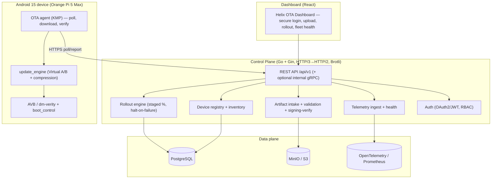

# Helix OTA — Master Design Specification

| Field | Value |
|---|---|
| Revision | 1 |
| Created | 2026-06-07 |
| Last modified | 2026-06-07 |
| Status | active (design — pending operator review gate) |
| Status summary | Canonical master design for the Helix OTA universal over-the-air update system. Anchors the foundation corpus: vision, locked decisions, architecture, mandated stack, 1.0.0-MVP scope, security/trust model, data model, rollout engine, telemetry, submodule reuse + new-repo map, phased directory layout, documentation/export pipeline, four-layer testing strategy, and the multi-agent execution model. Synthesizes the two operator drafts via [`../research/additions_synthesis.md`](../research/additions_synthesis.md). |
| Issues | Wrapped-engine, trust-framework, and topology choices are deliberately open pending evidence-based ADRs (ADR-0001..0005). |
| Issues summary | No architectural commitment is made without research evidence (§11.4.6/§11.4.8). |
| Fixed | initial master design |
| Fixed summary | Foundation-corpus-first design produced from operator brief + HelixConstitution + submodules catalogue + additions drafts. |
| Continuation | On approval: write per-component 1.0.0-MVP specs, run the research ADRs, create the new submodule repos, then dispatch authoring + code-review workflows; render multi-format exports on stabilized content. |

## Table of contents

- [§1. Vision, scope, and non-goals](#1-vision-scope-and-non-goals)
- [§2. Locked decisions](#2-locked-decisions)
- [§3. Mandated technology stack](#3-mandated-technology-stack)
- [§4. System architecture](#4-system-architecture)
- [§5. 1.0.0-MVP definition](#5-100-mvp-definition)
- [§6. Security & trust model](#6-security--trust-model)
- [§7. Data model overview](#7-data-model-overview)
- [§8. Staged rollout engine](#8-staged-rollout-engine)
- [§9. Telemetry & observability](#9-telemetry--observability)
- [§10. Submodule reuse + new repositories](#10-submodule-reuse--new-repositories)
- [§11. Phasing & directory layout](#11-phasing--directory-layout)
- [§12. Documentation & multi-format export](#12-documentation--multi-format-export)
- [§13. Testing strategy (four-layer)](#13-testing-strategy-four-layer)
- [§14. Execution model](#14-execution-model)
- [§15. Constitution compliance map](#15-constitution-compliance-map)
- [§16. Architecture Decision Records (open)](#16-architecture-decision-records-open)

## §1. Vision, scope, and non-goals

**Vision.** A universal, generic, deeply decoupled OTA system — server control plane + per-OS client SDKs/agents + dashboard — embeddable into any operating system. First target: **Android 15 (all flavors/variants) on Orange Pi 5 Max**, where the build pipeline emits flashing images + OTA update `.zip` + mandatory hash files. Later phases extend to Linux (all flavors), Windows, and other upstream OSes via pluggable OS adapters.

**Hard guarantees (operator-stated).**
- Zero system corruption: an update must never brick or break a working device.
- Safe upload: every OTA artifact passes mandatory validation before it can be deployed.
- Granular rollout: deploy to all at once, or in steps (5%, 10%, 30%, … 100%).
- Observability: tracking/measurement/critical-data capture to detect and report problems.
- Scalability: single board → millions of devices.

**Non-goals for 1.0.0-MVP.** End-user/multi-version rollback (deferred; automatic A/B boot-failure rollback IS included); full TUF/Uptane (deferred to 1.0.1+); non-Android OS clients; delta updates; microservice decomposition.

## §2. Locked decisions

| # | Decision | Source |
|---|---|---|
| D1 | Foundation corpus first, then go wide (research → MVP spec → review gate → phase depth). | Operator |
| D2 | Device-side native Android A/B (`update_engine` + AVB/dm-verity + auto-rollback) + custom decoupled Go control plane; wrap an OSS engine only where it adds value. | Operator |
| D3 | The wrapped-engine choice (hawkBit / Mender / AOSP-native-only) is decided by the evidence-based research ADR, not pre-committed. | Operator + §11.4.8 |
| D4 | New reusable submodules get PUBLIC repos auto-created on GitHub + GitLab (listed before bulk creation). | Operator |
| D5 | `additions/` files are authoritative input — deeply analyzed and folded in. | Operator |
| D6 | Mandated stack: Go + Gin + Brotli + HTTP/3(QUIC)→HTTP/2 fallback, REST primary + all compatibility interfaces. | Operator |
| D7 | MVP defaults: 15 min + jitter poll (configurable); React dashboard; PostgreSQL + MinIO; OpenTelemetry. | Default (overridable) |

## §3. Mandated technology stack

- **Language/runtime:** Go (control plane, rollout engine, validators), Kotlin/KMP (Android agent).
- **HTTP framework:** **Gin** (`gin-gonic`).
- **Transport:** **HTTP/3 (QUIC)** primary via the `vasic-digital/http3` submodule (drop-in `net/http.Handler`), automatic **fallback to HTTP/2 + standard compression**; **Brotli** content compression with negotiated fallback (gzip) for older clients.
- **API surface:** **REST** is the mandated primary surface (`/api/v1`), plus all mandatory compatibility interfaces; **gRPC optional/internal only**.
- **Persistence:** PostgreSQL (relational), MinIO/S3 (artifact blobs), `cache` brick (optional Redis only if needed).
- **Observability:** OpenTelemetry via the `observability` brick; Prometheus/Grafana surface.
- **Containerization:** the `vasic-digital/containers` submodule is the canonical substrate (§11.4.76).

## §4. System architecture

Three planes plus infra, with two deliberately extractable seams (the **OS-adapter** seam for universality and the **rollout-engine** seam for OS-agnostic campaigns).



**Decoupling principle (§11.4.28).** Each unit has one purpose, a well-defined interface, and is independently testable: artifact-validator, rollout-engine, ota-protocol types, the update_engine bridge, and the OS-adapter are separate modules so future OSes and future projects can reuse them.

## §5. 1.0.0-MVP definition

End-to-end happy path: **admin logs in → uploads signed OTA `.zip` + hash → server validates (structure, hash, signature, version monotonicity, target compatibility) → publishes release → deploys (all-at-once for MVP; staged engine lands 1.0.1) → device polls (15 min + jitter), downloads, re-verifies, applies via `update_engine` to the inactive slot, reboots → `update_verifier` confirms → telemetry success/failure with automatic A/B rollback on boot failure.**

MVP components: Auth, Artifact intake+validation, Device registry, Release/Deploy (all-targets), Telemetry ingest, Dashboard (login/upload/deploy/health), Android agent, containerized dev stack.

## §6. Security & trust model

- **Artifact signing:** build-pipeline private key signs; public key in the device trust store; server verifies on upload, device re-verifies before apply.
- **Integrity:** SHA-256 (and SHA-512 where available) over the artifact + the mandatory hash file.
- **Transport:** TLS 1.3; HTTP/3(QUIC) with HTTP/2 fallback.
- **Device identity:** token bound to hardware id (Android KeyStore); mutual-TLS evaluated.
- **Anti-corruption / anti-downgrade:** AVB + dm-verity + A/B `boot_control`; bootloader version checks.
- **Audit:** every admin action logged.
- **Forward path:** TUF/Uptane is the 1.0.1+ hardening (ADR-0002); signing interfaces are designed so Uptane drops in without rework.

## §7. Data model overview

Base schema synthesized from both drafts (02 as the richer base), normalized: `users`, `api_keys`, `devices`, `device_groups`(+members), `artifacts`(+versions), `releases`, `deployments`, `deployment_phases`, `device_deployments`, `rollouts`, `telemetry_events`/`update_metrics`, `audit_logs`, `rollback_history` (1.0.1+). Full DDL + up/down migrations land in `1.0.0-mvp/database/`. Indexing per draft 02 §4 plus query-driven additions.

## §8. Staged rollout engine

OS-agnostic, extractable submodule. Config = ordered phases `{percentage, success_threshold, error_threshold, duration, auto_progress}`; engine starts a phase, targets the phase cohort, monitors telemetry, **halts/pauses on error-threshold breach**, advances on success-threshold within duration. Seeded by draft 02 §6; the Go loop there is a design reference, hardened with deterministic cohort selection and idempotent state transitions. Lands in `1.0.1-staged-rollout/`.

## §9. Telemetry & observability

Device event stream (`download_started/installing/installed/verifying/success/failure` + error codes + system health) → ingest → OpenTelemetry/Prometheus → dashboard health + alerting via `Herald`. Metrics drive the rollout halt logic (§8) and problem detection/reporting (operator requirement).

## §10. Submodule reuse + new repositories

**Reuse/extend (verified catalogue, §11.4.74):** `auth`, `security`, `database`, `Storage`, `observability`, `eventbus`, `ratelimiter`, `middleware`, `http3`, `mdns`, `recovery`, `Herald`, `config`, `discovery`, `cache`, `docs_chain`/`Document`/`Formatters` (export), `containers` (infra); Android: `Auth-KMP`, `Security-KMP`, `Storage-KMP`, `Config-KMP`; dashboard: `UI-Components-React`, `Dashboard-Analytics-React`, `Auth-Context-React`.

**New submodules (PUBLIC repos to be created on GitHub + GitLab per D4):**

| Repo | Purpose | Decoupled boundary |
|---|---|---|
| `ota-protocol` | Shared wire types, manifest schema, status/event enums (Go + KMP). | No business logic; pure contracts. |
| `ota-artifact-validator` | Structure/hash/signature/metadata validation pipeline. | OS-aware via plugins; no transport. |
| `ota-rollout-engine` | Staged-rollout + halt/advance logic, OS-agnostic. | No HTTP; pure engine + storage port. |
| `ota-update-engine-bridge` | Wrapper over AOSP `update_engine` / `boot_control`. | Android-only; thin, testable. |
| `ota-android-agent` | KMP device agent (poll/download/verify/apply/report). | Consumes protocol + bridge. |
| `ota-telemetry-schema` | Telemetry event/metric schema + codecs. | Shared by server + agents. |

(Final list confirmed in the MVP spec immediately before creation.)

## §11. Phasing & directory layout

```
docs/research/main_specs/
├── 00-master/      this design, ADRs, glossary, threat model, submodule map
├── research/       additions_synthesis.md, ota_landscape_report.md, ADR-000x
├── additions/      operator-supplied inputs (authoritative; analyzed in research/)
├── 1.0.0-mvp/      architecture, api, database, security, server, client_android, tests, deployment, diagrams
├── 1.0.1-staged-rollout/    rollout engine, monitoring, end-user rollback + TUF/Uptane (1.0.1+)
├── 1.X-linux/  1.X-windows/  1.X-other-os/   future-OS research + standards survey
└── _exports/       generated PDF/HTML/DOCX + diagram renders (built from stable source)
```

## §12. Documentation & multi-format export

Canonical source = Markdown + Mermaid. A containerized export pipeline (pandoc + mermaid-cli + drawio CLI) renders **PDF/HTML/DOCX** and **mermaid→svg/png/draw.io/uml** into `_exports/`, run on reviewed/stable content (reproducible at any tag). Every doc carries the Constitution metadata table + ToC (§11.4.61). Prefer reusing `docs_chain`/`Document`/`Formatters` for the pipeline.

## §13. Testing strategy (four-layer)

Per Constitution §1, every change ships four layers: **source-presence gate → artifact gate (bytes shipped) → runtime/integration → mutation meta-test (PASS→FAIL on negation)**, with no-bluff positive evidence (§7.1). Safety-critical paths (signing-verify, apply, rollout-gate) target ≥90% coverage. Device path: emulated A/B apply + a real Orange Pi 5 Max validation plan (download→verify→apply→reboot→verify; corrupt-slot→confirm A/B fallback).

## §14. Execution model

Operator authorized spawning subagents → multi-agent **Workflows**: (1) parallel research agents per OTA stack → synthesis → ADRs; (2) parallel spec-authoring agents per component; (3) **mandatory code-review subagents** (§11.4.125) adversarially verifying each artifact before it's accepted; (4) multi-format export on stable content. Foundation corpus first, operator review gate, then phase-by-phase depth.

## §15. Constitution compliance map

| Constitution rule | How this design honors it |
|---|---|
| §1 / §1.1 four-layer + mutation | §13 testing strategy. |
| §7.1 no-bluff | Draft marketing stripped; evidence-only ADRs (§16). |
| §11.4.6 / §11.4.8 | §2 D3 — engine choice deferred to research ADR. |
| §11.4.74 / §11.4.76 | §10 catalogue-first reuse; `containers` substrate. |
| §11.4.28 | §4 decoupling principle; §10 new-submodule boundaries. |
| §11.4.65 / §11.4.61 | §12 export pipeline + metadata/ToC on every doc. |
| §11.4.20 / §11.4.125 | §14 subagent-driven + code-review gate. |
| §2 / §2.1 / §3 / §4 | Multi-upstream push + submodule-commit-first + tag mirroring (applied at repo creation). |

## §16. Architecture Decision Records (open)

ADR-0001 wrapped engine (hawkBit vs Mender vs AOSP-native-only) · ADR-0002 supply-chain trust (signing vs TUF vs Uptane + timing) · ADR-0003 server topology (modular monolith vs microservices + scale trigger) · ADR-0004 transport (HTTP/3+Brotli rollout, HTTP/2 fallback) · ADR-0005 delta updates. Each ADR is evidence-backed by the research report and reconciles the contradictions in [`../research/additions_synthesis.md`](../research/additions_synthesis.md) §5.
