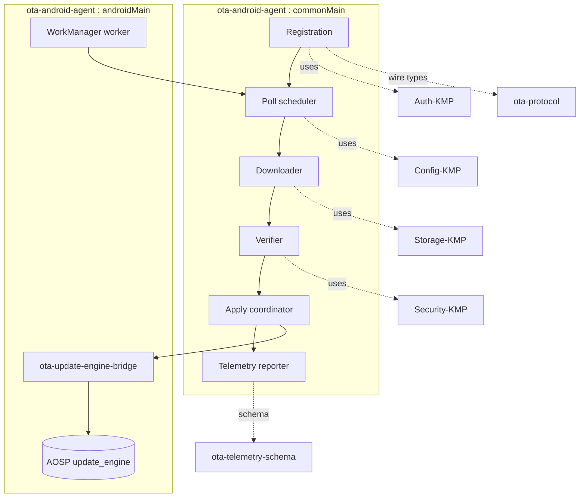

# Helix OTA — Android Agent Integration Guide (1.0.0-MVP)

| Field | Value |
| --- | --- |
| Revision | 1 |
| Created | 2026-06-07 |
| Last modified | 2026-06-07 |
| Status | active |
| Status summary | Integration guide for the 1.0.0-MVP Helix OTA Android device agent (`ota-android-agent`, KMP): registration, WorkManager-driven polling (15 min + configurable jitter), download-to-local, verify-before-apply (SHA-256 + signature) prior to `UpdateEngine.applyPayload`, telemetry reporting, and the system-UID / privileged-app deployment requirement. Reuses the catalogue KMP submodules `Auth-KMP`, `Security-KMP`, `Storage-KMP`, `Config-KMP` and the NEW submodules `ota-protocol`, `ota-update-engine-bridge`, `ota-telemetry-schema`. |
| Issues | Several AOSP constants/behaviours are carried as UNVERIFIED from the research notes (e.g. `CLEANUP_PREVIOUS_UPDATE` value, full Android-15 `ErrorCodeConstants` table, RK3588/Orange Pi 5 Max A/B + VAB enablement). The exact public API surface of the KMP catalogue submodules has not been inspected; capability claims about them are tagged UNVERIFIED. HelixConstitution clause numbers are UNVERIFIED against the authoritative text. |
| Fixed | N/A (initial revision). |
| Continuation | Confirm KMP submodule public APIs (`Auth-KMP` device-token issue/verify, `Security-KMP` SHA-256 + signature primitives, `Storage-KMP` blob/range, `Config-KMP` runtime config); pin the Android-15 `update_engine` AIDL surface (stable vs `IUpdateEngine`); validate the agent runs platform-signed as `android.uid.system` on the target image; close all UNVERIFIED hardware items in [`build_integration.md`](build_integration.md) and [`update_engine_integration.md`](update_engine_integration.md). |

## Table of contents

1. [Purpose and scope](#1-purpose-and-scope)
2. [Locked context honored](#2-locked-context-honored)
3. [Agent architecture (KMP)](#3-agent-architecture-kmp)
4. [Submodule reuse](#4-submodule-reuse)
5. [Device registration](#5-device-registration)
6. [Polling with WorkManager (15 min + jitter, configurable)](#6-polling-with-workmanager-15-min--jitter-configurable)
7. [Download to local](#7-download-to-local)
8. [Verify-before-apply (SHA-256 + signature) then applyPayload](#8-verify-before-apply-sha-256--signature-then-applypayload)
9. [Telemetry](#9-telemetry)
10. [System-UID / privileged-app requirement](#10-system-uid--privileged-app-requirement)
11. [End-to-end update lifecycle](#11-end-to-end-update-lifecycle)
12. [Testing (four-layer)](#12-testing-four-layer)
13. [Open / UNVERIFIED items](#13-open--unverified-items)
14. [Sources](#14-sources)

> ToC mandated by HelixConstitution §11.4.61 (UNVERIFIED clause number); it follows the metadata table per [`documentation_standards.md` §3](../../00-master/documentation_standards.md).

---

## 1. Purpose and scope

This guide specifies how the **Helix OTA Android device agent** is integrated on an Android 15 device (Orange Pi 5 Max / RK3588 target) for the **1.0.0-MVP** release. It is the device-side counterpart to the Go control plane and covers the agent's full duty cycle: **register → poll → download → verify → apply → report**.

It is scoped to the MVP trust model — **signing + SHA-256 + AVB** — per [ADR-0002 §4.1](../../research/adr/adr-0002-supply-chain-trust.md). Device-side TUF is explicitly **deferred to 1.0.1** per [ADR-0002 §4.3](../../research/adr/adr-0002-supply-chain-trust.md); this guide does not implement TUF metadata on device, but the verify step is designed MVP-forward so the Uptane-ready signing interface drops in without rework.

Two companion specs carry the lower layers:

- [`update_engine_integration.md`](update_engine_integration.md) — the `applyPayload(...)` contract, header properties, callback states/error codes, and AVB/`boot_control`/`update_verifier` interplay.
- [`build_integration.md`](build_integration.md) — building the agent as a system app in the AOSP tree for the target board.

## 2. Locked context honored

This document does not re-open any locked decision; it consumes them:

- **Device-side strategy (LOCKED).** Native Android A/B (`update_engine` + AVB/dm-verity + automatic boot-failure rollback) on device + a custom Go control plane (modular monolith for MVP per [ADR-0003](../../research/adr/adr-0003-server-topology.md)); wrap OSS only where it adds value (hawkBit gated per [ADR-0001](../../research/adr/adr-0001-wrapped-engine.md)). [ADR-0001 §1; master design §2 D2]
- **Trust (LOCKED).** Signing + SHA-256 + AVB for MVP; TUF device-side deferred to 1.0.1 per [ADR-0002](../../research/adr/adr-0002-supply-chain-trust.md).
- **Stack (LOCKED).** Go + Gin (gin-gonic) + Brotli + HTTP/3 (QUIC) via the `vasic-digital/http3` submodule with HTTP/2 + gzip fallback; **REST primary** (`/api/v1`); gRPC optional/internal only. [ADR-0004 §97; master design §3]
- **Catalogue-first reuse (§11.4.74, UNVERIFIED).** The agent reuses the KMP catalogue submodules and the six NEW submodules from the [submodule reuse map §3–§4](../../00-master/submodule_reuse_map.md); no submodule name is invented (§7.1 / §11.4.6).

## 3. Agent architecture (KMP)

The agent is `ota-android-agent` — a **Kotlin Multiplatform** module whose orchestration logic (`commonMain`) is platform-agnostic and whose Android-only apply path lives in `androidMain` behind the `ota-update-engine-bridge`. [submodule reuse map §3 Android client, §4]



Decoupling boundary (per [submodule reuse map §4](../../00-master/submodule_reuse_map.md)): the agent holds **no server-side logic**; the **only** OS-apply path is the bridge; the bridge is **Android-only, thin, and testable** with no polling, networking, or business policy.

## 4. Submodule reuse

| Concern | Submodule | Class | Boundary / note |
| --- | --- | --- | --- |
| Device identity, token issue/verify, RBAC at the agent edge | `Auth-KMP` | reuse | Agent obtains/refreshes a device token; no auth logic re-implemented. (UNVERIFIED: `Auth-KMP` exposes device-token issue/verify as needed.) |
| SHA-256 hashing + signature verification of the downloaded artifact | `Security-KMP` | reuse | All crypto primitives come from `Security-KMP`; the agent contains no bespoke crypto. (UNVERIFIED: `Security-KMP` exposes SHA-256 + detached-signature verify.) |
| Local persistence of the downloaded artifact + state | `Storage-KMP` | reuse | Blob/range storage behind a port; no direct filesystem/S3 SDK calls outside `Storage-KMP`. (UNVERIFIED: range/stream get for large `.zip`.) |
| Runtime config (poll interval, jitter, endpoints) | `Config-KMP` | reuse | The 15 min + jitter poll cadence (master §5 / D7) flows through `Config-KMP`; no bespoke config parsing. |
| Wire types, manifest schema, status/event enums | `ota-protocol` | new + reuse | Pure contracts only — no business logic/transport/storage. |
| Apply via AOSP `update_engine` / `boot_control` | `ota-update-engine-bridge` | new | Android-only, thin; see [`update_engine_integration.md`](update_engine_integration.md). |
| Telemetry event/metric schema + codecs | `ota-telemetry-schema` | new + reuse | Shared server + agent; no transport/storage. |

Only canonical names from [`documentation_standards.md` §9](../../00-master/documentation_standards.md) are used (§7.1 anti-bluff). The React/dashboard submodules are intentionally not referenced here (not on the verified catalogue).

## 5. Device registration

On first boot (or first agent launch after a factory reset), the agent registers with the control plane over the **REST `/api/v1`** surface (HTTP/3 primary, HTTP/2 fallback) [ADR-0004 §97]. Registration establishes a device record (master §6) and obtains a device token via `Auth-KMP`.

Registration payload (wire types from `ota-protocol`):

- `hardware_id` — stable hardware identifier (master §6 device-identity).
- `current_build_fingerprint` — `ro.build.fingerprint` of the running slot.
- `current_slot` / `verified_boot_state` — observed via `boot_control` / `ro.boot.verifiedbootstate` (telemetry only; see [`update_engine_integration.md` §AVB interplay](update_engine_integration.md)).
- `agent_version`, `model`, `soc` (e.g. RK3588).

The control plane returns the device's registration id and (if `Auth-KMP` supports hardware-bound device tokens) a token bound to `hardware_id`. If `security`/`Security-KMP` does not yet expose a hardware-bound device token, that is an upstream **extend** item (per [submodule reuse map §5](../../00-master/submodule_reuse_map.md)) — UNVERIFIED.

A real Kotlin registration snippet is in [`code_snippets/Registration.kt`](code_snippets/Registration.kt).

## 6. Polling with WorkManager (15 min + jitter, configurable)

The agent polls the control plane for an assigned update on a periodic schedule. The cadence is **15 minutes plus configurable jitter** (master §5 / D7), driven by `Config-KMP` so the values are runtime-tunable per fleet/cohort.

Design constraints:

- **WorkManager `PeriodicWorkRequest`** is the Android scheduler. Note: WorkManager enforces a **minimum periodic interval of 15 minutes** (`PeriodicWorkRequest.MIN_PERIODIC_INTERVAL_MILLIS`), which matches the locked 15-min cadence. (UNVERIFIED exact constant value against the target AndroidX version.)
- **Jitter** spreads fleet poll times so millions of devices do not stampede the control plane at the same instant — directly serving the single-board→millions scalability guarantee (master §1). Jitter is applied as a `setInitialDelay(...)` per scheduled run, drawn uniformly from `[0, jitterMaxMillis]` where `jitterMaxMillis` comes from `Config-KMP`.
- **Constraints**: require network connectivity; optionally require charging / unmetered network for large downloads (configurable via `Config-KMP`). HTTP/3's QUIC connection-migration tolerates network changes across the poll window [ADR-0004 §65].
- **Backoff**: transient poll failures use WorkManager's exponential backoff; the agent never busy-loops.

The poll request hits `GET /api/v1/devices/{id}/update` (REST primary; exact path owned by `ota-protocol`). A `204 No Content` means "no update"; a `200` returns the release manifest (artifact URL, SHA-256, signature, the four `payload_properties` values, rollout phase token).

Snippets: scheduling in [`code_snippets/PollScheduler.kt`](code_snippets/PollScheduler.kt); the worker in [`code_snippets/OtaPollWorker.kt`](code_snippets/OtaPollWorker.kt).

## 7. Download to local

Per the verify-before-apply decision ([ADR-0002 §4.1](../../research/adr/adr-0002-supply-chain-trust.md); [android-update-engine-api §7](../../research/stacks/android-update-engine-api.md)), the agent prefers the **local `file://` apply path**: it downloads the entire `ota_update.zip` to local storage **before** invoking `update_engine`.

- **Destination**: `/data/ota_package/` — the directory `update_engine` expects for local apply, and which the agent must have read/write access to as a system component (§10). [android-update-engine-api §10]
- **Download mechanism**: streamed via `Storage-KMP` over the transport layer. The artifact path is pinned to `identity` content-encoding with **HTTP Range** enabled (resumable), regardless of control-plane content negotiation [ADR-0004 §106].
- **Resumability**: the agent controls retry/resume policy on the local path (it owns the download), unlike streaming apply where `update_engine` owns the transfer [android-update-engine-api §7].
- **Storage gating**: the agent checks free space on `/data` before downloading; low free `/data` lowers Virtual A/B update success because the COW snapshot may spill to `/data` [android15-virtual-ab §8]. Report free-`/data` as telemetry so the control plane can treat low-space devices as elevated-risk.

A streaming (`https://`) apply remains an opt-in for storage-constrained fleets but trades away the pre-apply full-artifact verification window [android-update-engine-api §7]; MVP defaults to local download.

Snippet: [`code_snippets/Downloader.kt`](code_snippets/Downloader.kt).

## 8. Verify-before-apply (SHA-256 + signature) then applyPayload

This is the **safety-critical** step. The agent **must** verify the downloaded artifact **before** handing it to `update_engine` ([ADR-0002 §4.1](../../research/adr/adr-0002-supply-chain-trust.md)). Verification is layered:

1. **Whole-zip / artifact integrity (Helix MVP trust).** Compute **SHA-256** over the downloaded `ota_update.zip` (via `Security-KMP`) and compare to the control-plane manifest hash. Verify the **detached signature** over that hash against the Helix-pinned public key (via `Security-KMP`). This is the MVP "signing + SHA-256" layer [ADR-0002 §4.1].
2. **Payload header verification.** Read the four `payload_properties.txt` lines (`FILE_HASH`, `FILE_SIZE`, `METADATA_HASH`, `METADATA_SIZE`) and independently confirm `FILE_HASH`/`FILE_SIZE` of the `payload.bin` entry match (the `*_HASH` are base64(SHA-256); `*_SIZE` are decimal bytes) [android-update-engine-api §4, §6]. These four values are then passed verbatim to `applyPayload` (see [`update_engine_integration.md`](update_engine_integration.md)).
3. **AVB / engine layer (defense in depth).** Only after (1) and (2) pass does the agent call `applyPayload(file://…, offset, size, props)`. `update_engine` then **independently** re-verifies `METADATA_HASH`/`FILE_HASH` and the payload signature, and the on-device AVB/dm-verity chain verifies the booted slot [android-update-engine-api §7; android-avb-rollback §9]. The agent **never** disables AVB or dm-verity, never calls `markBootSuccessful` itself, and never writes slot flags or rollback indexes [android-avb-rollback §10].

If any verification fails, the agent **aborts the apply**, deletes the artifact, and reports a verification-failure telemetry event (§9). A failed verify never reaches `update_engine`.

Snippet: [`code_snippets/Verifier.kt`](code_snippets/Verifier.kt). The apply hand-off is in [`code_snippets/UpdateApplier.kt`](code_snippets/UpdateApplier.kt) and detailed in [`update_engine_integration.md`](update_engine_integration.md).

## 9. Telemetry

The agent reports state transitions and outcomes using the **`ota-telemetry-schema`** event/metric schema (shared server + agent; no transport/storage in the schema module) [submodule reuse map §3 Telemetry]. Events are posted over REST `/api/v1` (HTTP/3 → HTTP/2). The control plane consumes them to drive staged-rollout halt/advance decisions (the rollout engine consumes telemetry signals; [ADR-0001 §1](../../research/adr/adr-0001-wrapped-engine.md)).

Modeled states mirror the `boot_control` / Virtual A/B state machine [android-avb-rollback §10; android15-virtual-ab §9]:

- `REGISTERED`
- `POLLED` / `UPDATE_ASSIGNED`
- `DOWNLOADING` → `DOWNLOADED`
- `VERIFY_OK` / `VERIFY_FAILED`
- `APPLYING` (driven by `onStatusUpdate`) → `APPLIED_PENDING_REBOOT`
- `BOOTED_NOT_YET_SUCCESSFUL` → `SUCCESSFUL` / `ROLLED_BACK`
- `MERGE_SNAPSHOTTED` → `MERGING` → `MERGE_COMPLETE` (Virtual A/B `MergeStatus` [android15-virtual-ab §9])

Map `update_engine` status/error codes directly into telemetry codes [android-update-engine-api §8, §12]. Critically, surface **unexpected slot fallback** (current slot != commanded slot), `verifiedbootstate` != GREEN/YELLOW, and verity EIO as high-value failure signals that should drive automatic rollout halt [android-avb-rollback §10, §11]. Treat an update as "done" only after **merge completion**, not at reboot [android15-virtual-ab §12].

Snippet: [`code_snippets/TelemetryReporter.kt`](code_snippets/TelemetryReporter.kt).

## 10. System-UID / privileged-app requirement

`android.os.UpdateEngine` and `UpdateEngineCallback` are **`@SystemApi`** — only system apps can use them; there is **no manifest permission** a normal third-party app can request [android-update-engine-api §10]. Therefore the Helix agent **must** be a system component:

- Run as the **system UID** via `android:sharedUserId="android.uid.system"` **and** be **platform-signed**, OR be installed as a **privileged system app** under `/system/priv-app/` (platform/OEM-signed). [android-update-engine-api §10]
- Have **read/write access to `/data/ota_package/`** for the local `file://` apply path. [android-update-engine-api §10]
- Be allowed by **SELinux** to bind the `update_engine` service over Binder/AIDL. [android-update-engine-api §10]

Consequence: the agent is **shipped as part of the system image** (or via an OEM partnership), **not** as a Play-Store app [android-update-engine-api §10, §12]. The build/packaging mechanics are in [`build_integration.md`](build_integration.md).

## 11. End-to-end update lifecycle

```mermaid
sequenceDiagram
  participant W as WorkManager
  participant A as ota-android-agent
  participant CP as Go control plane (/api/v1)
  participant FS as /data/ota_package
  participant UE as update_engine
  W->>A: periodic trigger (15m + jitter)
  A->>CP: GET /devices/{id}/update
  CP-->>A: 200 manifest (url, sha256, sig, props) | 204
  A->>FS: download ota_update.zip (Range, identity)
  A->>A: SHA-256 + signature verify (Security-KMP)
  A->>A: verify FILE_HASH/SIZE, METADATA_HASH/SIZE
  alt verify fails
    A->>CP: telemetry VERIFY_FAILED; abort
  else verify ok
    A->>UE: applyPayload(file://…, offset, size, props)
    UE-->>A: onStatusUpdate(...) ; onPayloadApplicationComplete(SUCCESS)
    A->>CP: telemetry APPLIED_PENDING_REBOOT
    A->>UE: reboot to new slot
    Note over UE: update_verifier + AVB/dm-verity; markBootSuccessful by framework
    A->>CP: telemetry SUCCESSFUL after merge complete
  end
```

The dangerous-window invariant from Virtual A/B applies: **never trigger a slot revert once `MergeStatus == MERGING`** [android15-virtual-ab §10, §12].

## 12. Testing (four-layer)

Per HelixConstitution §1 / §1.1 (four-layer + mutation immunity) and master design §13, every change ships four layers, with positive evidence (no-bluff, §7.1). The agent's **verify-before-apply** and **apply** paths are safety-critical and floored at **≥90% coverage** [master design §13; additions_synthesis §5 C8].

1. **Source-presence gate.** Static assertion that the code exists and is wired: the verifier rejects on hash/signature mismatch; `applyPayload` is never reachable without a passed verify; only catalogue submodule names are referenced; `android:sharedUserId="android.uid.system"` and the `@SystemApi` usage are present in source. Enforced by linters/grep gates in CI.
2. **Artifact gate (bytes shipped).** Build the agent APK/system module and assert the shipped artifact contains the verifier, the WorkManager worker, the bridge classes, and the platform-signing config — i.e. the behaviour is in the bytes that ship, not only in source.
3. **Runtime / integration.** Emulated A/B apply: a fake/host `update_engine` bridge plus a real `ZIP_STORED` payload exercises `download → verify → applyPayload → onStatusUpdate → onPayloadApplicationComplete`. WorkManager scheduling tested with a test driver (fake clock) to confirm the 15-min + jitter cadence and backoff. Plus the real-board plan from master §13: **download → verify → apply → reboot → verify; corrupt-slot → confirm A/B fallback** on the Orange Pi 5 Max.
4. **Mutation meta-test.** Negate each safety check (e.g. invert the SHA-256 comparison, skip the signature check, bypass the verify gate) and assert the test suite turns **PASS → FAIL**. A mutation that disables verify-before-apply yet leaves tests green is a conformance defect.

UNVERIFIED: per-repo test suites for the NEW submodules do not yet exist (see [requirements_traceability R-SUB-07](../../00-master/requirements_traceability.md)).

## 13. Open / UNVERIFIED items

- KMP catalogue submodule public APIs (`Auth-KMP` device token, `Security-KMP` SHA-256 + signature verify, `Storage-KMP` range get, `Config-KMP` runtime config) — UNVERIFIED; confirm before coding.
- `PeriodicWorkRequest.MIN_PERIODIC_INTERVAL_MILLIS` exact value on the target AndroidX version — UNVERIFIED.
- Hardware-bound device token in `security`/`Security-KMP` — UNVERIFIED (possible **extend**).
- RK3588 / Orange Pi 5 Max A/B + Virtual A/B + `dm-user` enablement — UNVERIFIED top-priority hardware validation [android15-virtual-ab §11].
- HelixConstitution clause numbers — UNVERIFIED against authoritative text.

## 14. Sources

- [`android-update-engine-api.md`](../../research/stacks/android-update-engine-api.md) — applyPayload, header properties, status/error codes, local-vs-streaming, system-UID.
- [`android-avb-rollback.md`](../../research/stacks/android-avb-rollback.md) — AVB / dm-verity / `boot_control` / rollback; agent MUST/MUST-NOT.
- [`android15-virtual-ab.md`](../../research/stacks/android15-virtual-ab.md) — Virtual A/B compression, merge lifecycle, `/data` sizing, RK3588 considerations.
- [`adr-0001-wrapped-engine.md`](../../research/adr/adr-0001-wrapped-engine.md), [`adr-0002-supply-chain-trust.md`](../../research/adr/adr-0002-supply-chain-trust.md), [`adr-0003-server-topology.md`](../../research/adr/adr-0003-server-topology.md), [`adr-0004-transport.md`](../../research/adr/adr-0004-transport.md).
- [`submodule_reuse_map.md`](../../00-master/submodule_reuse_map.md), [`documentation_standards.md`](../../00-master/documentation_standards.md), [`2026-06-07-helix-ota-design.md`](../../00-master/2026-06-07-helix-ota-design.md).
