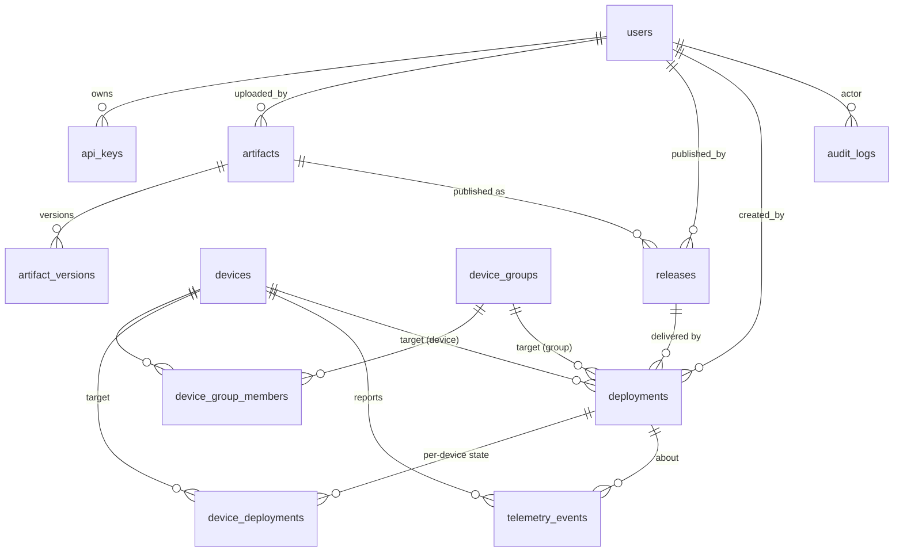

# Helix OTA — 1.0.0-MVP Database Schema

| Field | Value |
| --- | --- |
| Revision | 2 |
| Created | 2026-06-07 |
| Last modified | 2026-06-07 |
| Status | active |
| Status summary | Canonical 1.0.0-MVP relational data model for the Helix OTA Go control plane: the `helix_ota` PostgreSQL schema, entity-relationship description, table-by-table rationale, constraints, indexes, and the four-layer testing plan. Backed by real, executed migration DDL (`migrations/001_initial_schema.{up,down}.sql`). |
| Issues | Relative telemetry-vs-rollout volume is UNVERIFIED (ADR-0003 §3.2); HelixConstitution clause numbers (§11.4.x) are carried from the corpus convention and are UNVERIFIED; precise public surfaces of the `database`/`auth`/`security`/`Storage` catalogue submodules are UNVERIFIED (submodule_reuse_map.md). |
| Fixed | Rev 2: clarified §5.6 version monotonicity is app-layer (Go publish-time), not a DB constraint; reworded §5.9 event vocabulary as derived/extended from master §9; added PII handling note; aligned §6/§10 constraint count ordering. |
| Continuation | When ADR-0001 (hawkBit) is un-gated, add the deferred `rollouts` bridge table in a later migration; when the staged-rollout engine lands (1.0.1) add `deployment_phases` + `device_deployments.phase_id`; when end-user/multi-version rollback lands (1.0.1) add `rollback_history`. Set numeric partition/retention policy for `telemetry_events` and `audit_logs` from MVP load-test data (currently UNVERIFIED). Confirm the `database` submodule migration runner is the one driving these files. |

## Table of contents

1. [Purpose and scope](#1-purpose-and-scope)
2. [Locked-stack and strategy alignment](#2-locked-stack-and-strategy-alignment)
3. [The `helix_ota` schema](#3-the-helix_ota-schema)
4. [Entity-relationship description](#4-entity-relationship-description)
5. [Table-by-table rationale](#5-table-by-table-rationale)
   - [5.1 users](#51-users)
   - [5.2 api_keys](#52-api_keys)
   - [5.3 devices](#53-devices)
   - [5.4 device_groups and device_group_members](#54-device_groups-and-device_group_members)
   - [5.5 artifacts and artifact_versions](#55-artifacts-and-artifact_versions)
   - [5.6 releases](#56-releases)
   - [5.7 deployments](#57-deployments)
   - [5.8 device_deployments](#58-device_deployments)
   - [5.9 telemetry_events](#59-telemetry_events)
   - [5.10 audit_logs](#510-audit_logs)
6. [Constraints summary](#6-constraints-summary)
7. [Index summary and query drivers](#7-index-summary-and-query-drivers)
8. [Deferred to 1.0.1 (NOT in this schema)](#8-deferred-to-101-not-in-this-schema)
9. [Submodule reuse](#9-submodule-reuse)
10. [Migration files](#10-migration-files)
11. [Testing (four-layer)](#11-testing-four-layer)
12. [Anti-bluff / UNVERIFIED register](#12-anti-bluff--unverified-register)
13. [Sources](#13-sources)

> The table-of-contents requirement is mandated by HelixConstitution §11.4.61 (UNVERIFIED clause number). This document carries its ToC immediately after the metadata table, per [`documentation_standards.md` §3](../../00-master/documentation_standards.md).

---

## 1. Purpose and scope

This document specifies the relational data model for **Helix OTA 1.0.0-MVP** — the
control-plane state persisted in PostgreSQL. It is the design rationale that accompanies the
executable DDL in [`migrations/001_initial_schema.up.sql`](migrations/001_initial_schema.up.sql)
and its reverse [`migrations/001_initial_schema.down.sql`](migrations/001_initial_schema.down.sql).

The schema is deliberately **MVP-scoped**. It covers the end-to-end MVP happy path from the
master design §5: *admin logs in → uploads signed OTA `.zip` + hash → server validates → publishes
release → deploys (all-at-once for MVP) → device polls, downloads, re-verifies, applies via
`update_engine`, reboots → telemetry success/failure with automatic A/B rollback on boot failure.*
Staged-rollout phasing and end-user/multi-version rollback are **deferred to 1.0.1** and are
explicitly absent here (§8). [master design §1 non-goals, §5, §7]

The entity list is taken verbatim from the master design §7 ("base schema … 02 as the richer
base, normalized") and the operator brief; field-level detail is normalized from
[`additions/initial_research_02.md` §4](../../additions/initial_research_02.md). [master design §7]

## 2. Locked-stack and strategy alignment

The schema honors the locked decisions without re-opening them:

- **Persistence = PostgreSQL** (relational state) + **MinIO/S3** (artifact blobs). The DB stores
  metadata and the **object key** of each blob (`artifacts.file_path`), never the bytes — blobs
  live in `Storage`. [master design §3; D7]
- **Modular monolith (ADR-0003).** One Go binary, therefore **one PostgreSQL schema** (`helix_ota`)
  with internal module boundaries mirrored by table groupings (artifact-validator, rollout-engine,
  device registry, telemetry). A future service split is a lift-out, not a re-shard. [ADR-0003 §3]
- **Wrapped engine gated (ADR-0001).** hawkBit is the front-runner but GATED; the AOSP-native-only
  Go rollout engine is the pre-authorized fallback. The MVP schema therefore commits **no
  `hawkbit_*` columns** (draft 02's `rollouts.hawkbit_rollout_id` is deferred with the rest of the
  staged-rollout machinery, §8). [ADR-0001 §4, §5.3]
- **Signing + SHA-256 + AVB for MVP; TUF deferred (ADR-0002).** `artifacts` carries
  `checksum_sha256` (mandatory), `checksum_sha512` (where available), and a detached `signature`
  column — the MVP trust model. The signing interface is MVP-forward so TUF/Uptane drops in at 1.0.1
  without a destructive migration. [ADR-0002 §4.1, §4.2; master design §6]
- **Transport is out of scope for the DB.** HTTP/3→HTTP/2, Brotli, REST `/api/v1`, optional internal
  gRPC are transport concerns (`http3`, `middleware`, `ota-protocol`); they touch no table here.
  [master design §3; submodule_reuse_map Transport row]

## 3. The `helix_ota` schema

All control-plane objects live in a dedicated **`helix_ota`** PostgreSQL schema rather than `public`.

Rationale:

- **Co-tenancy isolation.** If ADR-0001's hawkBit is adopted, hawkBit runs on its own
  PostgreSQL schema/instance (hawkBit recommends a separate schema). A dedicated `helix_ota` schema
  guarantees the Helix-authored tables never collide with a co-located hawkBit schema. [ADR-0001 §3.1; ADR-0003 §3]
- **Clean teardown / least privilege.** The control-plane role can be scoped to `helix_ota`; the
  down migration drops the schema with `RESTRICT`, failing loudly if any unexpected object remains.
- **Forward-compatible.** 1.0.1 additions (`deployment_phases`, `rollouts`, `rollback_history`) land
  in the same schema; a service split (ADR-0003 §3.2) can later move a table group out without
  renaming.

The migration sets `search_path = helix_ota, public` for its session and `CREATE EXTENSION IF NOT
EXISTS pgcrypto` so `gen_random_uuid()` is available on PostgreSQL < 13 (it is core on 13+).

## 4. Entity-relationship description

Twelve tables in four functional clusters. UUID primary keys throughout
(`gen_random_uuid()`); all timestamps are `TIMESTAMPTZ DEFAULT now()`.

**Identity & access** — `users` 1—N `api_keys`; `users` is referenced (nullable, audit-preserving)
by `artifacts.uploaded_by`, `releases.published_by`, `deployments.created_by`, and `audit_logs.user_id`.

**Fleet** — `devices` N—M `device_groups` through the composite-PK join `device_group_members`.

**Artifacts → releases → deployments** (the supply chain):
`artifacts` 1—N `artifact_versions`; `artifacts` 1—N `releases` (a release pins one validated
artifact + channel); `releases` 1—N `deployments`; a `deployments` row targets all / a group / a
single device; `deployments` 1—N `device_deployments` (one row per targeted device, unique on
`(deployment_id, device_id)`).

**Observability** — `telemetry_events` references `devices` and `deployments`
(`ON DELETE SET NULL`, history survives deletion); `audit_logs` references `users` (also
`SET NULL`).

(Diagram source is Mermaid per [`documentation_standards.md` §6](../../00-master/documentation_standards.md).)

## 5. Table-by-table rationale

### 5.1 users

Dashboard/API operators — the RBAC subjects. Identity, password verification, token issue/verify,
and RBAC enforcement are **owned by the `auth`/`security` catalogue submodules**; this table is the
relational projection the control plane joins against for ownership and audit. `role` is constrained
to `('admin','operator','viewer')`. `username` and `email` are unique. `is_active` supports soft
disable without deletion (FKs from audit/artifacts must survive). [submodule_reuse_map Auth row; master design §6]

### 5.2 api_keys

Non-interactive credentials (the CI build pipeline that signs and uploads artifacts; automation).
Only `key_hash` is persisted (unique) — cleartext is shown once at issue. `permissions` is JSONB
(scope set). `expires_at` is CHECK-constrained to be after `created_at`; `revoked_at` allows
revocation without deletion. FK to `users` is `ON DELETE CASCADE` (a deleted user's keys go with it).

### 5.3 devices

Fleet inventory. `device_id` is the **stable external identity** (unique) — a token bound to the
hardware id (Android KeyStore, master §6), distinct from the surrogate `id`. `os_type` is
CHECK-constrained to `('android','linux','windows','other')`: **`'android'` is the only Phase-1
value**, but the column exists so the OS-adapter seam (ADR-0003 §3.1) is schema-ready without a later
migration. `status ('active','inactive','blocked')` gates eligibility. `last_seen_at` is updated on
each poll (15 min + jitter, D7). `metadata` JSONB holds free-form device attributes used by dynamic
group `filter_criteria`. [master design §6; ADR-0003 §3.1]

### 5.4 device_groups and device_group_members

`device_groups` are named cohorts; `filter_criteria` JSONB carries a **dynamic** selector
(evaluated against `devices.metadata`), while `device_group_members` records **static** membership.
The join uses a composite primary key `(group_id, device_id)` — the natural key, no surrogate
needed — and cascades on deletion of either side. A secondary index on `device_id` answers
"which groups is this device in?". `name` is unique.

### 5.5 artifacts and artifact_versions

`artifacts` is one uploaded OTA blob's metadata. Key design points:

- **`file_path` is the Storage object key**, not a local FS path — bytes live in MinIO/S3 behind the
  `Storage` submodule. [submodule_reuse_map Storage row]
- **Integrity (ADR-0002 MVP trust model):** `checksum_sha256 CHAR(64) NOT NULL`, with a CHECK that it
  matches `^[0-9a-f]{64}$`; `checksum_sha512 CHAR(128)` (nullable, "where available") with an
  analogous CHECK; a detached `signature TEXT`. Verified server-side on upload by
  `ota-artifact-validator` and device-side before apply. [ADR-0002 §4.1; master design §6]
- **`artifact_type`** defaults to `'full'`; `'incremental'`/`'delta'` are allowed by the CHECK but
  **unused at MVP** — delta updates are ADR-0005, deferred. [master design §1 non-goals; ADR-0005]
- **`upload_status ('pending','validating','validated','failed')`** mirrors the validation pipeline
  (structure → hash → signature → version monotonicity → target compatibility, master §5);
  `validation_errors` JSONB records failures. Only `validated` artifacts may be published.
- **Uniqueness:** `(name, os_type, version)` is unique — one artifact per OS per version.
- `uploaded_by` FK is `ON DELETE SET NULL` (artifact provenance outlives the uploader).

`artifact_versions` carries version lineage (`changelog`, `release_notes`) and an `is_latest` flag
made safe by a **partial unique index** (`WHERE is_latest`) guaranteeing at most one latest per
artifact. `(artifact_id, version)` is unique.

### 5.6 releases

The master design §7 lists `releases` as a **first-class entity distinct from deployments**: a
*release* is the published, deployable unit an admin creates from a validated artifact before
deploying. Separating release (publish) from deployment (deliver) lets one release feed multiple
deployments (e.g. group A now, group B later). **Version monotonicity is enforced at publish time
in the Go control plane (application layer), NOT by a database constraint** — the DB only enforces
uniqueness via `releases_channel_version_uniq` (`channel` + `version`) and
`artifacts_name_os_version_uniq` (`(name, os_type, version)`).
`channel ('stable','beta','canary','internal')` + `version` is unique.
`status ('draft','published','superseded','withdrawn')` with a CHECK that a `published` release has
`published_at` set. FK to `artifacts` is `ON DELETE RESTRICT` (cannot delete an artifact that has
releases). [master design §5, §7]

### 5.7 deployments

An instruction to deliver a `release` to a target set. For MVP the **only supported strategy is
all-at-once** (master §5: "staged engine lands 1.0.1"); `rollout_strategy` JSONB defaults to
`{"mode":"all_at_once"}` and is kept as JSONB so a 1.0.1 staged config drops in without a column
migration. Targeting uses `target_type ('all','group','device')` plus nullable
`target_group_id`/`target_device_id`, made consistent by a **table CHECK**: `'all'` has neither ref,
`'group'` has exactly the group ref, `'device'` has exactly the device ref. `status` includes
`('draft','active','paused','completed','failed','cancelled')`. A time-ordering CHECK ensures
`completed_at >= started_at`. FK to `releases` is `RESTRICT`; target FKs are `SET NULL`.
**Deferred:** `deployment_phases` and the hawkBit `rollouts` bridge (§8). [master design §5, §8; ADR-0001 §4]

### 5.8 device_deployments

Per-device delivery state — the join recording what each device actually did for a deployment, one
row per `(deployment_id, device_id)` (unique). `status` tracks the device lifecycle
`('pending','downloading','installing','verifying','success','failed','rolled_back')`, where
`rolled_back` records the **automatic A/B boot-failure rollback** that IS in MVP (distinct from the
deferred end-user rollback). `progress NUMERIC(5,2)` is CHECK-bounded to `0.00–100.00`;
`retry_count >= 0`. The MVP omits draft 02's `phase_id` (staged phases are 1.0.1). FKs cascade on
deployment/device deletion. [master design §1 (auto-rollback in MVP), §5]

### 5.9 telemetry_events

Device-reported event stream (master §9). **Renamed from draft 02's `update_metrics` to the
master's canonical `telemetry_events`.** This is the higher-volume, append-mostly table and the
first scale-split candidate after the rollout engine (ADR-0003 §3.2 trigger #1 — relative volume is
**UNVERIFIED**, to be set from MVP load tests). `event_type` is CHECK-constrained to a device
vocabulary derived from master §9, extended with `download_complete` and `rollback`:
`('download_started','download_complete','installing','installed','verifying','success','failure','rollback')`.
`duration_ms`/`bytes_transferred` are CHECK `>= 0` when present. `device_id`/`deployment_id` FKs are
`ON DELETE SET NULL` so telemetry history survives device/deployment deletion. Metrics from this
table drive the (1.0.1) rollout halt logic and the operator-required problem detection.
[master design §9; ADR-0003 §3.2]

### 5.10 audit_logs

Every admin/operator action — master §6 mandates "every admin action logged". Append-only:
`action`, `resource_type`, nullable `resource_id`, `details` JSONB, `ip_address INET`, `user_agent`.
`user_id` FK is `ON DELETE SET NULL` so the audit record outlives the actor (a security
requirement). Indexed by user, action, `(resource_type, resource_id)`, and time. [master design §6]

**PII handling note:** `users.email`, `audit_logs.ip_address`, and `audit_logs.user_agent` are
stored in **plaintext**; `users.password_hash` and `api_keys.key_hash` are **hashed** (never stored
in cleartext). Encryption-at-rest and a retention/erasure policy for these fields are **UNVERIFIED /
future** (not specified or implemented at MVP).

## 6. Constraints summary

Verified counts from applying the up migration to PostgreSQL 16 (see §10):
**12 primary keys, 16 foreign keys, 23 CHECK constraints, 9 UNIQUE constraints, 45 indexes.**

- **UUID PKs** on all 12 tables (`device_group_members` uses a composite natural PK).
- **CHECK constraints** enforce: enumerated `role`/`status`/`os_type`/`channel`/`event_type`/
  `target_type`/`artifact_type`/`upload_status` values (replacing draft 02's bare comment-strings);
  SHA-256/512 hex format and length; non-negative sizes/durations/retries; progress 0–100; release
  publish consistency; deployment target/type consistency; deployment time ordering; api-key expiry
  ordering.
- **FK delete behavior** is chosen per relationship: `CASCADE` for owned children (`api_keys`,
  `device_group_members`, `device_deployments`); `RESTRICT` for supply-chain parents that must not
  vanish under a referent (`artifacts`←`releases`, `releases`←`deployments`); `SET NULL` for
  provenance/audit/telemetry references that must survive actor/target deletion.

## 7. Index summary and query drivers

Indexes follow draft 02 §4 plus query-driven additions:

| Index | Drives query |
| --- | --- |
| `idx_devices_os_type`, `idx_devices_status`, `idx_devices_last_seen` | fleet filtering; stale-device detection |
| `idx_api_keys_user` | list a user's keys; auth lookups |
| `idx_dgm_device` | "which groups is this device in?" |
| `idx_artifacts_os_type`, `idx_artifacts_version`, `idx_artifacts_status` | artifact browse + validation-queue |
| `idx_artifact_versions_one_latest` (partial unique) | single-latest invariant + latest lookup |
| `idx_releases_artifact`, `idx_releases_status`, `idx_releases_channel` | release listing per channel/state |
| `idx_deployments_release`, `idx_deployments_status` | active-deployment dashboard |
| `idx_device_deployments_status`, `idx_device_deployments_device` | per-deployment progress; device history |
| `idx_telemetry_events_device/deployment/type/created` | telemetry rollups, time-range scans, halt-logic feed |
| `idx_audit_logs_user/action/resource/created` | audit search by actor, action, resource, time |

UNIQUE constraints also create supporting indexes (e.g. `devices.device_id`, `users.email`).
**UNVERIFIED:** time-series partitioning / retention for `telemetry_events` and `audit_logs` is not
set at MVP — pending load-test data (ADR-0003 §3.2). [additions 02 §4]

## 8. Deferred to 1.0.1 (NOT in this schema)

These entities from draft 02 / master §7 are **intentionally absent** and are NOT created by this
migration:

| Deferred entity | Why deferred | Owning decision |
| --- | --- | --- |
| `deployment_phases` | Staged-rollout phasing (5/10/30/…/100 %) lands in 1.0.1 `1.0.1-staged-rollout/`; MVP is all-at-once. | master §1 non-goals, §5, §8 |
| `rollouts` (incl. `hawkbit_rollout_id`) | hawkBit is GATED (front-runner, not committed); committing a hawkBit bridge column now would presume an un-closed decision. | ADR-0001 §4, §5.3 |
| `rollback_history` | End-user / multi-version rollback is a 1.0.1 non-goal; **automatic A/B boot-failure rollback IS in MVP** and is captured by `device_deployments.status='rolled_back'` + `telemetry_events.event_type='rollback'`, needing no separate table. | master §1 non-goals |
| TUF metadata tables | TUF/Uptane device-side trust is 1.0.1 hardening; MVP uses signing + SHA-256 + AVB, with the `signature` column MVP-forward. | ADR-0002 §4.1–§4.3 |
| Delta-artifact tables / columns | Delta updates are ADR-0005 (deferred); `artifact_type` already reserves `'delta'`/`'incremental'`. | master §1 non-goals; ADR-0005 |

## 9. Submodule reuse

Per catalogue-first (§11.4.74, UNVERIFIED) and [`submodule_reuse_map.md`](../../00-master/submodule_reuse_map.md):

- **`database`** owns the migration runner, connection pooling, and the storage-port the
  rollout/registry modules persist through. Helix OTA writes DDL/queries against it; no bespoke
  driver code. (UNVERIFIED: exact `database` migration-runner API.)
- **`Storage`** (and `Storage-KMP`) holds artifact bytes (MinIO/S3); `artifacts.file_path` is its
  object key. The DB never stores blobs.
- **`auth`/`security`** own identity/RBAC/crypto; `users`/`api_keys` are the relational projection
  only. SHA-256/512 + signature-verify primitives for `ota-artifact-validator` come from `security`
  (UNVERIFIED that the primitives are exposed as needed).
- **`observability`/`Herald`** consume `telemetry_events` for dashboards/alerting; the schema +
  codecs live in the NEW `ota-telemetry-schema` submodule.
- Wire/manifest types (used to read/write these rows over REST) come from the NEW `ota-protocol`
  submodule. No invented submodule names are used (§7.1). [submodule_reuse_map §3, §4]

## 10. Migration files

| File | Purpose |
| --- | --- |
| [`migrations/001_initial_schema.up.sql`](migrations/001_initial_schema.up.sql) | Creates the `helix_ota` schema and all 12 tables, constraints, and indexes. Wrapped in a single transaction. |
| [`migrations/001_initial_schema.down.sql`](migrations/001_initial_schema.down.sql) | Drops all tables in **strict reverse dependency order**, then drops the schema with `RESTRICT`. Does not drop the shared `pgcrypto` extension. |

**Validation performed (not asserted — executed):** both migrations were applied to a throwaway
**PostgreSQL 16.14** cluster. Result: 12 tables, 12 PK + 16 FK + 23 CHECK + 9 UNIQUE constraints,
45 indexes; a bad-SHA-256 insert was correctly rejected by `artifacts_sha256_chk`; the down
migration left zero `helix_ota` objects; and a clean re-apply of the up migration succeeded. This is
the artifact gate of §11.

## 11. Testing (four-layer)

Per HelixConstitution §1 / master design §13, every change ships four layers with no-bluff positive
evidence (§7.1). For this schema:

1. **Source-presence gate.** Assert the artifacts exist and contain the required objects:
   `schema.md`, `001_initial_schema.up.sql`, `001_initial_schema.down.sql` are present; the up file
   contains `CREATE SCHEMA helix_ota` and a `CREATE TABLE helix_ota.<name>` for each of the 12
   tables; the down file contains a matching `DROP TABLE` for each. A grep/AST check, not a claim.
2. **Artifact gate (bytes shipped).** Apply `001_initial_schema.up.sql` to a real PostgreSQL
   instance and assert the realized catalog: exactly 12 tables in `helix_ota`; expected PK/FK/CHECK/
   UNIQUE/index counts (§6: 12/16/23/9/45); every CHECK present (e.g. `artifacts_sha256_chk`,
   `deployments_target_ref_chk`). **Executed in §10 on PG 16.14.**
3. **Runtime / integration.** Exercise the schema with the control plane: insert a `user` →
   `api_key` → `artifact` (validated) → `release` (published) → `deployment` (all_at_once) →
   `device_deployment` rows → `telemetry_events`, asserting (a) every CHECK rejects out-of-domain
   values (bad `os_type`, progress > 100, mismatched `target_type`/refs, non-hex checksum,
   bad `event_type`); (b) FK delete behaviors (`CASCADE`/`RESTRICT`/`SET NULL`) fire as designed;
   (c) the partial unique `is_latest` index forbids two latest versions; (d) up→down→up round-trips
   cleanly. (down→up round-trip executed in §10.)
4. **Mutation meta-test (PASS→FAIL on negation).** A test that, when a constraint is *removed or
   inverted*, must flip from PASS to FAIL — proving the test actually exercises the constraint.
   Examples: drop `artifacts_sha256_chk` → the "bad-checksum rejected" test must FAIL; widen
   `device_deployments_progress_chk` → the "progress > 100 rejected" test must FAIL; invert
   `deployments_target_ref_chk` → the "group deployment without group_id rejected" test must FAIL.
   Any constraint whose negation does not break a test is untested and the meta-test flags it.

Safety-critical relevance: `artifacts` integrity CHECKs (signing/hash) sit on the verify-before-apply
path floored at ≥90% coverage (master §13; ADR-0002 §7).

## 12. Anti-bluff / UNVERIFIED register

Per §7.1 / §11.4.6 / §11.4.123 (UNVERIFIED clause numbers, [`documentation_standards.md` §8](../../00-master/documentation_standards.md)):

- **UNVERIFIED:** relative volume of `telemetry_events` vs rollout traffic (ADR-0003 §3.2, no load
  figures in sources).
- **UNVERIFIED:** HelixConstitution clause numbers (§1, §7.1, §11.4.6, §11.4.28, §11.4.61, §11.4.74,
  §11.4.123) — carried from corpus convention, not cross-checked against the constitution text.
- **UNVERIFIED:** precise public surfaces of `database`, `auth`, `security`, `Storage`
  (submodule_reuse_map.md Continuation) — "satisfies" claims are conditional on inspection.
- **UNVERIFIED:** time-series partitioning/retention thresholds for `telemetry_events`/`audit_logs`.
- **VERIFIED (executed):** the DDL is valid PostgreSQL 16; the constraint/index counts; the
  bad-checksum rejection; the down migration fully reverses the up (§10).
- No fabricated submodule names, columns, or hawkBit specifics are committed; gated/deferred items
  are marked, not invented.

## 13. Sources

- [`../../00-master/2026-06-07-helix-ota-design.md`](../../00-master/2026-06-07-helix-ota-design.md) — master design (§5 MVP path, §6 trust, §7 entity list, §9 telemetry vocabulary, §13 testing).
- [`../../00-master/documentation_standards.md`](../../00-master/documentation_standards.md) — metadata/ToC (§2, §3, §11.4.61), anti-bluff (§8), submodule catalogue (§9).
- [`../../00-master/submodule_reuse_map.md`](../../00-master/submodule_reuse_map.md) — component→submodule bindings, NEW-submodule boundaries.
- [`../../research/adr/adr-0001-wrapped-engine.md`](../../research/adr/adr-0001-wrapped-engine.md) — hawkBit gated; no committed `hawkbit_*` columns at MVP.
- [`../../research/adr/adr-0002-supply-chain-trust.md`](../../research/adr/adr-0002-supply-chain-trust.md) — signing + SHA-256 + AVB for MVP; TUF deferred; MVP-forward signing interface.
- [`../../research/adr/adr-0003-server-topology.md`](../../research/adr/adr-0003-server-topology.md) — modular monolith → one schema; telemetry split trigger.
- [`../../research/adr/adr-0005-delta-updates.md`](../../research/adr/adr-0005-delta-updates.md) — delta updates deferred (`artifact_type` reserves the values).
- [`../../additions/initial_research_02.md`](../../additions/initial_research_02.md) §4 — richer base schema and index list, normalized into this design.
