# Artifact Signing & Verification (1.0.0-MVP)

| Field | Value |
| --- | --- |
| Revision | 1 |
| Created | 2026-06-07 |
| Last modified | 2026-06-07 |
| Status | active |
| Status summary | Normative MVP specification for OTA artifact signing and verification: build-pipeline key signs each release; the Go control plane verifies on upload; the Android device re-verifies before apply; integrity is SHA-256 + detached signature; this composes with (does not replace) AVB/dm-verity and the `update_engine` payload check. Interfaces are designed MVP-forward so TUF/Uptane drops in per ADR-0002 without artifact rework. |
| Issues | HelixConstitution clause numbers (§11.4.61, §7.1, §11.4.6, §11.4.74, §11.4.28, §11.4.123, §11.4.125, §1) are UNVERIFIED against the authoritative constitution text. The exact signature scheme (ED25519 vs ECDSA-P256 vs RSA) is not yet pinned by any ADR and is recorded here as a decision-to-make, not an asserted fact. The `security` / `Security-KMP` catalogue submodules' precise public crypto surface has not been inspected and is UNVERIFIED (carried from ADR-0002 §8 item 9 and the reuse map). The Android-15 / RK3588 `update_engine` `FILE_HASH`/`METADATA_HASH` constants the device verify-gate integrates against are UNVERIFIED (carried from ADR-0004 §6). |
| Fixed | N/A (initial revision). |
| Continuation | Pin the MVP signature scheme via an addendum or ADR once `security`'s exposed primitives are inspected; confirm `ota-artifact-validator` reuses `security` SHA-256/512 + signature-verify primitives rather than hand-rolling crypto; confirm the `ota-update-engine-bridge` device re-verify hook against the real Android-15 `IUpdateEngine` constants; close the ADR-0002 §4.3 sequencing items before any TUF device-side enforcement is made mandatory. |

## Table of contents

1. [Purpose and scope](#1-purpose-and-scope)
2. [Trust model overview (MVP)](#2-trust-model-overview-mvp)
3. [Integrity primitives: SHA-256 + detached signature](#3-integrity-primitives-sha-256--detached-signature)
4. [Build-pipeline signing](#4-build-pipeline-signing)
5. [Server-side verification on upload](#5-server-side-verification-on-upload)
6. [Device-side re-verification before apply](#6-device-side-re-verification-before-apply)
7. [Composition with AVB / dm-verity / A/B](#7-composition-with-avb--dm-verity--ab)
8. [MVP-forward interfaces (TUF/Uptane drop-in per ADR-0002)](#8-mvp-forward-interfaces-tufuptane-drop-in-per-adr-0002)
9. [Catalogue reuse and module boundaries](#9-catalogue-reuse-and-module-boundaries)
10. [Testing (four-layer)](#10-testing-four-layer)
11. [Open / UNVERIFIED items](#11-open--unverified-items)
12. [Compliance notes (HelixConstitution)](#12-compliance-notes-helixconstitution)
13. [Sources](#13-sources)

> The table-of-contents requirement is mandated by HelixConstitution §11.4.61 (UNVERIFIED clause number). This document carries its ToC immediately after the metadata table.

---

## 1. Purpose and scope

This document specifies, normatively, how Helix OTA establishes that a release artifact is
**authentic** (signed by the build pipeline) and **intact** (matches its declared hash) for the
1.0.0-MVP. It covers three enforcement points — build-pipeline signing, server verify on upload,
and device re-verify before apply — and how those compose with the native Android A/B trust chain
(AVB / dm-verity / `update_engine`). It deliberately constrains the design so the deferred TUF /
Uptane trust framework (ADR-0002) can be layered in for 1.0.1+ **without re-signing or re-packaging
existing artifacts**.

It does **not** decide TUF/Uptane adoption (that is ADR-0002, deferred to 1.0.1+), transport
(ADR-0004 / [transport_security.md](transport_security.md)), or key custody/rotation mechanics
([key_management.md](key_management.md)). It honors the LOCKED stack and strategy without
re-deciding them: native Android A/B (`update_engine` + AVB/dm-verity + auto-rollback) on device +
a custom Go (Gin) control plane; signing + SHA-256 + AVB for MVP; TUF device-side deferred to 1.0.1
per ADR-0002.

## 2. Trust model overview (MVP)

The MVP trust model is **plain per-artifact trust**: a per-release SHA-256 (and SHA-512 where
available) plus a detached signature over the artifact, verified server-side on upload and
device-side before apply, layered on top of the native AVB + A/B `update_engine` payload check
(master §6; ADR-0002 §4.1). There are **three independent verification gates plus the engine's own
check**:

```mermaid
flowchart LR
    BP["Build pipeline<br/>(private signing key)"] -->|sign artifact + emit hash| ART["Signed OTA .zip<br/>+ SHA-256 + detached sig"]
    ART -->|upload| SRV["Go control plane<br/>(Gin /api/v1)"]
    SRV -->|GATE 1: verify hash + signature on upload| STORE["Storage brick<br/>(MinIO/S3)"]
    STORE -->|byte-identical download over HTTPS/Range| DEV["Android agent<br/>(ota-android-agent)"]
    DEV -->|GATE 2: re-verify hash + signature before apply| BRIDGE["ota-update-engine-bridge"]
    BRIDGE -->|applyPayload| UE["update_engine<br/>(GATE 3: FILE_HASH/METADATA_HASH<br/>+ payload signature)"]
    UE --> AVB["AVB / dm-verity + boot_control<br/>(GATE 4: verified boot + auto-rollback)"]
```

The MVP explicitly accepts a single-signing-key exposure: plain signing does **not** mitigate
rollback, indefinite-freeze, fast-forward, mix-and-match, malicious-mirror denial, or
key-compromise recovery; those attack classes are closed by the TUF layer in 1.0.1+ (ADR-0002 §1,
§3.1, §5.2). The interim depth is AVB + the A/B payload check + server-side upload verification
(ADR-0002 §5.2; threat_model §4.x).

## 3. Integrity primitives: SHA-256 + detached signature

- **Hash:** SHA-256 over the full artifact bytes is mandatory; SHA-512 is computed **additionally
  where available** (master §6). The hash is carried in the mandatory hash file accompanying the
  artifact and is also recorded in the release manifest (`ota-protocol`).
- **Signature:** a **detached** signature over the artifact (not an embedded re-wrap), so the
  artifact `.zip` / `payload.bin` stays **byte-identical** — a hard requirement for both the
  `ZIP_STORED` + HTTP-Range streaming contract (ADR-0004 §3.2) and for a future TUF `targets` entry
  to layer over the same bytes (ADR-0002 §4.2). The signed digest is SHA-256 of the artifact;
  signing the digest (not the raw blob) keeps the operation streaming-friendly for large payloads.
- **Signature scheme:** the concrete algorithm (ED25519, ECDSA-P256, or RSA-PSS) is **not yet
  pinned** by any ADR and MUST be selected from the primitives exposed by the `security` catalogue
  submodule (UNVERIFIED which it exposes). go-tuf/v2 supports ED25519/RSA/ECDSA (ADR-0002 §3.2), so
  any of these keeps the 1.0.1+ TUF path open; the choice is recorded as a decision-to-make
  (Continuation), not asserted here.
- **What the signature covers:** the artifact bytes (via their SHA-256 digest). It does **not**
  cover freshness, version monotonicity, or per-device targeting — those are enforced separately by
  the server validation pipeline (version monotonicity, target compatibility; master §5) in the MVP,
  and by TUF metadata (timestamp/snapshot/targets, expiry, version monotonicity, threshold sigs) in
  1.0.1+ (ADR-0002 §4.2).

## 4. Build-pipeline signing

- The **build-pipeline private key signs** each release; the corresponding **public key lives in
  the device trust store** (master §6; threat_model §line 90). The signing identity is the build
  pipeline, **not** a per-device or per-operator key, which bounds the blast radius of an
  online-control-plane compromise (the control plane never holds the signing private key in the MVP;
  threat_model §171–175).
- Signing is performed behind a **signer abstraction** (§8) so the MVP detached-signature signer and
  a future TUF role signer share one seam (ADR-0002 §4.2). The signer abstraction is specified to be
  compatible with the `go-securesystemslib` `signature.Signer` integration point that go-tuf/v2 uses
  (ADR-0002 §4.2, §3.2).
- The signing operation emits, per release: `{artifact bytes (unchanged), sha256, sha512?,
  detached_signature, key_id}`. `key_id` identifies which trust-store entry verifies it, enabling
  rotation overlap ([key_management.md](key_management.md)).
- Key custody, rotation, and the offline-signing-ceremony forward path are specified in
  [key_management.md](key_management.md); this document treats the signing key as an input.

## 5. Server-side verification on upload

The Go control plane (Gin, `/api/v1`) verifies **on upload, before the artifact is published**, as
the first enforcement gate and the first stage of the artifact validation pipeline (master §5):

1. **Structure** — the upload is a well-formed OTA `.zip` with the mandatory hash file and manifest
   (`ota-protocol` schema).
2. **Hash** — recomputed SHA-256 (and SHA-512 where present) over the received bytes MUST equal the
   declared hash; mismatch rejects the upload.
3. **Signature** — the detached signature MUST verify against a **trusted build-pipeline public key**
   selected by `key_id` from the server trust store; failure rejects the upload.
4. **Version monotonicity** — the release version MUST be strictly greater than the current target
   for the same artifact lineage (anti-downgrade at the control plane; master §5/§6).
5. **Target compatibility** — the artifact's declared target matches a known device/board profile
   (master §5).

Verification is a **distinct step** from storage: only an artifact that passes all stages is written
to the `Storage` brick (MinIO/S3) and becomes eligible for a release/deploy. The verifier reuses
`security` crypto primitives via `ota-artifact-validator`; it contains no transport logic (§9). Every
admin upload/publish action is audit-logged (master §6).

## 6. Device-side re-verification before apply

The Android agent (`ota-android-agent`) **re-verifies independently before apply** — server-side
verification is not trusted transitively (defense-in-depth across an untrusted network; ADR-0002
§2 verify-before-apply driver):

1. The agent downloads the **byte-identical** artifact over HTTPS with Range (ADR-0004 §3.3); no
   content compression is applied to the artifact path so the bytes the device hashes equal the bytes
   the server signed (ADR-0004 §3.2).
2. The agent recomputes SHA-256 (and SHA-512 where available) and compares against the manifest hash;
   mismatch aborts before any apply.
3. The agent verifies the detached signature against the **public key in the on-device trust store**
   (selected by `key_id`); the trust store and its rotation are specified in
   [key_management.md](key_management.md). Failure aborts.
4. Only a **fully verified local artifact** is handed to `ota-update-engine-bridge` for apply. The MVP
   chooses **local-verified-file apply** over streaming an unverified payload straight to
   `applyPayload`, because the verify-before-apply requirement mandates a fully verified local artifact
   before apply (ADR-0002 §4.1; ADR-0004 §3.3 Option B). A stage-then-verify-then-`file://`-apply
   fallback is retained for flaky networks; both paths satisfy verify-before-apply because
   `update_engine` independently verifies `FILE_HASH`/`METADATA_HASH` + AVB before commit (ADR-0004
   §3.3, §4).

The device re-verify step is kept as a **distinct gate in front of the apply path** so a TUF
refresh/verify flow can be inserted ahead of the existing hash+signature check without changing the
apply path (§8; ADR-0002 §4.2). KMP `Security-KMP` provides the device-side crypto primitives (§9).

## 7. Composition with AVB / dm-verity / A/B

Helix signing **complements, never replaces**, the native Android trust chain (master §6; ADR-0002
§1):

| Layer | Owner | Protects | Helix relationship |
| --- | --- | --- | --- |
| Helix detached signature + SHA-256 | Helix (build pipeline → server → device) | Artifact authenticity + integrity **before** apply, on both server and device | Helix-owned; the subject of this document |
| `update_engine` `FILE_HASH` / `METADATA_HASH` + payload signature | AOSP | Payload integrity during streaming/apply to the inactive slot | Helix serves byte-identical so these verify (ADR-0004 §3.2); UNVERIFIED Android-15 constants (§11) |
| AVB / dm-verity | AOSP | Verified boot: every block of the system partition is hash-verified at runtime against a signed root | Independent of Helix signing; Helix does not modify the AVB chain |
| A/B `boot_control` + auto-rollback | AOSP | Atomic apply to the inactive slot; automatic rollback to the last-good slot on boot failure | Provides the zero-bricking guarantee independent of any Helix or TUF metadata layer (ADR-0002 §5.1) |

Key composition points:

- **Layered, not overlapping:** Helix verifies *which* artifact is authorized and *that* it is
  authentic before apply; AVB verifies *that the running system* is intact at boot; A/B guarantees the
  apply is atomic and reversible (ADR-0002 §1). A failure at any Helix gate aborts before
  `update_engine` is invoked; a failure at the AVB/boot stage triggers native A/B rollback regardless
  of Helix.
- **Byte-identity is the contract** that lets these layers coexist: re-compressing or re-wrapping the
  artifact would break both the `update_engine` hash check and a future TUF target entry (ADR-0004
  §3.2; ADR-0002 §4.2). The detached-signature design (§3) preserves it.
- **No double-signing collision:** the artifact retains its existing AOSP/payload signature unchanged;
  the Helix detached signature is a separate, additive artifact (ADR-0002 §3.2 additive/non-invasive
  layering).

## 8. MVP-forward interfaces (TUF/Uptane drop-in per ADR-0002)

The MVP signing/verification interfaces are designed so TUF (then a Director+Image split) drops in
**without rework** (ADR-0002 §4.2). The four seams:

1. **Opaque target identity.** Every artifact is identified by **path + length + SHA-256**, so a TUF
   `targets` entry layers over it byte-identically later; artifacts keep their existing signature
   (ADR-0002 §4.2). The MVP manifest (`ota-protocol`) records exactly these fields.
2. **Signer abstraction.** Signing sits behind an interface compatible with `go-securesystemslib`
   `signature.Signer` (the integration point go-tuf/v2 uses), so the MVP detached-signature signer and
   a future TUF role signer share one seam (ADR-0002 §4.2, §3.2).
3. **Verify-gate as a distinct step.** Device-side verification is a separate step that **gates apply**,
   so a TUF refresh/verify flow (role order root→timestamp→snapshot→targets; expiry; version
   monotonicity; threshold sigs) can be inserted in front of the existing hash+signature check without
   changing the apply path (ADR-0002 §4.2; §6 above).
4. **Per-device "what should this device install" decision.** The control plane reserves a per-device
   target decision (already required by staged rollout) so a TUF/Uptane **Director** repository can
   later mint per-device `targets.json` from the inventory DB (ADR-0002 §4.2; §4.3 step 5).

Sequencing for 1.0.1+ is owned by ADR-0002 §4.3 and is **not** reordered here: prototype the server
publish path + a Go refresh client; ADR + spike the on-device client (the dominant, UNVERIFIED cost);
define the offline key-custody ceremony; only then make device-side TUF verification mandatory; the
Director+Image split is a stretch. No on-device trust mechanism beyond MVP plain signing is made
mandatory without that spike (ADR-0002 §4.3, §6).

## 9. Catalogue reuse and module boundaries

Per catalogue-first reuse (§11.4.74, UNVERIFIED clause), no bespoke crypto is invented where a
catalogue submodule exists (ADR-0002 §4.2):

| Concern | Submodule(s) | Class | Boundary |
| --- | --- | --- | --- |
| Server-side hash + signature primitives | `security` | reuse | Crypto primitives only; consumed by `ota-artifact-validator`. UNVERIFIED that `security` exposes the SHA-256/512 + signature-verify primitives needed. |
| Device-side hash + signature primitives | `Security-KMP` | reuse | KMP crypto for the agent's re-verify gate. UNVERIFIED surface. |
| Artifact validation pipeline (structure→hash→sig→version→target) | `ota-artifact-validator` (NEW) | new | Operates on raw artifact bytes; **no transport**; depends on `security` + `ota-protocol`. Independently testable. |
| Manifest / target identity schema (path+length+sha256, key_id) | `ota-protocol` (NEW) | new | Pure contracts; no business logic, no transport, no storage. |
| Device apply bridge + device re-verify hook | `ota-update-engine-bridge` (NEW) | new | Android-only, thin; wraps AOSP `update_engine`/`boot_control`. No networking or policy. |
| Blob staging / byte-identical serve | `Storage` | reuse | Object persistence behind a storage port; serves byte-identical with Range. |
| Upload request handling, audit | `middleware`, `auth` | reuse | Request-auth + audit middleware; no signing logic. |

The signer abstraction, verify-gate, validator, and bridge are kept independently testable so the
signing/verify path is Uptane-swappable (§11.4.28 decoupling; ADR-0002 §7).

## 10. Testing (four-layer)

Per HelixConstitution §1 (UNVERIFIED clause), the signing/verify path — a **safety-critical path
targeting ≥90% coverage** (master §13; ADR-0002 §7) — ships all four layers with no-bluff positive
evidence (§7.1):

- **Layer 1 — Source-presence gate.** Static check that the source actually contains: a server
  verify-on-upload step rejecting bad hash/signature; a device re-verify-before-apply step; a signer
  abstraction matching the `signature.Signer` seam; the opaque-target (path+length+sha256+key_id)
  manifest fields; and the verify-gate-distinct-from-apply structure. Absence of any is a build-time
  failure.
- **Layer 2 — Artifact gate (bytes shipped).** Confirm the shipped artifacts: the released `.zip`
  is **byte-identical** to the signed bytes (no re-compression/re-wrap), carries the mandatory hash
  file, and its declared SHA-256 matches the bytes; confirm the device build embeds a non-empty trust
  store with at least the active build-pipeline public key.
- **Layer 3 — Runtime / integration.** End-to-end: sign → upload → server verifies → publish →
  device downloads byte-identical → device re-verifies → apply via `update_engine`. **Negative
  runtime cases (must reject, not apply):** tampered byte → server reject AND device reject; valid
  hash but wrong/forged signature → reject at both gates; signature by an untrusted/rotated-out
  `key_id` → reject; downgrade (lower version) → server reject; truncated/range-corrupted download →
  device hash mismatch abort. Confirm AVB/A/B still rolls back on a corrupt-slot boot independent of
  Helix gates (master §13 corrupt-slot→A/B fallback).
- **Layer 4 — Mutation meta-test (PASS→FAIL on negation).** Mutate the verify logic and require the
  suite to flip PASS→FAIL: e.g. force `verifySignature` to always-return-true, skip the device
  re-verify call, accept a non-monotonic version, or compare against the wrong `key_id` — each
  mutation MUST be caught by Layer 3. A surviving mutant is a coverage defect on a safety-critical
  path.

## 11. Open / UNVERIFIED items

1. **Signature scheme not pinned.** ED25519 vs ECDSA-P256 vs RSA-PSS is a decision-to-make against
   `security`'s exposed primitives. **UNVERIFIED.** (Continuation.)
2. **`security` / `Security-KMP` crypto surface.** That these submodules expose the required
   SHA-256/512 + signature primitives is **UNVERIFIED** (ADR-0002 §8 item 9; reuse map §3).
3. **Android-15 / RK3588 `update_engine` constants** (`FILE_HASH`, `METADATA_HASH`, payload-signature
   behavior) the device verify-gate composes with are **UNVERIFIED** (ADR-0004 §6; ADR-0002 §8
   item 8).
4. **Single-signing-key exposure is an accepted MVP residual** — no rollback/freeze/mix-and-match/
   mirror-denial mitigation until TUF in 1.0.1+ (ADR-0002 §5.2; threat_model §171–182). Tracked, not
   fixed, in the MVP.
5. **HelixConstitution clause numbers** (§11.4.61, §7.1, §11.4.6, §11.4.74, §11.4.28, §11.4.123,
   §11.4.125, §1) are **UNVERIFIED** against the authoritative text (corpus convention).

## 12. Compliance notes (HelixConstitution)

| Clause (UNVERIFIED numbers) | How this spec complies |
| --- | --- |
| §11.4.61 (ToC) | ToC present immediately after the metadata table. |
| §7.1 / §11.4.6 (no-bluff / no-guessing) | Every claim cites an ADR, the master design, or the threat model; the signature scheme, submodule crypto surface, and Android-15 constants are carried as **UNVERIFIED** rather than asserted. |
| §11.4.74 (catalogue-first reuse) | Crypto routed through `security` / `Security-KMP`; validation/bridge/contracts in the justified NEW submodules; no bespoke crypto invented (§9). |
| §11.4.28 (decoupling) | Signer abstraction + distinct verify-gate + validator + bridge are independently testable and Uptane-swappable (§8, §9). |
| §1 / §1.1 (four-layer + mutation) | §10 specifies all four layers on the ≥90% safety-critical signing/verify path. |
| §11.4.123 (rock-solid proof) | UNVERIFIED items are closed by the ADR-0002 §4.3 spikes (server publish + Go refresh client; on-device client; key-custody ceremony) and by Layer-3 runtime evidence, not by assertion. |
| §11.4.125 (code-review gate) | Subject to the mandatory adversarial code-review subagent before acceptance (master §14). |

## 13. Sources

All paths relative to `docs/research/main_specs/`:

- [`research/adr/adr-0002-supply-chain-trust.md`](../../research/adr/adr-0002-supply-chain-trust.md) — §1, §2, §3.1–§3.2, §4.1–§4.3, §5, §7, §8.
- [`research/adr/adr-0004-transport.md`](../../research/adr/adr-0004-transport.md) — §3.2, §3.3, §4, §6 (byte-identity, Range, verify-before-apply).
- [`00-master/2026-06-07-helix-ota-design.md`](../../00-master/2026-06-07-helix-ota-design.md) — §5 (MVP flow), §6 (security & trust model), §13 (four-layer testing).
- [`00-master/threat_model.md`](../../00-master/threat_model.md) — signing-key asset + residual risk (lines ~90, 108, 154–182).
- [`00-master/submodule_reuse_map.md`](../../00-master/submodule_reuse_map.md) — §3 (artifact intake/validation, Android client), §4 (NEW submodules).
- [`00-master/documentation_standards.md`](../../00-master/documentation_standards.md) — §2 (metadata), §8 (anti-bluff), §9 (canonical submodules).
- [transport_security.md](transport_security.md), [key_management.md](key_management.md) — companion MVP security specs.
