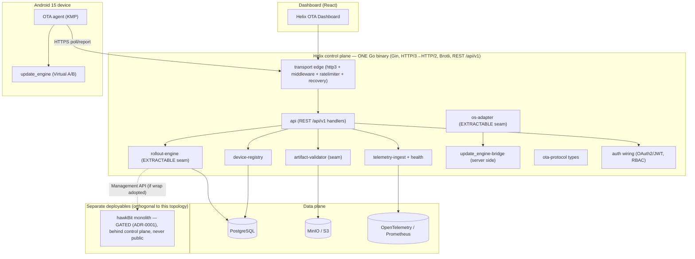

# 1.0.0-MVP — Server Architecture (Modular Monolith)

| Field | Value |
|---|---|
| Revision | 1 |
| Created | 2026-06-07 |
| Last modified | 2026-06-07 |
| Status | active |
| Status summary | Defines the 1.0.0-MVP server architecture for the Helix OTA control plane: a single-deployable modular monolith in Go + Gin (per ADR-0003) with enforced internal package boundaries mirroring future services, extractable `rollout-engine` and `OS-adapter` seams, and the locked HTTP/3(QUIC)→HTTP/2 + Brotli transport (per ADR-0004). Composes from the verified submodule catalogue (catalogue-first). |
| Issues | hawkBit wrap (ADR-0001) is GATED, not committed; the rollout-engine package may front either the wrap or the Go-native fallback — both seam shapes are carried. Numeric split thresholds are UNVERIFIED. Exact public API of several catalogue submodules is UNVERIFIED (carried from the submodule reuse map). HelixConstitution clause numbers are UNVERIFIED against the authoritative text. |
| Fixed | N/A (initial revision). |
| Continuation | On approval: pin the `ota-*` new-submodule list before repo creation (master §10/D4); close the ADR-0001 hawkBit gates or select the Go-native fallback; set numeric split thresholds from MVP load tests (ADR-0003 §3.2) and record in an ADR revision; confirm catalogue submodule public surfaces to drop UNVERIFIED tags. |

## Table of contents

1. [Purpose and scope](#1-purpose-and-scope)
2. [Topology decision (recap)](#2-topology-decision-recap)
3. [Process & deployment view](#3-process--deployment-view)
4. [Internal package boundaries (the seams)](#4-internal-package-boundaries-the-seams)
5. [Extractable seams: rollout-engine & OS-adapter](#5-extractable-seams-rollout-engine--os-adapter)
6. [Boundary enforcement](#6-boundary-enforcement)
7. [Transport composition (HTTP/3 + Brotli)](#7-transport-composition-http3--brotli)
8. [Catalogue-first composition](#8-catalogue-first-composition)
9. [Scale trigger to split into services](#9-scale-trigger-to-split-into-services)
10. [Testing (four-layer)](#10-testing-four-layer)
11. [Compliance notes (HelixConstitution)](#11-compliance-notes-helixconstitution)
12. [Open / UNVERIFIED items](#12-open--unverified-items)
13. [Sources](#13-sources)

> The table-of-contents requirement is mandated by HelixConstitution §11.4.61 (UNVERIFIED clause number). This document carries its ToC immediately after the metadata table.

---

## 1. Purpose and scope

This document specifies the **server-side architecture** of the Helix OTA control plane for **1.0.0-MVP**. It is normative for how the Go control plane is structured internally, deployed, and composed from the submodule catalogue. It does **not** re-decide the locked stack or the open ADR choices; it implements them:

- **Topology** is fixed by **ADR-0003** (modular monolith with extractable seams). [adr-0003 §3]
- **Transport** is fixed by **ADR-0004** (HTTP/3(QUIC) primary, HTTP/2 fallback, Brotli content compression, REST `/api/v1` primary). [adr-0004 §4]
- **Trust** integration points are fixed by **ADR-0002** (signer abstraction + distinct verify-gate, Uptane-ready). [adr-0002 §4.2]
- **Engine wrap** is **GATED** by **ADR-0001** (wrap hawkBit front-runner, Go-native rollout engine as the pre-authorized fallback). [adr-0001 §4]

Scope is the **Helix-authored Go control plane only**. If ADR-0001 adopts hawkBit, hawkBit remains a **separate deployable behind** the control plane (never publicly exposed) and is orthogonal to this topology. [adr-0003 §3]

## 2. Topology decision (recap)

ADR-0003 adopts **Option B — a modular monolith with extractable seams** for 1.0.0-MVP: one deployable Go binary (Gin, REST-primary, Brotli, HTTP/3→HTTP/2; PostgreSQL + MinIO/S3) with **enforced internal module boundaries** that mirror the future services, and the **rollout-engine** and **OS-adapter** built as cleanly extractable modules. Microservice extraction is deferred until a defined scale trigger fires (§9). [adr-0003 §3]

This honors the locked strategy — native Android A/B (`update_engine` + AVB/dm-verity + auto-rollback) on device + a custom Go control plane — and the locked stack (D6). [master §2 D2/D6; adr-0003 §1]

## 3. Process & deployment view

At MVP the Helix-authored control plane is **one process / one binary** on the `containers` submodule substrate (§11.4.76, UNVERIFIED). [adr-0003 §6; master §3]

Key points:
- **One Helix deployable** is the lowest MVP operational cost consistent with correctness — especially valuable if a JVM hawkBit is already running alongside. [adr-0003 §4.1]
- The dashed `rollout-engine → hawkBit` edge exists **only if** ADR-0001's wrap is adopted; under the Go-native fallback the rollout-engine package contains the engine itself. Either way the seam shape is identical to the rest of the binary (§5). [adr-0001 §4]
- Artifacts are served **byte-identical, `ZIP_STORED`, with HTTP Range, content-encoding `identity`** — never Brotli/gzip (§7). [adr-0004 §4]

## 4. Internal package boundaries (the seams)

Internal Go packages mirror the future services and the decoupling principle's named units. These are the **enforced boundaries** that keep the monolith from decaying into an unstructured single binary (ADR-0003 Option C). [adr-0003 §3.1; master §4]

| Package (seam) | Purpose | Maps to NEW submodule | Catalogue reuse | Extractable now? |
|---|---|---|---|---|
| `artifact-validator` | Upload validation pipeline: structure → SHA-256 vs hash file → signature → version monotonicity → target compatibility → metadata extraction (see [`artifact_validation.md`](artifact_validation.md)). Defense-in-depth alongside device-side verify-before-apply. | `ota-artifact-validator`, `ota-protocol` (manifest schema) | `security` (hash/signature primitives), `Storage` (blob staging) | No (in-binary; OS-aware via plugins) |
| `rollout-engine` | OS-agnostic staged-rollout state machine (percentage phases gated by success/error thresholds, pause/halt on breach). **First split candidate.** | `ota-rollout-engine` | `database` (phase/cohort state), `observability`/`Herald` (signals) | **YES** (designed extractable) |
| `ota-protocol` types | Shared release/deployment/telemetry/device wire contracts. Pure contracts; no business logic, no transport, no storage. | `ota-protocol` | — | N/A (already a contracts module) |
| `update_engine-bridge` | Server side of the thin Android `applyPayload` client contract. | `ota-update-engine-bridge` (device-side, Android-only counterpart) | — | No |
| `os-adapter` | Universality seam (Android Phase 1; Linux candidates RAUC/OSTree later), built as a module so a future-OS phase is an add, not a rewrite. | (via bridge + protocol) | — | **YES** (designed extractable) |
| `device-registry` | Device records, groups, inventory. | `ota-protocol` (device/status types) | `database`, `discovery`, `mdns` | No |
| `telemetry-ingest` | Event ingest → OpenTelemetry/Prometheus → health (see [`telemetry_processing.md`](telemetry_processing.md)); feeds rollout-engine halt logic. | `ota-telemetry-schema` | `observability`, `Herald` | No (second split candidate per §9) |
| `api` | REST `/api/v1` handlers wiring the seams; the only package that speaks HTTP for business endpoints. | `ota-protocol` (REST contracts) | `http3`, `middleware`, `ratelimiter`, `recovery` | No |
| `auth` wiring | OAuth2/JWT, RBAC, API keys, audit — policy wiring only, no auth logic re-implemented. | — | `auth`, `security`, `middleware` | No |

Each seam has **one purpose, a well-defined interface, and is independently testable** (§11.4.28, UNVERIFIED). [adr-0003 §3.1; submodule-reuse-map §3/§4]

## 5. Extractable seams: rollout-engine & OS-adapter

Two seams are designed for **lift-out, not rewrite** when a scale trigger fires (§9). [adr-0003 §3.1, §3.2]

### 5.1 rollout-engine

- **No HTTP.** Pure engine plus a **storage port** (backed by `database`) and a **telemetry-signal port** (consumes signals from `telemetry-ingest`; contains no ingest itself). [submodule-reuse-map §4]
- Interface surface (illustrative; pure-Go, no Gin types cross the boundary):
  - `StartPhase(deploymentID, phase) (PhaseState, error)`
  - `ObserveTelemetry(signal) (PhaseDecision, error)` → `advance | hold | pause | halt`
  - `CohortFor(deploymentID, phase) (DeviceSet, error)` — deterministic cohort selection
- **Idempotent state transitions** + a **fake clock + fake telemetry** make it independently testable to the safety-critical ≥90% floor. [master §8; adr-0003 §6]
- Under ADR-0001's wrap path, this package is the **adapter to hawkBit's Management API** (drive create/start/pause/resume + emergency shutdown); under the fallback it **is** the Go-native wave state machine (Foundries.io-style `init→canary→expanding→complete/cancelled` + Memfault one-click abort). The **port surface above is identical** in both cases, so the wrap/fallback choice never changes the seam contract. [adr-0001 §4]

### 5.2 os-adapter

- The **universality boundary**: Android now via the `update_engine-bridge`; Linux candidates (RAUC/OSTree) later. Built as a module so the Linux/universal phase is an **add**, not a rewrite. [adr-0003 §3.1; adr-0001 §4]
- Exposes an apply/verify port consumed by the device-facing flow; the server holds **no OS-specific apply logic** outside this seam. The Android device-side apply itself lives in `ota-update-engine-bridge` (Android-only, thin). [submodule-reuse-map §4]

Because both seams are extractable by construction, satisfying a split trigger is a **lift-out**. [adr-0003 §3.2]

## 6. Boundary enforcement

A monolith decays into ADR-0003 Option C without active enforcement. Mandatory controls:

- **Internal-import discipline.** Cross-seam calls go **only** through the published package interface (ports); no reaching into another seam's internals. Enforced in CI (e.g. an import-linter / `depguard`-style allow-list rule — tool choice UNVERIFIED, but the rule is mandatory). [adr-0003 §3.1, §4.2]
- **No transport types across seams.** Gin/`http.Request` types are confined to the `api` and transport-edge packages; business seams take/return `ota-protocol` types only. [adr-0004 §4; submodule-reuse-map §3]
- **Independent testability per seam** to its coverage floor (≥90% on signing-verify, apply, rollout-gate). [master §13; adr-0003 §6]

This is what keeps every seam a **lift-out** when §9 fires. [adr-0003 §3.2]

## 7. Transport composition (HTTP/3 + Brotli)

Per ADR-0004, composed at the binary's edge: [adr-0004 §4]

1. **Transport protocol:** HTTP/3 (QUIC) primary via the `vasic-digital/http3` submodule (drop-in `net/http.Handler`), with automatic negotiation/fallback to **HTTP/2** (TLS 1.3 throughout) for clients/networks that cannot use QUIC/UDP-443. **REST `/api/v1` is the primary surface**; gRPC is optional/internal only. [adr-0004 §4.1; master §3]
2. **Two-class compression rule (load-bearing):**
   - **Control-plane REST/JSON** (poll/check-in, rollout assignment, telemetry ingest, dashboard): **Brotli**, negotiating to **gzip** via `Accept-Encoding`.
   - **OTA artifacts** (`payload.bin` / OTA ZIP): **no content compression** — served **byte-identical**, **`ZIP_STORED`**, content-encoding **`identity`**, with **mandatory HTTP Range** so streaming range-fetch and hash/signature verification hold. [adr-0004 §4.2]
3. **Artifact delivery:** device-pull streaming over HTTPS with mandatory Range (`Storage` brick + MinIO/S3); the control plane returns `{url, offset, size, FILE_HASH, FILE_SIZE, METADATA_HASH, METADATA_SIZE}`. [adr-0004 §4.3]
4. **Resumability:** do not send `DISABLE_DOWNLOAD_RESUME`; the server MUST honour Range/conditional requests so interrupted transfers resume from offset. [adr-0004 §4.4]

Negotiation order at the edge: HTTP/3 → HTTP/2 → `br` → `gzip` → `identity`. The **artifact path is pinned to `identity` + Range regardless** of control-plane negotiation. A **CI/serving guard** MUST assert the artifact path is never Brotli/gzip-compressed or re-zipped with compression (would silently break streaming + hashing). [adr-0004 §4, §5.2]

> **UNVERIFIED (needs spike):** Range-request semantics over HTTP/3/HTTP/2 through the `http3` submodule + MinIO/S3 end-to-end; QUIC/UDP-443 reachability and the HTTP/2 fallback trigger; Brotli quality/parameter tuning at fleet scale. [adr-0004 §6]

## 8. Catalogue-first composition

Cross-cutting concerns come from the **verified submodule catalogue** (§11.4.74, UNVERIFIED), embedded in the single binary — not re-implemented. Only canonical names are used; none invented. [master §10; submodule-reuse-map §3]

- **Transport edge:** `http3`, `middleware` (Brotli/gzip negotiation), `ratelimiter`, `recovery`.
- **Auth:** `auth`, `security`, `middleware` (OAuth2/JWT, RBAC, API keys, audit wiring).
- **Persistence:** `database` (PostgreSQL state), `Storage` (MinIO/S3 blobs), `cache` (optional Redis only if a measured need exists).
- **Observability/alerting:** `observability` (OpenTelemetry/Prometheus), `Herald` (alert routing), `eventbus` (internal domain-event fan-out).
- **Config:** `config` (poll interval + jitter, runtime config).
- **Device presence:** `discovery`, `mdns` (UNVERIFIED fit for the Android-on-Orange-Pi target).
- **Substrate:** `containers` (canonical deployment substrate, §11.4.76).

**NEW submodules** (no catalogue cover; PUBLIC repos per D4, final list confirmed before creation): `ota-protocol`, `ota-artifact-validator`, `ota-rollout-engine`, `ota-update-engine-bridge`, `ota-android-agent`, `ota-telemetry-schema`. [master §10; submodule-reuse-map §4]

> **UNVERIFIED:** the precise public API of each catalogue submodule has not been inspected this revision; "satisfies" claims are UNVERIFIED until confirmed. [submodule-reuse-map §7]

## 9. Scale trigger to split into services

Extract a seam into its own service **when any one fires** (first-mover: rollout-engine; then telemetry ingestion): [adr-0003 §3.2]

1. **Divergent scaling pressure** — telemetry-ingestion load and rollout-control load need materially different horizontal scaling. (Telemetry is plausibly the higher-volume of the two — **UNVERIFIED**; confirm via MVP load tests.)
2. **Second OS target enters active development** — the Linux/universal phase begins, so the `os-adapter` seam is extracted and Android/Linux paths deploy and scale independently.
3. **Independent release cadence** — a seam (most likely rollout-engine) needs a cadence the monolith's release train blocks.

**Numeric thresholds** (device count, req/s, telemetry events/s) are **UNVERIFIED** — no load figures exist in the sources; set them from MVP load-test data and record in an ADR revision before the first split. Because the seams are extractable by construction (§5), satisfying a trigger is a **lift-out**, not a rewrite. [adr-0003 §3.2, §7]

## 10. Testing (four-layer)

Per HelixConstitution §1 (UNVERIFIED clause), every change ships four layers; safety-critical paths (signing-verify, apply, rollout-gate) target **≥90% coverage** with mutation immunity. [master §13; adr-0003 §6]

| Layer | What it asserts for this architecture |
|---|---|
| **1. Source-presence gate** | The seam packages (`artifact-validator`, `rollout-engine`, `ota-protocol`, `update_engine-bridge`, `os-adapter`, `telemetry-ingest`, `api`, `device-registry`) exist with their published port interfaces; the import-linter/boundary rule (§6) is present in CI config; the catalogue submodules (§8) are wired (not re-implemented). |
| **2. Artifact gate** | The build produces **one** Go binary (ADR-0003 single-deployable); the binary embeds the catalogue bricks; the transport edge negotiates HTTP/3→HTTP/2 and the artifact route serves `identity` + Range (the CI/serving guard of §7 ships). |
| **3. Runtime / integration** | Boot the binary; exercise REST `/api/v1` over HTTP/3 with HTTP/2 fallback; stream a real `ZIP_STORED` `payload.bin` end-to-end with byte-range correctness + resume (the ADR-0004 §6 spike); confirm a cross-seam call only crosses via the port; confirm rollout-engine consumes telemetry signals and halts on threshold breach. |
| **4. Mutation meta-test** | Negate a boundary/seam invariant (e.g. allow a forbidden cross-seam import, or let the artifact route emit `br`) and assert the gate flips **PASS→FAIL**; negate a rollout halt condition and assert the rollout-gate test fails. |

No-bluff positive evidence only (§7.1, UNVERIFIED). The ADR-0004 §6 spikes are the rock-solid-proof mechanism (§11.4.123, UNVERIFIED) closing the transport UNVERIFIEDs before those code paths are marked stable. [adr-0004 §8]

## 11. Compliance notes (HelixConstitution)

> Clause numbers are carried from the corpus convention and are **UNVERIFIED** against the authoritative HelixConstitution text. [submodule-reuse-map §7]

| Clause | How this architecture complies |
|---|---|
| §11.4.28 (decoupling) | Each seam (§4) has one purpose, a well-defined port interface, and independent testability; the rollout-engine and os-adapter are extractable (§5); enforcement in §6. [adr-0003 §6] |
| §11.4.6 / §11.4.8 (no-guessing / research-first) | Built on the ADRs' cited evidence; numeric split thresholds and transport spikes carried as **UNVERIFIED** rather than invented (§9, §7). [adr-0003 §7; adr-0004 §6] |
| §11.4.74 (catalogue-first reuse) | Cross-cutting concerns taken from the verified catalogue (§8); NEW submodules only where no catalogue cover exists. [master §10] |
| §11.4.76 (containers substrate) | The single deployable runs on the `containers` substrate; a future split reuses the same substrate (§3). [adr-0003 §6] |
| §1 / §1.1 (four-layer + mutation) | §10 testing; ≥90% floor on signing/apply/rollout-gate regardless of mono/micro packaging. [master §13] |
| §11.4.123 (rock-solid proof) | ADR-0004 §6 spikes close transport UNVERIFIEDs with executable evidence before the dependent paths are stable (§10). **UNVERIFIED** against clause text. |
| D2 / D6 (locked) | Native A/B + custom Go control plane (D2); mandated stack adopted verbatim (D6); engine wrap left to ADR-0001. [master §2] |

## 12. Open / UNVERIFIED items

1. **ADR-0001 wrap vs fallback** — the `rollout-engine` package fronts either hawkBit (gated) or the Go-native engine; both seam shapes carried until the gates close. [adr-0001 §5.3]
2. **Numeric split thresholds** — no load figures in sources; set from MVP load tests. **UNVERIFIED.** [adr-0003 §7]
3. **Transport spikes** — Range-over-HTTP3 via `http3`+MinIO/S3; QUIC reachability + HTTP/2 fallback; Brotli tuning. **UNVERIFIED (needs spike).** [adr-0004 §6]
4. **Catalogue submodule public surfaces** — `auth`/`security`/`Storage`/`middleware`/`discovery`/`mdns` fit not yet inspected. **UNVERIFIED.** [submodule-reuse-map §7]
5. **Boundary-enforcement tooling** — the import-linter/`depguard` rule is mandatory; exact tool **UNVERIFIED**. [adr-0003 §3.1]
6. **Constitution clause numbers** — carried from corpus convention. **UNVERIFIED.**

## 13. Sources

All paths relative to `docs/research/main_specs/`.

- [`research/adr/adr-0003-server-topology.md`](../../research/adr/adr-0003-server-topology.md) — modular-monolith decision, seams, scale trigger, compliance.
- [`research/adr/adr-0004-transport.md`](../../research/adr/adr-0004-transport.md) — HTTP/3→HTTP/2, Brotli two-class rule, artifact Range/`ZIP_STORED`/`identity`, resume.
- [`research/adr/adr-0001-wrapped-engine.md`](../../research/adr/adr-0001-wrapped-engine.md) — hawkBit wrap (gated) vs Go-native rollout-engine fallback; rollout-engine seam shape.
- [`research/adr/adr-0002-supply-chain-trust.md`](../../research/adr/adr-0002-supply-chain-trust.md) — signer abstraction + verify-gate seam (artifact-validator integration point).
- [`00-master/2026-06-07-helix-ota-design.md`](../../00-master/2026-06-07-helix-ota-design.md) — locked decisions, mandated stack, §4 architecture, §10 catalogue, §13 testing.
- [`00-master/submodule_reuse_map.md`](../../00-master/submodule_reuse_map.md) — component→submodule bindings, NEW-submodule boundaries, anti-bluff notes.
- [`artifact_validation.md`](artifact_validation.md), [`telemetry_processing.md`](telemetry_processing.md) — sibling server specs for the validator and telemetry seams.
