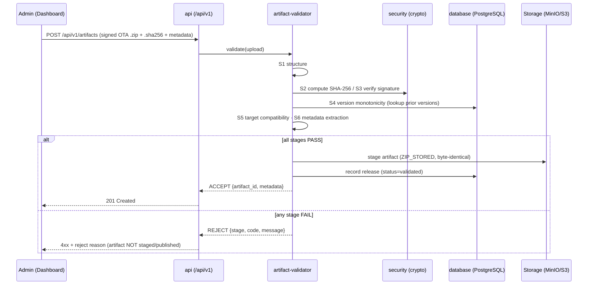

# 1.0.0-MVP — Artifact Upload Validation Pipeline

| Field | Value |
|---|---|
| Revision | 2 |
| Created | 2026-06-07 |
| Last modified | 2026-06-07 |
| Status | active |
| Status summary | Specifies the mandatory server-side upload validation pipeline for OTA artifacts as an ordered decision table: structure → SHA-256 vs hash file → signature → version monotonicity → target compatibility → metadata extraction, with explicit reject/accept paths. Server-side validation is defense-in-depth alongside device-side verify-before-apply; it is the "safe upload" hard guarantee. Implements ADR-0002 (plain signing for MVP, Uptane-ready interfaces) and preserves the ADR-0004 byte-identity rule. |
| Issues | Whether the `security` brick exposes the SHA-256/512 + signature-verify primitives the validator needs is UNVERIFIED. Exact Android OTA metadata field names / custom-metadata location are partially from the operator drafts and UNVERIFIED against AOSP. `ZIP_STORED` enforcement interacts with ADR-0004's artifact serving and must not be bypassed. HelixConstitution clause numbers are UNVERIFIED. |
| Fixed | Rev 2: resolved S4↔S6 ordering circularity (version/target identifiers parsed by an S1/manifest-read precursor so they precede S4/S5 gating; full metadata extraction stays at S6); corrected the S2 "constant-time compare" claim (public-digest compare gains nothing from timing-safety — integrity = digest match + S3 signature); added explicit NON-GOAL that the server does not re-validate the artifact's retained AOSP/payload signature at intake (device re-verifies before apply). |
| Continuation | Confirm the `security`/`Security-KMP` crypto primitive surface; pin the exact OTA metadata schema (`ota-protocol` manifest) against AOSP `META-INF/com/android/metadata`; wire the signer abstraction to `go-securesystemslib` `signature.Signer` so TUF drops in later (ADR-0002 §4.2); finalize `ota-artifact-validator` repo before creation. |

## Table of contents

1. [Purpose and scope](#1-purpose-and-scope)
2. [Position in the system (where this runs)](#2-position-in-the-system-where-this-runs)
3. [Pipeline overview](#3-pipeline-overview)
4. [Inputs](#4-inputs)
5. [Decision table (ordered stages)](#5-decision-table-ordered-stages)
   - [5.1 Stage S1 — Structure](#51-stage-s1--structure)
   - [5.2 Stage S2 — SHA-256 vs hash file](#52-stage-s2--sha-256-vs-hash-file)
   - [5.3 Stage S3 — Signature](#53-stage-s3--signature)
   - [5.4 Stage S4 — Version monotonicity](#54-stage-s4--version-monotonicity)
   - [5.5 Stage S5 — Target compatibility](#55-stage-s5--target-compatibility)
   - [5.6 Stage S6 — Metadata extraction](#56-stage-s6--metadata-extraction)
6. [Accept path](#6-accept-path)
7. [Reject path (common contract)](#7-reject-path-common-contract)
8. [Uptane-forward design](#8-uptane-forward-design)
9. [Catalogue-first composition](#9-catalogue-first-composition)
10. [Testing (four-layer)](#10-testing-four-layer)
11. [Compliance notes (HelixConstitution)](#11-compliance-notes-helixconstitution)
12. [Open / UNVERIFIED items](#12-open--unverified-items)
13. [Sources](#13-sources)

> The table-of-contents requirement is mandated by HelixConstitution §11.4.61 (UNVERIFIED clause number). This document carries its ToC immediately after the metadata table.

---

## 1. Purpose and scope

This document specifies the **mandatory upload validation pipeline** the Helix OTA control plane runs **before any artifact can be published or deployed**. It satisfies the operator "safe upload" hard guarantee: *every OTA artifact passes mandatory validation before it can be deployed.* [master §1]

The pipeline is **server-side defense-in-depth**, not a replacement for device-side checks. The device still re-verifies (`FILE_HASH`/`METADATA_HASH` + AOSP/payload signature + AVB/dm-verity) before apply, and `update_engine` performs the atomic apply with automatic boot-failure rollback. [adr-0002 §1; adr-0004 §4.2] Both drafts independently converged on "artifact integrity = SHA-256 + signature verification, verified server-side on upload and device-side before apply." [adr-0002 §1]

For **1.0.0-MVP the trust model is plain per-artifact signing** (SHA-256 + detached signature + AVB) — **not** TUF/Uptane, which is deferred to 1.0.1+; the signing/verify interfaces are designed MVP-forward so TUF drops in without rework (§8). [adr-0002 §4.1, §4.2]

This logic lives in the `artifact-validator` seam (NEW submodule `ota-artifact-validator`), which is **OS-aware via plugins and carries no transport**. [architecture §4; submodule-reuse-map §4]

**NON-GOAL (intake):** the server does **not** validate the artifact's retained AOSP/payload signature at intake. S3 verifies only the **Helix-layer** detached signature (additive to the AOSP signature); the artifact's own AOSP/payload signature is carried through byte-identically and is **re-verified by the device** (AOSP/payload signature + AVB/dm-verity) before apply. Re-validating the AOSP signature server-side is out of scope for MVP. [adr-0002 §4.2; adr-0004 §4.2]

## 2. Position in the system (where this runs)

A rejected artifact is **never staged in object storage as deployable, never recorded as a publishable release, and never assigned to any device.** [master §5; §7]

## 3. Pipeline overview

The pipeline is an **ordered, fail-fast sequence**. Stages run in the order S1→S6. The **first failing stage** terminates the pipeline and returns the reject contract (§7); later stages do not run. A staged artifact that later fails a re-validation is quarantined, not deployed.

The S1 structure stage includes a **manifest-read precursor**: as part of parsing the package structure, S1 reads the `ota-protocol` manifest and parses the lightweight identifiers needed for gating — the **version identifier** (used by S4 monotonicity) and the **declared target identifiers** (used by S5 target compatibility). These identifiers are therefore available to the gating stages **before** S4 runs; this resolves the apparent S4↔S6 ordering circularity. **Full** release metadata extraction (sizes, hashes, build fingerprint, the complete release record) still happens at S6 — S1 only parses the minimal identifiers required to gate.

| # | Stage | Question answered | Brick / source |
|---|---|---|---|
| S1 | Structure | Is this a well-formed OTA package with the required entries (incl. `ZIP_STORED` payload)? | `ota-artifact-validator` + `ota-protocol` manifest schema |
| S2 | SHA-256 vs hash file | Do the computed digests match the mandatory hash file byte-for-byte? | `security` (hash primitives) |
| S3 | Signature | Is the detached signature valid under the trusted public key? | `security` (signature verify), signer abstraction (§8) |
| S4 | Version monotonicity | Is this version strictly newer than what's already published for the target? | `database` (prior-version lookup) |
| S5 | Target compatibility | Does the artifact declare a device/product/build target the fleet can accept? | `ota-protocol` + `database` (known targets) |
| S6 | Metadata extraction | Capture release metadata (target, version, sizes, hashes, build fingerprint) for the release record. | `ota-protocol` manifest + AOSP metadata |

This ordering matches the master MVP flow: *server validates (structure, hash, signature, version monotonicity, target compatibility) → publishes release.* [master §5]

## 4. Inputs

The upload (multipart) carries: [adr-0004 §4.3; drafts initial_research §5.4]

- `artifact` — the signed OTA `.zip` (the `payload.bin` inside is `ZIP_STORED`, byte-identical, already-compressed; **must not** be re-compressed — preserves the ADR-0004 byte-identity rule). [adr-0004 §4.2]
- `hash_file` — the mandatory external hash file (e.g. `.sha256`) the build pipeline emits. [master §1, §6]
- `signature` / signed manifest — the detached signature over the artifact (and/or the manifest carrying `{path, length, SHA-256}` per target file). [adr-0002 §4.2]
- `declared_metadata` — target product/build, version, and the device-compatibility fields (extracted/confirmed in S6).

The trusted **public key** comes from server config (`config` brick); the **signer/verifier** is behind the signer abstraction (§8). [adr-0002 §4.2; master §6]

## 5. Decision table (ordered stages)

Common columns: **Condition** (the predicate), **PASS →** (next action), **FAIL →** (reject; pipeline terminates, see §7). All FAILs follow the §7 reject contract.

### 5.1 Stage S1 — Structure

| Condition | PASS → | FAIL → |
|---|---|---|
| Upload is a readable ZIP and parses without error | continue | REJECT `S1_MALFORMED_ARCHIVE` |
| Required entries present (OTA payload + metadata entry/manifest) per the `ota-protocol` schema | continue | REJECT `S1_MISSING_ENTRY` |
| `payload.bin` (and OTA ZIP entries the device range-fetches) are stored **`ZIP_STORED`** (uncompressed) | continue | REJECT `S1_NOT_ZIP_STORED` |
| Declared sizes are internally consistent (no truncation/overrun) | continue to S2 | REJECT `S1_SIZE_INCONSISTENT` |

Rationale: `update_engine` byte-range-fetches `payload.bin` by `offset`/`size` from an **uncompressed (`ZIP_STORED`)** ZIP; a compressed payload breaks streaming range-fetch and hash verification. S1 enforces this at intake so the ADR-0004 byte-identity contract holds end-to-end. [adr-0004 §4.2; aosp-update-engine via adr-0004 §1]

### 5.2 Stage S2 — SHA-256 vs hash file

| Condition | PASS → | FAIL → |
|---|---|---|
| Mandatory hash file is present and parseable | continue | REJECT `S2_HASH_FILE_MISSING` |
| Server-computed SHA-256 over the artifact **equals** the hash-file value (plain byte-for-byte digest comparison) | continue | REJECT `S2_HASH_MISMATCH` |
| SHA-512 computed and recorded where available (defense-in-depth; absence is not a fail at MVP) | continue to S3 | — |

Integrity is SHA-256 (and SHA-512 where available) over the artifact + the mandatory hash file. [master §6] A mismatch means corruption or tampering: hard reject. The hash-file value is a **public, attacker-known digest**, so a constant-time comparison buys nothing here (there is no secret to leak via timing); a plain comparison is sufficient. The integrity guarantee comes from the **digest match (S2) plus the S3 signature** over the same bytes, not from the comparison being timing-safe. Hashes computed here are also persisted for the release record (S6) and the device download contract (`FILE_HASH`). [adr-0004 §4.3]

### 5.3 Stage S3 — Signature

| Condition | PASS → | FAIL → |
|---|---|---|
| A detached signature (or signed manifest) is present | continue | REJECT `S3_SIGNATURE_MISSING` |
| Signature verifies under the **trusted public key** via the signer abstraction | continue | REJECT `S3_SIGNATURE_INVALID` |
| The signed bytes correspond to the **same** artifact that passed S2 (no swap between hash and signature scope) | continue to S4 | REJECT `S3_SIGNATURE_SCOPE_MISMATCH` |

The build-pipeline private key signs; the public key is in server config and the device trust store; the server verifies on upload and the device re-verifies before apply. [master §6] MVP uses a **detached-signature signer**; the abstraction is compatible with `go-securesystemslib` `signature.Signer` so a future TUF role signer shares the same seam (§8). [adr-0002 §4.2] The artifact keeps its existing AOSP/payload signature regardless — S3 is the Helix-layer signature, additive to it. [adr-0002 §4.2]

### 5.4 Stage S4 — Version monotonicity

| Condition | PASS → | FAIL → |
|---|---|---|
| A comparable version identifier is parseable (parsed by the S1/manifest-read precursor, before S4) | continue | REJECT `S4_VERSION_UNPARSEABLE` |
| Version is **strictly greater** than the latest published version for the same target | continue | REJECT `S4_NOT_MONOTONIC` (downgrade/equal) |
| No published release already exists with the same `{target, version}` (idempotency / no clobber) | continue to S5 | REJECT `S4_DUPLICATE_VERSION` |

Anti-downgrade is an MVP guarantee (bootloader/AVB enforce it on-device; the server enforces it at intake so a stale or replayed artifact is never publishable). Plain signing alone does **not** mitigate rollback/freeze — S4 is the server-side guard that plain signing leaves open at MVP, pending TUF's stronger freshness guarantees in 1.0.1+. [master §6; adr-0002 §3.1, "why plain signing is not enough"]

> Override (e.g. an intentional rollback release) is **out of scope for MVP** (end-user/multi-version rollback is deferred); if ever added it MUST be an explicit, audited admin action, not a silent pass. [master §1 non-goals]

### 5.5 Stage S5 — Target compatibility

| Condition | PASS → | FAIL → |
|---|---|---|
| Artifact declares a target (product/device/build fingerprint) | continue | REJECT `S5_TARGET_UNDECLARED` |
| Declared target matches a known/accepted target class for the fleet | continue | REJECT `S5_TARGET_UNKNOWN` |
| Declared target is **Android Phase-1 compatible** (Android 15 / RK3588 class for MVP) | continue to S6 | REJECT `S5_TARGET_UNSUPPORTED` |

Prevents mix-and-match / wrong-software deployment to incompatible devices — the validator confirms the artifact is for a device class the fleet can accept before it can be assigned. Phase-1 scope is Android-15-first; non-Android targets are rejected at MVP. [master §1; adr-0001 §1]

> The exact device-compatibility fields (`ro.product.name`, `ro.build.fingerprint`, etc.) and whether they come from `META-INF/com/android/metadata` or a custom metadata entry are partly from the operator drafts and **UNVERIFIED** against AOSP — pinned in the `ota-protocol` manifest schema before coding. [drafts initial_research_02 §5.4]

### 5.6 Stage S6 — Metadata extraction

| Condition | PASS → | FAIL → |
|---|---|---|
| All required release fields extractable (target, version, FILE_SIZE, METADATA_SIZE, FILE_HASH, METADATA_HASH, build fingerprint) | continue | REJECT `S6_METADATA_INCOMPLETE` |
| Extracted metadata is internally consistent with S2 hashes and S1 sizes | ACCEPT (→ §6) | REJECT `S6_METADATA_INCONSISTENT` |

S6 produces the **release record fields** and the **device download contract** (`{url, offset, size, FILE_HASH, FILE_SIZE, METADATA_HASH, METADATA_SIZE}`) the control plane later returns to devices. [adr-0004 §4.3] Metadata is treated as opaque `{path + length + SHA-256}` target data so a TUF `targets` entry can layer over it byte-identically later (§8). [adr-0002 §4.2]

## 6. Accept path

When **all** of S1–S6 pass: [master §5]

1. Stage the artifact in object storage via `Storage` (MinIO/S3) **byte-identical, `ZIP_STORED`, content-encoding `identity`** — never re-compressed/re-zipped (preserves ADR-0004 byte-identity + Range). [adr-0004 §4.2]
2. Record a **release** in `database` (PostgreSQL) with status `validated`, the S6 metadata, and the computed hashes; this is the publishable unit. [master §7]
3. Write an **audit log** entry for the upload (admin identity, artifact id, validation result). [master §6]
4. Surface the artifact to the dashboard as **deployable** (one-click deploy-to-all for MVP; staged rollout lands 1.0.1). [master §5]

The artifact only becomes assignable to devices **after** the accept path completes.

## 7. Reject path (common contract)

Any stage failure: [§5]

- **Terminate immediately** (fail-fast); later stages do not run.
- Return a typed reject `{stage, code, message}` (codes per §5) → mapped to a `4xx` by the `api` layer; the message is operator-actionable but leaks no key material.
- **Do not stage** the artifact as deployable, **do not record a publishable release**, **do not assign to any device**. A partially-uploaded blob is discarded/quarantined, never promoted. [master §5]
- **Audit-log** the rejection (admin identity, stage, code) for the security trail. [master §6; threat model intake controls]

This is the enforcement point of the "safe upload" guarantee: a non-conforming artifact is structurally unable to reach a device. [master §1]

## 8. Uptane-forward design

MVP ships plain signing, but the interfaces are designed so TUF (then a Director+Image split) drops in without rework: [adr-0002 §4.2]

- Treat every artifact as an **opaque target identified by `path + length + SHA-256`** (S6) so a TUF `targets` entry layers over it byte-identically later; artifacts keep their existing signature.
- Put signing/verify behind a **signer abstraction** compatible with `go-securesystemslib` `signature.Signer` (the go-tuf/v2 integration point) so the MVP detached-signature signer (S3) and a future TUF role signer share one seam.
- Keep verification a **distinct device-side step that gates apply**, so a TUF refresh/verify flow (root→timestamp→snapshot→targets, expiry, version monotonicity, threshold sigs) can be inserted in front of the existing hash+signature check without changing the apply path. (S4's monotonicity is the MVP analogue of TUF's freshness guarantee.)
- Reserve a **per-device "what should this device install" decision** in the control plane so a Director repository can later mint per-device `targets.json` from the inventory DB.

Route signing/verify work through the verified catalogue (`security`, `Security-KMP`) — **UNVERIFIED** whether these expose the needed primitives without bespoke crypto. [adr-0002 §4.2, §8]

## 9. Catalogue-first composition

| Concern | Brick / module | Class |
|---|---|---|
| Hash + signature primitives | `security` (server), `Security-KMP` (device) | reuse (UNVERIFIED surface) |
| Blob staging | `Storage` (MinIO/S3) | reuse |
| Upload handling / request middleware | `middleware` | reuse |
| Prior-version + target lookup, release record | `database` (PostgreSQL) | reuse |
| Manifest / target schema, device + status types | `ota-protocol` | new |
| The validation pipeline itself | `ota-artifact-validator` | new |

No transport in the validator; only canonical catalogue names used (none invented). [submodule-reuse-map §3/§4]

## 10. Testing (four-layer)

Signing-verify is a **safety-critical path → ≥90% coverage** with mutation immunity. [master §13; adr-0002 §7]

| Layer | What it asserts for this pipeline |
|---|---|
| **1. Source-presence gate** | All six stage functions (S1–S6) exist in `ota-artifact-validator`; the signer abstraction and the `ota-protocol` manifest schema are present; reject codes (§5) are defined; `security`/`Storage`/`database` are wired (not re-implemented). |
| **2. Artifact gate** | The validator ships in the control-plane binary; an accepted artifact is staged **`ZIP_STORED`, byte-identical, `identity`** (assert the bytes are unchanged and uncompressed); a rejected artifact produces **no** deployable blob and **no** publishable release row. |
| **3. Runtime / integration** | Drive each stage with crafted fixtures: malformed ZIP (S1), compressed payload (S1 `NOT_ZIP_STORED`), hash mismatch (S2), bad/missing signature (S3), downgrade + duplicate version (S4), unknown/unsupported target (S5), incomplete metadata (S6); plus a fully-valid artifact reaching ACCEPT and becoming deployable. Confirm fail-fast (later stages do not run) and audit-log on both paths. |
| **4. Mutation meta-test** | Negate each accept condition (e.g. make S2 compare succeed on a mismatch, or let S4 admit an equal version, or let S1 admit a compressed payload) and assert the corresponding test flips **PASS→FAIL**. The pipeline's safety is proven by the negation breaking the gate. |

No-bluff positive evidence only (§7.1, UNVERIFIED). [adr-0002 §7]

## 11. Compliance notes (HelixConstitution)

> Clause numbers carried from the corpus convention; **UNVERIFIED** against the authoritative text. [submodule-reuse-map §7]

| Clause | How this pipeline complies |
|---|---|
| §1 zero-corruption / safe-upload | The ordered decision table makes a non-conforming artifact structurally unable to reach a device (§7); byte-identity preserved (§6). [master §1] |
| §11.4.28 (decoupling) | Signer abstraction + a distinct verify-gate keep the validator / signing / update_engine-bridge independently testable and Uptane-swappable (§8). [adr-0002 §7] |
| §11.4.74 (catalogue-first) | Crypto/storage/DB routed through `security`/`Storage`/`database`; no bespoke crypto where a catalogue brick exists (§9). [adr-0002 §7] |
| §11.4.6 / §11.4.8 (no-guessing / research-first) | Plain-signing-for-MVP vs TUF-for-1.0.1 decided on ADR evidence; metadata field specifics carried **UNVERIFIED** rather than asserted (§5.5, §5.6). [adr-0002 §7] |
| §1 / §1.1 (four-layer + mutation) | §10 testing; signing-verify floored ≥90% with mutation immunity. [master §13] |
| §11.4.123 (rock-solid proof) | The 1.0.1+ TUF adoption spikes (server publish + Go refresh client, on-device client, key custody) replace the carried UNVERIFIEDs before device-side TUF is mandated. **UNVERIFIED** against clause text. [adr-0002 §4.3] |

## 12. Open / UNVERIFIED items

1. **`security` / `Security-KMP` primitive surface** — SHA-256/512 + signature-verify availability. **UNVERIFIED.** [adr-0002 §8]
2. **OTA metadata schema** — exact device-compatibility fields and whether from `META-INF/com/android/metadata` or custom entry. **UNVERIFIED** against AOSP. [drafts initial_research_02 §5.4]
3. **Android-15 / RK3588 `update_engine` constants/AIDL** the download contract integrates against. **UNVERIFIED** (carried from ADR-0001/0002). [adr-0002 §8]
4. **Signer abstraction ↔ `go-securesystemslib`** binding not yet implemented; provisional until spiked. [adr-0002 §8]
5. **Constitution clause numbers** — carried from corpus convention. **UNVERIFIED.**

## 13. Sources

All paths relative to `docs/research/main_specs/`.

- [`research/adr/adr-0002-supply-chain-trust.md`](../../research/adr/adr-0002-supply-chain-trust.md) — MVP plain signing, Uptane-ready signer abstraction + verify-gate, attack classes plain signing leaves open.
- [`research/adr/adr-0004-transport.md`](../../research/adr/adr-0004-transport.md) — byte-identity rule, `ZIP_STORED`, Range, download contract `{url, offset, size, FILE_HASH, ...}`.
- [`research/adr/adr-0001-wrapped-engine.md`](../../research/adr/adr-0001-wrapped-engine.md) — Android-15-first scope; Helix owns payload + trust regardless of wrap.
- [`00-master/2026-06-07-helix-ota-design.md`](../../00-master/2026-06-07-helix-ota-design.md) — §1 hard guarantees, §5 MVP flow, §6 security model, §7 data model, §13 testing.
- [`00-master/submodule_reuse_map.md`](../../00-master/submodule_reuse_map.md) — `ota-artifact-validator` boundary, `security`/`Storage`/`database` bindings.
- [`00-master/threat_model.md`](../../00-master/threat_model.md) — artifact-intake threat controls (server-side defense-in-depth).
- [`additions/initial_research_02.md`](../../additions/initial_research_02.md), [`additions/initial_research.md`](../../additions/initial_research.md) — operator drafts (upload/verification flow, metadata extraction).
- [`architecture.md`](architecture.md) — the `artifact-validator` seam this pipeline implements.
