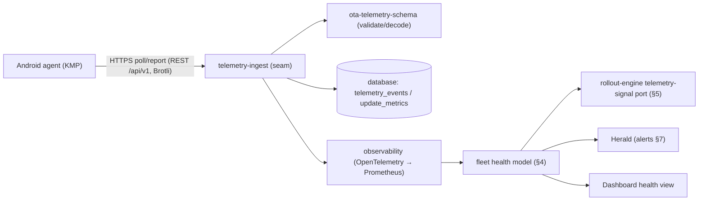

# 1.0.0-MVP — Telemetry Processing & Health

| Field | Value |
|---|---|
| Revision | 1 |
| Created | 2026-06-07 |
| Last modified | 2026-06-07 |
| Status | active |
| Status summary | Specifies the server-side telemetry pipeline for 1.0.0-MVP: device event ingest → OpenTelemetry/Prometheus → fleet health, the halt-on-failure inputs the rollout-engine consumes, and the post-boot health window + auto canary-abort concept carried forward from the research (active in 1.0.1 staged rollout). Composes from the `observability`/`Herald` catalogue bricks and the NEW `ota-telemetry-schema` module; runs inside the modular-monolith binary (ADR-0003). |
| Issues | Staged rollout (and thus auto canary-abort) lands in 1.0.1, not MVP — MVP ingests and surfaces health and supports one-click manual abort; auto-abort is the forward concept. Post-boot health-window duration/criteria are operator-configurable and UNVERIFIED (no fixed figure in sources; draft phase durations are non-binding). `observability`/`Herald` public surfaces are UNVERIFIED. HelixConstitution clause numbers are UNVERIFIED. |
| Fixed | N/A (initial revision). |
| Continuation | Pin the `ota-telemetry-schema` event/metric enums + codecs before repo creation; confirm `observability` (OpenTelemetry/Prometheus) and `Herald` (alert channels) public surfaces; set health-window duration + canary success/error thresholds from MVP/1.0.1 data and record them; wire the rollout-engine telemetry-signal port (see architecture §5.1) to the health-signal output here. |

## Table of contents

1. [Purpose and scope](#1-purpose-and-scope)
2. [Event ingest](#2-event-ingest)
3. [Processing pipeline (ingest → OTel/Prometheus → health)](#3-processing-pipeline-ingest--otelprometheus--health)
4. [Fleet health model](#4-fleet-health-model)
5. [Halt-on-failure inputs (rollout-engine contract)](#5-halt-on-failure-inputs-rollout-engine-contract)
6. [Post-boot health window + auto canary-abort](#6-post-boot-health-window--auto-canary-abort)
7. [Alerting & notifications](#7-alerting--notifications)
8. [MVP vs 1.0.1 boundary](#8-mvp-vs-101-boundary)
9. [Catalogue-first composition](#9-catalogue-first-composition)
10. [Testing (four-layer)](#10-testing-four-layer)
11. [Compliance notes (HelixConstitution)](#11-compliance-notes-helixconstitution)
12. [Open / UNVERIFIED items](#12-open--unverified-items)
13. [Sources](#13-sources)

> The table-of-contents requirement is mandated by HelixConstitution §11.4.61 (UNVERIFIED clause number). This document carries its ToC immediately after the metadata table.

---

## 1. Purpose and scope

This document specifies how the Helix OTA control plane **ingests device telemetry, processes it through OpenTelemetry/Prometheus, derives fleet health, and feeds the rollout-engine's halt-on-failure logic** — and carries forward the **post-boot health window + automatic canary-abort** concept from the research as the forward design (active in 1.0.1 staged rollout). [master §9]

It satisfies the operator "observability" hard guarantee: *tracking/measurement/critical-data capture to detect and report problems.* [master §1]

This logic lives in the `telemetry-ingest` seam, with the event/metric **schema + codecs** in the NEW `ota-telemetry-schema` module (shared by server + agents; **no transport, no storage**). The pipeline/export and alerting reuse `observability` + `Herald`. It runs inside the single modular-monolith binary at MVP and is the **second split candidate** (after rollout-engine) if a scale trigger fires. [architecture §4, §9; submodule-reuse-map §3/§4]

**MVP boundary:** MVP **ingests events, drives OpenTelemetry/Prometheus, surfaces dashboard health, and supports manual (one-click) abort.** The **automatic** canary-abort tied to a post-boot health window is the forward concept that activates with the staged rollout engine in **1.0.1**, because MVP deploys all-at-once (the staged engine lands 1.0.1). [master §1 non-goals, §5, §8]

## 2. Event ingest

Devices report a status event stream over the locked transport (HTTPS poll/report; HTTP/3→HTTP/2, REST `/api/v1`; control-plane JSON is Brotli/gzip-compressed — telemetry is control-plane traffic, not artifact traffic). [adr-0004 §1, §4; master §9]

The device event lifecycle (from the master design + drafts): [master §9; drafts initial_research §5.3]

```
download_started → installing → installed → verifying → (success | failure)
```

Each event carries at least: `{device_id, deployment_id, status, progress, error_code/message, system_health, timestamp}` (schema owned by `ota-telemetry-schema`; the draft `StatusReport` shape is a design reference). [drafts initial_research_02 §5; master §9]

Ingest responsibilities (the `telemetry-ingest` seam):
- Authenticate the reporting device (device token bound to hardware id; `auth`/`security`). [master §6]
- Validate the event against the `ota-telemetry-schema` codec; reject malformed events (no silent acceptance).
- Normalize and forward to the processing pipeline (§3); persist raw events / derived metrics in `database` (`telemetry_events` / `update_metrics`). [master §7]
- Emit a **health signal** consumable by the rollout-engine's telemetry-signal port (§5). [architecture §5.1]

## 3. Processing pipeline (ingest → OTel/Prometheus → health)



The pipeline maps directly to master §9: *device event stream → ingest → OpenTelemetry/Prometheus → dashboard health + alerting via `Herald`; metrics drive the rollout halt logic (§8) and problem detection/reporting.* [master §9]

## 4. Fleet health model

Health is computed **per deployment** (and per phase/cohort in 1.0.1) from the event stream: [master §8, §9]

| Metric | Derived from | Used by |
|---|---|---|
| **Success rate** | count(`success`) / count(devices in cohort that reached a terminal state) | rollout success-threshold check (§5) |
| **Error/failure rate** | count(`failure`) / count(cohort terminal) | rollout error-threshold check (§5); alerting (§7) |
| **In-flight progress** | distribution over `download_started/installing/installed/verifying` | dashboard; stuck-device detection |
| **Post-boot health** | `verifying → success` confirmation within the health window (§6) | canary-abort decision (§6, 1.0.1) |
| **System health** | device-reported `system_health` field | problem detection/reporting (operator requirement) |

Health is the **single source of truth** for both the rollout halt decision (§5) and alerting (§7). It is derived from Prometheus metrics produced via `observability`/OpenTelemetry, not recomputed ad hoc. [master §9]

## 5. Halt-on-failure inputs (rollout-engine contract)

The rollout-engine is OS-agnostic and **HTTP-free**; it consumes telemetry **signals** through a port (it contains no ingest itself). This section defines the signals telemetry processing supplies. [architecture §5.1; master §8; submodule-reuse-map §4]

The engine config is ordered phases `{percentage, success_threshold, error_threshold, duration, auto_progress}`; it **starts a phase, targets the phase cohort, monitors telemetry, halts/pauses on error-threshold breach, advances on success-threshold within duration.** [master §8]

Signals supplied to the engine's telemetry-signal port:

| Signal | Meaning | Engine decision |
|---|---|---|
| `error_rate ≥ error_threshold` (phase cohort) | failures exceed the phase's tolerance | **halt/pause** (and alert §7) |
| `success_rate ≥ success_threshold` within `duration` | phase met its bar in time | **advance** to next phase |
| `success_rate < success_threshold` at `duration` expiry | phase did not meet its bar | **hold/pause** (operator decision) |
| `post_boot_health_failed` (cohort, within window §6) | canary devices unhealthy after boot | **abort** (auto in 1.0.1; manual at MVP) |

The signal contract is identical whether the rollout-engine fronts hawkBit (wrap) or is the Go-native engine (fallback) — the wrap/fallback choice (ADR-0001) does not change what telemetry must supply. [architecture §5.1; adr-0001 §4] The rollout-gate is **safety-critical (≥90% coverage)**, so these signals and their thresholds are deterministically testable (fake clock + fake telemetry). [master §8, §13; adr-0003 §6]

> **MVP note:** MVP deploys all-at-once, so the per-phase signals above are produced and surfaced, but **automatic** halt/advance is a 1.0.1 staged-rollout capability; at MVP these drive **dashboard health + manual abort**. [master §5, §8]

## 6. Post-boot health window + auto canary-abort

This is the forward concept carried from the research drafts and the master design, made explicit here. [drafts initial_research §5.3; drafts initial_research_02 §6; master §8, §9]

**Post-boot health window.** After a device applies an update and reboots, it reports `verifying` and runs a **post-boot health check**; on success it reports `success`, otherwise `failure`. [drafts initial_research §5.3] The **window** is the bounded period during which a freshly-updated device must confirm health (`verifying → success`) before it is counted healthy. If the device does not confirm within the window, it is treated as a **post-boot failure** for the cohort's health math (§4). The **window duration and success criteria are operator-configurable**; **no fixed figure is asserted** — the drafts' phase durations are explicitly non-binding. [adr-0003 §3.2 (draft constants non-binding); master §8] On-device, this layers on top of `update_engine`'s own guarantee: `update_verifier` marks the slot successful, and a failed boot triggers **automatic A/B rollback** independently of the server. [drafts initial_research_02 §1; master §1, §6]

**Auto canary-abort (1.0.1).** The first rollout phase is the **canary** (smallest cohort, e.g. the draft's 5% "Canary" with `success_threshold`/`error_threshold`). [drafts initial_research_02 §6] If, within the post-boot health window, the canary cohort's post-boot failure/error rate breaches the phase's `error_threshold`, the rollout-engine **auto-aborts the rollout** (`pause_on_error` / `rollback_on_critical_failure` in the draft strategy) and raises an alert (§7), rather than advancing to wider cohorts. [drafts initial_research_02 §6; master §8] This is the Memfault-style "server-side one-click abort" made automatic by the health window — the pattern ADR-0001 names for the Go-native engine. [adr-0001 §3.3]

```mermaid
sequenceDiagram
    participant Cohort as Canary cohort
    participant TEL as telemetry-ingest
    participant H as health model
    participant RE as rollout-engine
    Cohort->>TEL: verifying / success / failure (post-boot)
    TEL->>H: events within health window
    H->>RE: post_boot_health_failed? (rate vs error_threshold)
    alt within window, breach
        RE->>RE: ABORT (auto in 1.0.1; manual at MVP)
        RE->>TEL: emit alert (Herald §7)
    else healthy within window
        RE->>RE: advance to next phase
    end
```

**MVP vs 1.0.1:** at **MVP** the post-boot health window is **observed and surfaced** (events ingested, health computed, dashboard + manual one-click abort available); **automatic** canary-abort activates with the **1.0.1** staged rollout engine. [master §1 non-goals, §5, §8]

> **UNVERIFIED:** window duration, canary cohort size, and success/error thresholds — no binding figures exist in the sources (draft constants are non-binding); set from data and record. [adr-0003 §3.2; master §8]

## 7. Alerting & notifications

Health breaches and aborts dispatch alerts via **`Herald`** (alert routing) with internal domain-event fan-out via **`eventbus`**; the control plane **publishes** events and does not implement a notifier. [master §9; submodule-reuse-map §3] Triggers: error-threshold breach (§5), post-boot health-window failure / canary-abort (§6), and stuck/unreporting devices (§4). Alert channel coverage by `Herald` is **UNVERIFIED**. [submodule-reuse-map §3]

## 8. MVP vs 1.0.1 boundary

| Capability | 1.0.0-MVP | 1.0.1 (staged rollout) |
|---|---|---|
| Event ingest (§2) | yes | yes |
| OpenTelemetry/Prometheus + dashboard health (§3, §4) | yes | yes |
| Persist `telemetry_events` / `update_metrics` (§2) | yes | yes |
| Halt-on-failure **signals** computed (§5) | yes (surfaced) | yes (drive engine) |
| **Automatic** halt/advance per phase (§5) | no (all-at-once) | yes |
| Post-boot health window **observed** (§6) | yes | yes |
| **Automatic** canary-abort (§6) | no (manual one-click) | yes |
| Alerting via `Herald` (§7) | yes | yes |

This boundary follows the master non-goals (staged rollout + automatic phase control land 1.0.1) while keeping MVP fully observable and manually controllable. [master §1, §5, §8]

## 9. Catalogue-first composition

| Concern | Brick / module | Class |
|---|---|---|
| Event/metric schema + codecs | `ota-telemetry-schema` | new |
| Telemetry pipeline / export (OpenTelemetry → Prometheus) | `observability` | reuse (UNVERIFIED surface) |
| Alert routing | `Herald` | reuse (UNVERIFIED surface) |
| Internal domain-event fan-out | `eventbus` | reuse |
| Event + derived-metric persistence | `database` (PostgreSQL) | reuse |
| Device auth on report | `auth`, `security` | reuse |

The schema module carries **no transport, no storage**; only canonical catalogue names used (none invented). [submodule-reuse-map §3/§4]

## 10. Testing (four-layer)

The rollout-gate fed by these signals is **safety-critical (≥90% coverage)** with mutation immunity. [master §13; adr-0003 §6]

| Layer | What it asserts for telemetry processing |
|---|---|
| **1. Source-presence gate** | `ota-telemetry-schema` defines the event/metric enums + codecs; the `telemetry-ingest` seam exposes the health-signal port; `observability`/`Herald`/`eventbus`/`database` are wired (not re-implemented); health-window + threshold config keys exist. |
| **2. Artifact gate** | The telemetry path ships in the control-plane binary; ingested events produce Prometheus metrics via `observability` (assert metrics are emitted); persisted `telemetry_events`/`update_metrics` rows are written; telemetry travels as Brotli/gzip control-plane JSON (never on the artifact `identity` path). |
| **3. Runtime / integration** | Feed a synthetic event stream (`download_started…success/failure`); assert success/error rates compute correctly; cross an error-threshold and assert a `halt/pause` signal is produced and an alert is dispatched; simulate post-boot health-window expiry without `success` and assert `post_boot_health_failed`; (1.0.1) assert auto canary-abort fires on canary breach within the window. Use a **fake clock + fake telemetry** for determinism. |
| **4. Mutation meta-test** | Negate a halt invariant (e.g. let the engine advance despite an error-threshold breach, or count a window-expired device as healthy) and assert the rollout-gate test flips **PASS→FAIL**. The safety of halt-on-failure / canary-abort is proven by the negation breaking the gate. |

No-bluff positive evidence only (§7.1, UNVERIFIED). [adr-0003 §6] On-device, the post-boot/A-B-rollback path is validated on the real Orange Pi 5 Max plan (download→verify→apply→reboot→verify; corrupt-slot→confirm A/B fallback). [master §13]

## 11. Compliance notes (HelixConstitution)

> Clause numbers carried from the corpus convention; **UNVERIFIED** against the authoritative text. [submodule-reuse-map §7]

| Clause | How telemetry processing complies |
|---|---|
| §1 observability guarantee | Event ingest → OTel/Prometheus → health detects and reports problems; alerting via `Herald` (§3, §4, §7). [master §1, §9] |
| §11.4.28 (decoupling) | Schema (`ota-telemetry-schema`) is transport/storage-free; ingest supplies signals to the rollout-engine via a port; engine contains no ingest (§2, §5). [architecture §5.1] |
| §11.4.74 (catalogue-first) | Pipeline/alerting reuse `observability`/`Herald`/`eventbus`; only the schema is new (§9). [master §10] |
| §11.4.6 / §11.4.8 (no-guessing / research-first) | Health-window/threshold figures carried **UNVERIFIED** (draft constants non-binding); MVP-vs-1.0.1 boundary set on the master non-goals, not invented (§6, §8). [adr-0003 §3.2] |
| §1 / §1.1 (four-layer + mutation) | §10 testing; the halt-on-failure/canary-abort path floored ≥90% with mutation immunity. [master §13] |
| §11.4.123 (rock-solid proof) | Halt/abort behaviour proven by negation flipping the gate (§10 layer 4) + on-device A/B-fallback validation, not by assertion. **UNVERIFIED** against clause text. [master §13] |

## 12. Open / UNVERIFIED items

1. **Health-window duration, canary cohort size, success/error thresholds** — no binding figures in sources (draft constants non-binding). **UNVERIFIED.** [adr-0003 §3.2; master §8]
2. **`observability` (OpenTelemetry/Prometheus) and `Herald` (alert channels) public surfaces** — not inspected this revision. **UNVERIFIED.** [submodule-reuse-map §7]
3. **`ota-telemetry-schema` event/metric enums + codecs** — to pin before repo creation. [master §10]
4. **Telemetry-vs-rollout volume asymmetry** (telemetry plausibly higher-volume → second split candidate) — **UNVERIFIED**; confirm via MVP load tests. [adr-0003 §3.2; architecture §9]
5. **Constitution clause numbers** — carried from corpus convention. **UNVERIFIED.**

## 13. Sources

All paths relative to `docs/research/main_specs/`.

- [`00-master/2026-06-07-helix-ota-design.md`](../../00-master/2026-06-07-helix-ota-design.md) — §1 observability guarantee + non-goals, §5 MVP flow, §8 staged rollout engine, §9 telemetry & observability, §13 testing.
- [`research/adr/adr-0003-server-topology.md`](../../research/adr/adr-0003-server-topology.md) — telemetry as second split candidate, draft constants non-binding, rollout-gate ≥90% floor.
- [`research/adr/adr-0004-transport.md`](../../research/adr/adr-0004-transport.md) — telemetry is control-plane traffic (Brotli/gzip), distinct from the artifact `identity` path.
- [`research/adr/adr-0001-wrapped-engine.md`](../../research/adr/adr-0001-wrapped-engine.md) — Memfault one-click-abort pattern; signal contract identical across wrap/fallback.
- [`00-master/submodule_reuse_map.md`](../../00-master/submodule_reuse_map.md) — `ota-telemetry-schema` boundary; `observability`/`Herald`/`eventbus` bindings.
- [`additions/initial_research.md`](../../additions/initial_research.md) — post-boot health check + recovery flow (device lifecycle).
- [`additions/initial_research_02.md`](../../additions/initial_research_02.md) — canary phase + rollout strategy config (`pause_on_error`, `rollback_on_critical_failure`); `update_verifier` slot-success.
- [`architecture.md`](architecture.md) — the `telemetry-ingest` seam and rollout-engine telemetry-signal port this spec feeds.
