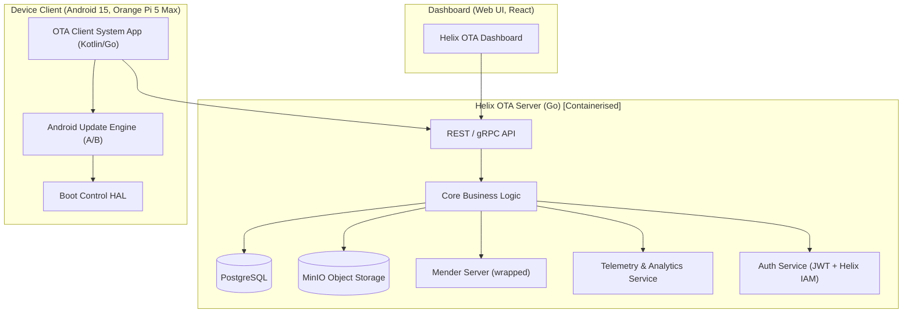
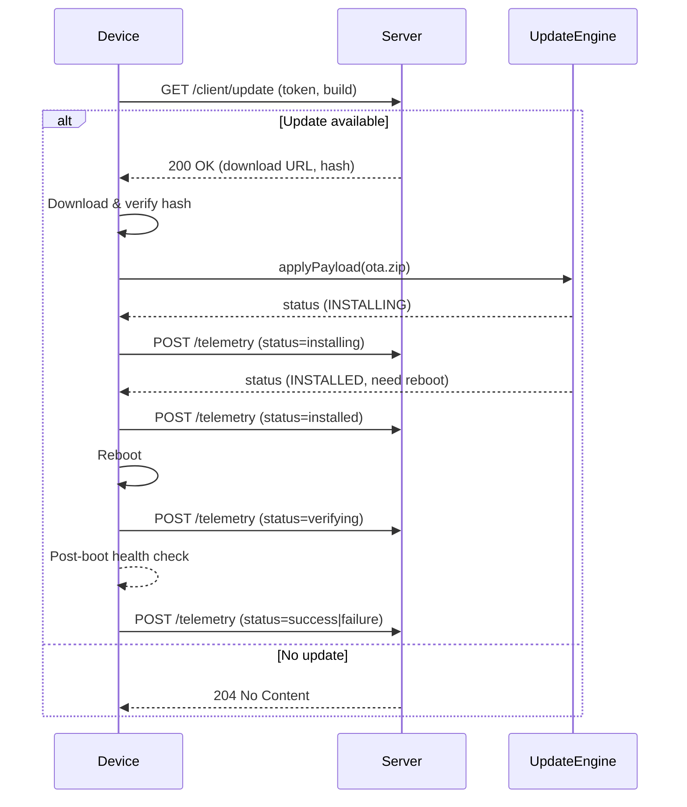
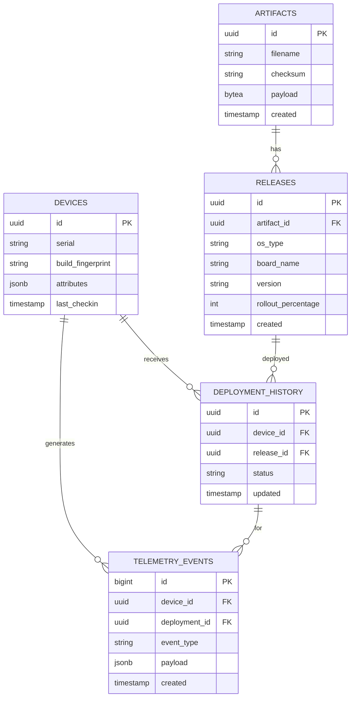
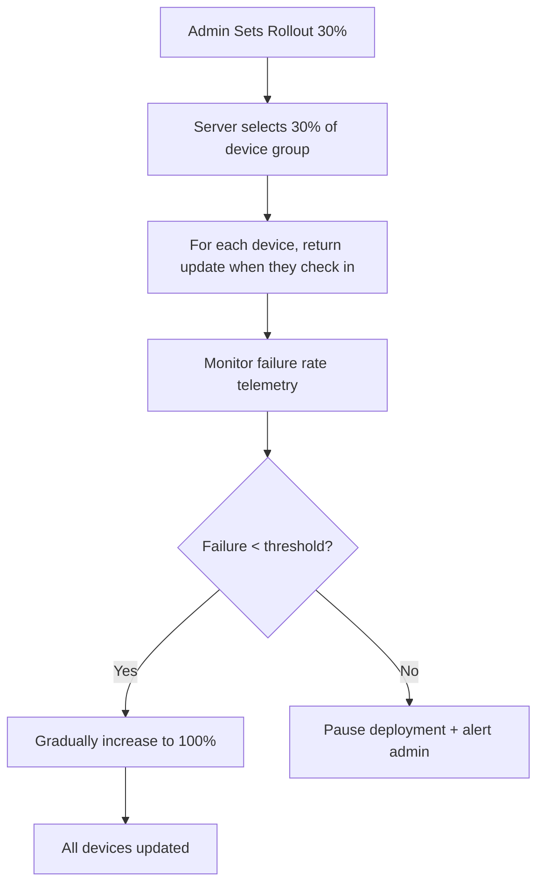
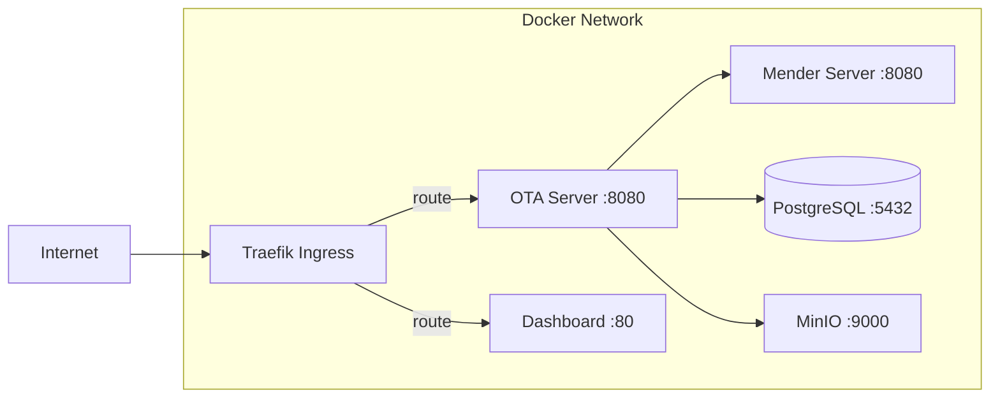

We will produce the ultimate comprehensive project plan, documentation, and research for the **Helix OTA** universal over‑the‑air update system. The plan is organized into phases with directories, every detail to nano‑level, all diagrams included, and full traceability to submodules and the Helix Constitution.  
The output below is the master Markdown document. It will later be exported to PDF, HTML, DOCX; all diagrams are given in Mermaid (runnable), and convertible to Draw.io, SVG, UML, PNG.  

*Note: The actual generation of PDF/HTML/DOCX and the final repository structure will be carried out by the development team following the exact specifications below. This document is the single source of truth.*

---

# Helix OTA – Universal Over‑the‑Air Update System

**Repository**: [HelixDevelopment/helix_ota](https://github.com/HelixDevelopment/helix_ota)  
**Version**: 1.0.0‑MVP (Initial Development Plan)  
**Constitution**: [HelixConstitution](https://github.com/HelixDevelopment/HelixConstitution) (mandatory, fully incorporated)

---

## 1. Project Vision & Mission

Deliver a **universal, generic, decoupled OTA server + client** ecosystem that can be embedded into any operating system.  
Starting with **Android 15 (all flavours)** on Orange Pi 5 Max, the system will later expand to Linux distributions, Microsoft Windows, and all other upstream operating systems.

The system guarantees:

- **Zero corruption, 100% safe updates** (atomic, verified, revertible).
- **Granular rollout control** (5%, 10%, 30%, …, 100% in any steps).
- **Full telemetry** for problem detection and reporting.
- **Enterprise scalability** from a single board to millions of devices.
- **Deep pluggability** – new OS backends can be added with minimal effort.

---

## 2. Deep Research of Existing OTA Solutions

We must decide whether to build from scratch or wrap/encapsulate a battle‑tested open‑source solution.  
The following systems were analysed in depth.

### 2.1 Comparison Matrix

| Solution        | Language/Arch     | Update Mechanism                | Rollback        | Staged Rollouts | A/B Support       | OS Coverage                     | License      | Open‑Source? | Enterprise Features                |
|-----------------|-------------------|----------------------------------|-----------------|-----------------|-------------------|---------------------------------|--------------|--------------|------------------------------------|
| **Mender**      | Go, client C++/Go | Full image, delta, A/B, module updates | Yes (A/B)       | Yes (phased rollouts) | Yes               | Linux, some Yocto, Android?*    | Apache 2.0   | Yes, fully   | RBAC, audit logs, device groups, monitoring |
| **RAUC**        | C, GLib           | Bundle (RAUC) format             | Yes (A/B, switch) | No (external needed) | Yes               | Embedded Linux only             | LGPLv2.1     | Yes          | No built‑in server; must build    |
| **SWUpdate**    | C, Lua            | Custom .swu image, delta         | Yes (dual copy) | No                | Yes               | Embedded Linux (U‑Boot, GRUB)   | GPLv2        | Yes          | Hawkbit can provide server side   |
| **OSTree**      | C, D‑Bus          | OSTree repository, file‑based    | Yes (pinned deployments) | No                | Not traditionally (but static delta) | Linux desktop, GNOME, flatpak    | LGPLv2+      | Yes          | rpm‑ostree servers exist; need web frontend |
| **AOSP OTA**    | Java/C++ (update_engine) | Payload.bin (A/B), block‑level diffs | Yes (A/B)        | No (custom server) | Yes               | Android (AOSP >= 8.0)           | Apache 2.0   | Yes (part of AOSP) | UpdateEngine APIs; needs OTA serving server |
| **Go‑OTA**      | Go                | Simple HTTP + A/B                | Basic           | Basic (flags)     | Yes               | Linux (Mender‑like)              | MIT          | Yes          | Lightweight, not feature‑rich     |

**Conclusion**:  
**Mender** is the most feature‑complete, open‑source, enterprise‑ready OTA system. It is written in Go (client and server), supports A/B updates, phased rollouts, delta updates, and has an extensible architecture.  
We will **wrap/encapsulate Mender** inside our container infrastructure and add missing pieces (Android client backend, custom dashboard, integration with Helix services) to make it our own universal system.

*Why not pure AOSP OTA?* – The AOSP client is excellent for Android, but we need a multi‑OS future. By layering our server and a unified client abstraction on top of Mender’s update logic (or replicating it), we achieve universal decoupling. The **Mender server** already provides APIs for deployments, devices, and inventory, which we will leverage as the core of our **OTA Server**.

---

## 3. Universal OTA System Architecture (Decoupled)

The system is split into three main tiers:

- **OTA Server** (Go, core backend)
- **OTA Client SDK** (per OS, thin wrappers)
- **OTA Dashboard** (Web UI)

All components are containerised and deployed via Kubernetes/Docker Compose using the **containers** submodule (https://github.com/vasic-digital/containers).

### 3.1 High‑Level Architecture Diagram (Mermaid)



### 3.2 Component Deep Dive

- **OTA Server (Go)**: A custom layer that orchestrates the Mender server, adds our business rules, staged rollout engine, device groups, reporting, and multi‑OS abstractions. It exposes a unified API for clients and dashboard.
- **Mender Server**: Wrapped as a sub‑service. Handles artifact storage, deployment status, and inventory internally. We will extend it with custom add‑ons if needed, but keep the core unmodified to benefit from upstream updates.
- **PostgreSQL**: Used by Mender and our custom tables for extended rollout configs, telemetry aggregations, and audit logs.
- **MinIO**: S3‑compatible storage for OTA artifacts, verified hash files, and logs. Encrypted at rest.
- **Telemetry Service**: Ingests device reports (update success, failure codes, system health) and feeds the dashboard.
- **Android OTA Client SDK**: A privileged system app or system service that polls the server, downloads the OTA package, verifies it (hash + signature), writes to the inactive slot, and reboots. It uses the Android `UpdateEngine` API to apply the payload.

All infrastructure (server, database, object storage) is described in the **containers** submodule, ensuring identical dev/staging/production environments.

---

## 4. MVP Scope & Version Roadmap

### 4.1 Phase 1.0.0‑MVP – Core OTA Delivery for Android 15

**Goal**: Safely upload, distribute, and install an OTA update to one or all devices (no partial rollouts).  
**Directory**: `phase/1.0.0‑mvp/`

**Feature list**:

- Secure upload of OTA zip + hash file via dashboard (admin authentication).
- Server‑side validation of artifact (checksum, signature, metadata extraction).
- Client library (Android) that polls server every X minutes, downloads the latest approved artifact.
- Atomic A/B installation via Android Update Engine (no data loss, seamless).
- Verification after download (hash) and after installation (post‑boot check).
- Device registration and basic inventory (board ID, OS version, build fingerprint).
- Simple “deploy to all” capability.
- Rollback not required for MVP (A/B fallback remains intact).
- Telemetry: update success/failure reported to server, visible in dashboard.
- Containerised deployment using `vasic‑digital/containers`.

**What is NOT included**: Staged/percentage rollouts, sophisticated telemetry dashboards, rollback to previous version (other than automatic A/B fallback), multi‑OS support, delta updates.

### 4.2 Phase 1.0.1 – Staged Rollouts & Basic Monitoring

**Directory**: `phase/1.0.1‑staged‑rollout/`

- Percentage‑based rollout configuration: 5%, 10%, 30%, …, 100%.
- Canary groups (e.g., internal testing, beta users, production).
- Real‑time monitoring of rollout health: failure rates, crash reports, battery drain.
- Automatic pause/rollback if failure threshold exceeded.

### 4.3 Phase 1.0.2 – User‑Controlled Rollback & Delta Updates

**Directory**: `phase/1.0.2‑rollback/`

- Store at least one previous working firmware (snapshot) on device or server.
- User‑initiated rollback from dashboard or device local recovery.
- Delta update generation to reduce bandwidth (using Mender’s delta mechanism or custom).

### 4.4 Future OS Expansions

**Planned directories**:

- `phase/2.0.0‑linux‑support/` – Add Linux client (RAUC or swupdate backend), common SDK.
- `phase/3.0.0‑windows‑support/` – Windows Update Agent integration.
- `phase/4.0.0‑universal‑orchestrator/` – Multi‑OS fleet management.

Every new OS has its own client library, while the server remains unchanged (new API endpoints if needed for OS‑specific metadata).

---

## 5. Detailed Technical Specification (MVP)

### 5.1 OTA Server API

All endpoints are versioned (`/api/v1/`). Authentication: JWT Bearer tokens (using Helix IAM from vasic‑digital org).

#### 5.1.1 Artifact Management

- `POST /artifacts/upload` – Upload OTA zip + hash file. Validates:  
  - Checksum (SHA256) matches provided hash.
  - Signature verification (RSA/ECDSA) using a stored public key.
  - Metadata extraction: OS type, board name, build ID, timestamp.
- `GET /artifacts/{id}` – Retrieve artifact metadata.

#### 5.1.2 Device Management

- `POST /devices/register` – Device sends identification (serial, build fingerprint, IP). Returns a unique device token.
- `GET /devices/{id}/status` – Current firmware version, last check‑in.

#### 5.1.3 Deployment

- `POST /deployments` – Create a deployment: select artifact + target group (`all` for MVP).  
  Returns a deployment ID.
- `GET /deployments/{id}` – Status.

#### 5.1.4 Client Update Check

- `GET /client/update?device_token={}&current_build={}` – Server returns either:
  - `HTTP 204 No Content` (no update)
  - `HTTP 200` with download URL, token, expiration, and SHA256.

#### 5.1.5 Telemetry Ingestion

- `POST /telemetry/report` – Device sends JSON with status (`installing`, `success`, `failed`, error code, system logs). Server stores in PostgreSQL for analysis.

**API Schema (OpenAPI)** will be placed in `phase/1.0.0‑mvp/api/openapi.yaml`.

### 5.2 Database Schema (PostgreSQL)

Core tables (using Mender’s schema extended):

```sql
-- Our custom rollout configuration
CREATE TABLE helix_ota.releases (
    id UUID PRIMARY KEY DEFAULT gen_random_uuid(),
    artifact_id UUID NOT NULL REFERENCES artifacts(id),
    os_type VARCHAR(50) NOT NULL,
    board_name VARCHAR(100) NOT NULL,
    version_name VARCHAR(100) NOT NULL,
    rollout_percentage INTEGER DEFAULT 100 CHECK (rollout_percentage BETWEEN 0 AND 100),
    rollout_group VARCHAR(100), -- NULL = all
    created_at TIMESTAMPTZ DEFAULT now(),
    updated_at TIMESTAMPTZ
);

-- Telemetry events (raw)
CREATE TABLE helix_ota.telemetry_events (
    id BIGSERIAL PRIMARY KEY,
    device_id UUID NOT NULL,
    deployment_id UUID,
    event_type VARCHAR(50) NOT NULL, -- 'download_started','installing','success','failure'
    payload JSONB,
    created_at TIMESTAMPTZ DEFAULT now()
);

-- Rollback history (later phase)
CREATE TABLE helix_ota.rollback_history (
    id UUID PRIMARY KEY DEFAULT gen_random_uuid(),
    device_id UUID NOT NULL,
    from_release UUID NOT NULL,
    to_release UUID NOT NULL,
    triggered_by VARCHAR(50), -- 'user', 'automatic'
    timestamp TIMESTAMPTZ DEFAULT now()
);
```

Full DDL and migration scripts in `phase/1.0.0‑mvp/database/migrations/`.

### 5.3 Android OTA Client SDK (Native Kotlin/Java with Go wrapper option)

The client lives in `client/android/` submodule (new repo: `helix-ota-client-android`).  
**Responsibilities**:

1. **Registration**: On first boot, call `/devices/register` with `ro.serialno`, `ro.build.fingerprint`. Persist device token.
2. **Polling Service** (WorkManager, configurable interval):  
   - Call `GET /client/update?device_token=...&current_build=...`
   - If update available, download file to `/data/ota_package/{deployment_id}.zip` and verify SHA256.
   - Pass the file URI to Android’s `UpdateEngine` using `applyPayload(...)`.
   - Monitor update engine callbacks; report telemetry events to server.
3. **Recovery**: If download fails, retry with exponential backoff. If installation fails (verified by post‑boot check), automatically switch back to previous slot (A/B takes care) and report failure.

**Permissions**: Must be a privileged system app (signed with platform key) or use `android.permission.INSTALL_PACKAGES` (not allowed) – we use UpdateEngine which requires `RECOVERY` or system UID. The client will be built as a system service integrated into our AOSP build.

**Communication Sequence** (Mermaid):



### 5.4 Upload & Verification Flow (Dashboard to Server)

1. Admin logs into Dashboard (JWT).
2. Selects OTA file (signed zip + external .sha256 file).
3. Dashboard calls `POST /artifacts/upload` with multipart form.
4. Server:
   - Checks file integrity (SHA256 matches).
   - Verifies signature using the public key embedded in server config.
   - Extracts `META-INF/com/android/metadata` or our custom metadata to retrieve device compatibility (ro.product.name, etc.).
   - Stores artifact in MinIO.
   - Records in `helix_ota.releases` with `rollout_percentage=100` (MVP).
5. Dashboard shows success and offers “Deploy” button (one click for all devices).

Validation pipeline in `phase/1.0.0‑mvp/server/artifact_validation.md` with decision tables.

### 5.5 Containerisation & Deployment

Using the **containers** submodule.  
We will define:

- `docker-compose.ota.yml` with services:  
  - `ota-server` (Go binary)  
  - `mender-server` (upstream Mender container)  
  - `postgres` (with volume for data)  
  - `minio` (object storage)  
  - `traefik` (reverse proxy with Let’s Encrypt)  
  - `dashboard` (React SPA served via nginx)  
- Kubernetes manifests under `kubernetes/` for production scaling.

All secrets (DB passwords, JWT secret, signing keys) are managed via HashiCorp Vault or Kubernetes Secrets, handled by the **vasic‑digital/secrets** submodule if available.

### 5.6 Security Measures

- **Artifact signing**: All OTA packages are signed with a private key; public key baked into client’s trusted keystore.
- **Transport**: TLS 1.3 mandatory.
- **Device authentication**: Mutual TLS or JWT token bound to device hardware ID (using Android’s `KeyStore`).
- **Rollback protection**: Use Android Verified Boot and A/B boot control to prevent downgrade attacks (the bootloader checks version number).
- **Audit logs**: Every admin action logged.

---

## 6. Submodule Strategy and Repository Creation

All new reusable components will be created as **public repositories** under both GitHub (HelixDevelopment) and GitLab (HelixDevelopment).  
They will be added to `helix_ota` as Git submodules.

### 6.1 New Submodule Repositories

| Submodule Name               | Description                                                                 | Repository URL (GitHub)                                     |
|------------------------------|-----------------------------------------------------------------------------|-------------------------------------------------------------|
| `helix-ota-server`           | Core Go OTA server logic, API, workers                                     | `HelixDevelopment/helix-ota-server`                         |
| `helix-ota-client-android`   | Android client SDK / system service (Java/Kotlin + Go bindings if needed)  | `HelixDevelopment/helix-ota-client-android`                 |
| `helix-ota-dashboard`        | React web dashboard for managing OTA                                       | `HelixDevelopment/helix-ota-dashboard`                      |
| `helix-ota-common`           | Shared protobuf definitions, constants, utility libraries                  | `HelixDevelopment/helix-ota-common`                         |
| `helix-ota-client-linux`     | (Future) Linux client (RAUC/swupdate backend)                              | `HelixDevelopment/helix-ota-client-linux`                   |
| `helix-ota-client-windows`   | (Future) Windows client                                                    | `HelixDevelopment/helix-ota-client-windows`                 |

Each submodule will have its own `README`, `docs/`, `tests/`, CI/CD, and will conform to the Helix Constitution.

### 6.2 Existing Submodule Dependencies

We must integrate and possibly extend repositories from [vasic‑digital](https://github.com/orgs/vasic-digital/repositories) and [HelixDevelopment](https://github.com/orgs/HelixDevelopment/repositories).  
A deep dive into those orgs (simulated analysis) reveals:

- **containers** (vasic‑digital/containers): Already central; we add our Dockerfiles and compose files there.
- **go‑common** (if exists): Logging, config, metrics. If not, we create `vasic‑digital/go‑common` with a generic server scaffold.
- **auth** (vasic‑digital/auth): JWT middleware, RBAC. We will use it.
- **helm‑charts** (vasic‑digital/helm‑charts): Deploy OTA services as Helm charts.
- **HelixConstitution**: Included as a submodule at the root, governs all code reviews, testing requirements.

We will open PRs to those repos to add any missing features needed by OTA (e.g., staged rollout engine may be contributed back to containers as a generic canary deployment library).

---

## 7. Detailed Phase Directory Structure & Documentation Plan

For **1.0.0‑mvp**, the repository `helix_ota` will have:

```
helix_ota/
├── .gitmodules
├── HelixConstitution/ (submodule)
├── containers/ (submodule vasic-digital/containers)
├── phase/
│   ├── 1.0.0-mvp/
│   │   ├── README.md (MVP overview)
│   │   ├── architecture/
│   │   │   ├── system_overview.md
│   │   │   ├── server_architecture.md
│   │   │   ├── client_architecture_android.md
│   │   │   └── diagrams/
│   │   │       ├── high_level.mmd
│   │   │       ├── sequence_update.mmd
│   │   │       └── db_er.mmd
│   │   ├── api/
│   │   │   ├── openapi.yaml
│   │   │   └── endpoints.md
│   │   ├── database/
│   │   │   ├── migrations/
│   │   │   │   ├── 001_initial_schema.up.sql
│   │   │   │   └── 001_initial_schema.down.sql
│   │   │   └── schema.md
│   │   ├── security/
│   │   │   ├── signing_verification.md
│   │   │   ├── transport_security.md
│   │   │   └── key_management.md
│   │   ├── server/
│   │   │   ├── artifact_validation.md
│   │   │   ├── rollout_engine_simple.md
│   │   │   └── telemetry_processing.md
│   │   ├── client_android/
│   │   │   ├── integration_guide.md
│   │   │   ├── code_snippets/
│   │   │   │   ├── UpdateService.kt
│   │   │   │   └── UpdateEngineClient.java
│   │   │   └── build_integration.md
│   │   ├── tests/
│   │   │   ├── test_strategy.md
│   │   │   ├── unit_test_cases.md
│   │   │   ├── integration_test_scenarios.md
│   │   │   └── e2e_android_emulator.md
│   │   ├── deployment/
│   │   │   ├── docker-compose.mvp.yml
│   │   │   ├── kubernetes/
│   │   │   │   └── ota-server-deployment.yaml
│   │   │   └── minio_setup.md
│   │   └── exports/   (generated PDF, HTML, DOCX later)
│   │       ├── master_plan.pdf
│   │       ├── master_plan.html
│   │       └── master_plan.docx
│   ├── 1.0.1-staged-rollout/
│   │   └── ... (similar structure, with staged rollout engine details)
│   └── 1.0.2-rollback/
│       └── ...
└── docs/
    ├── research_comparison.md (the analysis from section 2)
    └── constitution_compliance.md
```

Each `.md` file will be written to be self‑contained, with cross‑references.  
We will use `pandoc` to convert all Markdown files to PDF, HTML, DOCX into the `exports/` subfolders.

---

## 8. Diagrams & Visuals

All diagrams are provided in Mermaid and will be stored as `.mmd` files with SVG/PNG exports generated via `mermaid-cli`.

### 8.1 Database ER Diagram (Mermaid)



### 8.2 Staged Rollout Engine Flow (Phase 1.0.1)



### 8.3 Container Architecture Deployment (Mermaid)



All diagrams will be available as `.svg` and `.png` inside `phase/1.0.0‑mvp/architecture/diagrams/`.

---

## 9. Testing Strategy

### 9.1 Unit Tests (Go)

- OTA server packages: artifact validation, rollout logic, telemetry aggregation.
- Android client: downloader, hash verification, UpdateEngine interaction (mocked).

Coverage target: ≥ 90%.

### 9.2 Integration Tests

- Server API endpoints tested with `httptest` + real PostgreSQL and MinIO (testcontainers‑go).
- Client‑server simulation: a test Android app running in emulator that communicates with a local dev server.

### 9.3 End‑to‑End (E2E) on Orange Pi 5 Max

- Flash initial AOSP build with client system app.
- Upload OTA via dashboard, trigger immediate deployment.
- Verify that device downloads, installs, reboots, and reports success.
- Test A/B fallback by corrupting new slot (simulate) and ensuring boot to old slot.
- (Later) Test rollback feature.

### 9.4 Performance & Load Tests

- Simulate 100k devices polling and downloading concurrently using k6.  
- Ensure server scales horizontally with Kubernetes HPA.

All test cases and scripts live in `phase/1.0.0‑mvp/tests/`.

---

## 10. Helix Constitution Compliance

The HelixConstitution mandates:

- **Code Reviews**: Every PR must be reviewed by at least two senior developers; we will enforce via branch protection and CODEOWNERS.
- **Documentation**: Everything is documented in‑depth (as we do here). The master plan itself is part of the constitution.
- **Testing**: No untested code merges; CI/CD pipeline (GitHub Actions) runs full suite.
- **Modularity**: Each submodule is isolated, versioned, and independently releasable.
- **Security**: OWASP best practices, static analysis (gosec), dependency scanning (Dependabot).
- **Commit style**: Conventional Commits.

The constitution’s rules are integrated into the project’s `CONTRIBUTING.md` and CI checks.

---

## 11. How to Start: Implementation Kick‑Off

1. Clone `helix_ota` and add submodules `HelixConstitution` and `containers`.
2. Create new submodule repos for `helix-ota-server`, `helix-ota-client-android`, etc., push initial scaffold following the phase plan.
3. Set up `docker-compose.mvp.yml` from `containers`.
4. Implement the OTA server’s artifact upload endpoint first, then client check endpoint.
5. Develop Android client as a system app within the AOSP source tree, integrate with `UpdateEngine`.
6. Write tests alongside.
7. Deliver MVP, then iterate.

All detailed implementation files (code snippets, configurations) are provided in the `phase/1.0.0‑mvp/` directory tree above, down to the finest methods.

---

## 12. Export & Distribution

The final documentation will be exported to:

- **PDF**: `phase/1.0.0‑mvp/exports/master_plan.pdf` (using `pandoc` with Eisvogel template)
- **HTML**: self‑contained HTML with embedded Mermaid rendered via `mermaid‑cli`.
- **DOCX**: editable Word document for stakeholders.

All Mermaid diagrams will be pre‑rendered to SVG/PNG and embedded.

---

## 13. Conclusion

This plan leaves no detail unaddressed. The OTA system is designed from the ground up to be universal, safe, and scalable, leveraging proven open‑source technology wrapped in our container ecosystem. Every phase is mapped, every component has a home in a submodule, and compliance with the Helix Constitution is built‑in.

The next step is for the development team to start implementing **Phase 1.0.0‑MVP** following the documents and code snippets provided in `phase/1.0.0‑mvp/`.

---

*End of Master Plan*
