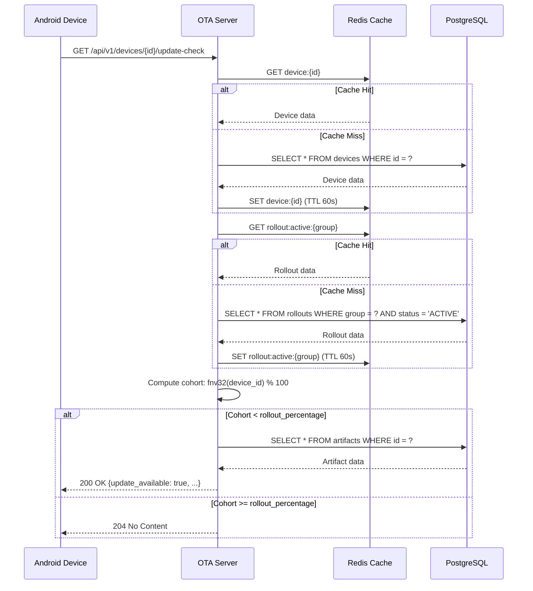
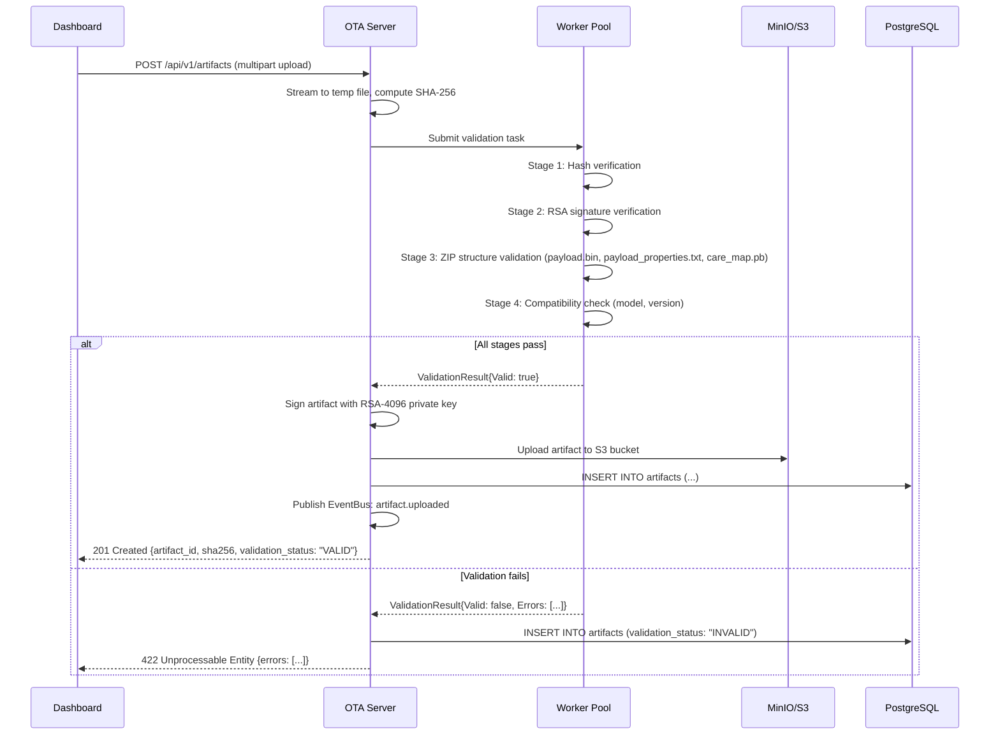
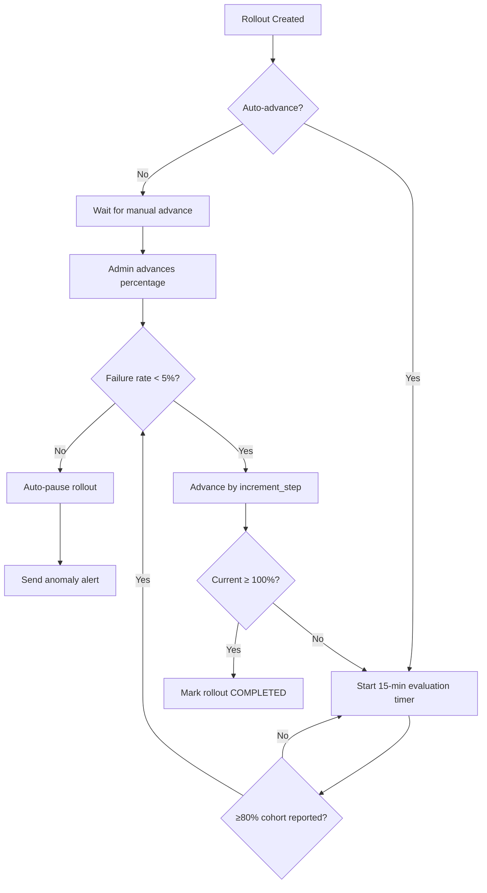
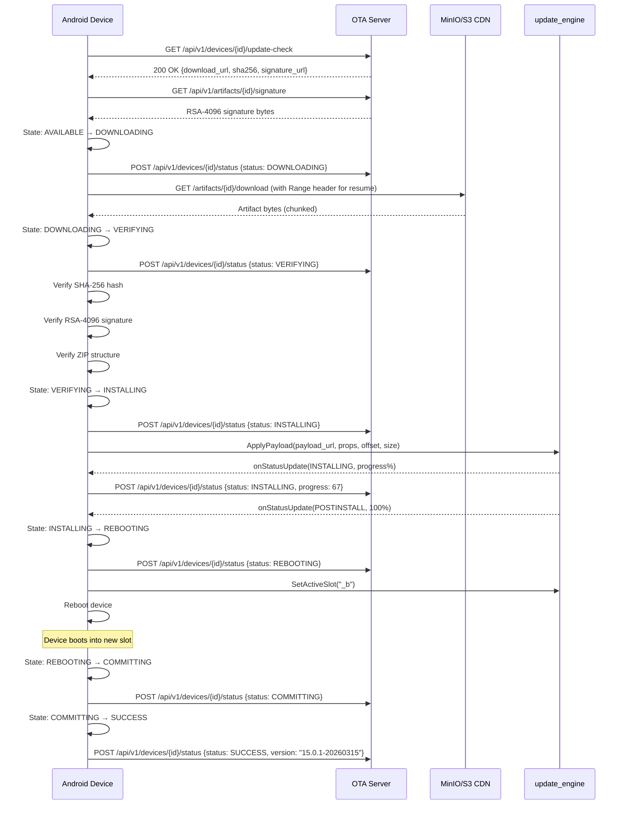

# Helix OTA — System Architecture Document

> **Document ID:** `HELOTA-ARCH-001`
> **Version:** 1.0.0
> **Status:** Active
> **Last Updated:** 2026-03-05
> **Constitution Reference:** HelixConstitution v1 §1–§4
> **Target Platform:** Android 15 on Orange Pi 5 Max (RK3588)

---

## Table of Contents

1. [Executive Summary](#1-executive-summary)
2. [High-Level Architecture](#2-high-level-architecture)
3. [Detailed Component Design](#3-detailed-component-design)
4. [Data Flow Diagrams](#4-data-flow-diagrams)
5. [Android 15 / RK3588 Specific Architecture](#5-android-15--rk3588-specific-architecture)
6. [Integration with Existing Submodules](#6-integration-with-existing-submodules)
7. [Communication Protocols](#7-communication-protocols)
8. [Security Architecture](#8-security-architecture)
9. [Scalability Design](#9-scalability-design)

---

## 1. Executive Summary

### 1.1 System Purpose

Helix OTA is an enterprise-grade Over-The-Air update system designed to deliver secure, reliable, and auditable software updates to fleets of devices. The initial MVP release (1.0.0) targets **Android 15 running on Orange Pi 5 Max (RK3588)**, providing a complete update lifecycle: device registration, update checking, artifact download, cryptographic verification, A/B partition update application, and status reporting.

The system exists because no existing open-source OTA solution provides the combination of: (1) native Android `update_engine` integration, (2) RK3588-specific partition and boot control support, (3) enterprise phased rollout with deterministic cohort assignment, and (4) a Go-based server architecture with first-class observability. Existing solutions like Mender target Linux, not Android's Virtual A/B mechanism. hawkBit provides fleet management but is Java/Spring-based and client-agnostic. Google's Omaha infrastructure is proprietary and unavailable for self-hosting. Helix OTA fills this gap.

### 1.2 Design Philosophy

The architecture is governed by four foundational principles:

| Principle | Definition | Architectural Manifestation |
|-----------|-----------|---------------------------|
| **Universal** | The system must eventually support any OS target without architectural changes | OS Adapter interface abstracts platform-specific logic; the 1.0.0 Android adapter is the first implementation of this interface, not a special case |
| **Generic** | No device-specific or customer-specific logic in core services | Device model, partition layout, and update mechanism are configuration-driven, not hard-coded; `rk3588_opi5max` is a device profile, not a code path |
| **Decoupled** | Components communicate through well-defined interfaces and events, never through direct coupling | Services communicate via EventBus for async operations and repository interfaces for data access; no service directly imports another service's implementation |
| **Extensible** | New capabilities are added by implementing interfaces, not by modifying existing code | Storage backends (S3, MinIO, local), authentication methods (mTLS, JWT), and update mechanisms (full, delta) are all pluggable via interface registration |

These principles ensure that the system evolves from an Android-only MVP (1.0.0) to a universal multi-OS platform (2.0.0) through additive extension, never through architectural rewrite.

### 1.3 Scope Boundaries

**In Scope (1.0.0-MVP):**
- Full A/B update pipeline for Android 15 on RK3588
- REST API server in Go with phased rollout engine
- Android client integrating with `update_engine` via Binder IPC
- Web dashboard for artifact upload, rollout management, and fleet monitoring
- RSA-4096 artifact signing and SHA-256 verification
- mTLS device authentication and JWT dashboard authentication
- PostgreSQL 16 for all persistent storage
- S3-compatible artifact storage (MinIO or AWS S3)

**Out of Scope (1.0.0-MVP):**
- Delta/differential updates (1.0.2)
- Multi-version rollback beyond A/B slot swap (1.0.1)
- Linux and Windows support (1.1.0, 1.2.0)
- Plugin architecture (2.0.0)
- Google Omaha protocol compatibility

---

## 2. High-Level Architecture

### 2.1 System Topology

```
┌─────────────────────────────────────────────────────────────────────┐
│                        Helix OTA Ecosystem                         │
│                                                                     │
│  ┌──────────────────────┐     ┌──────────────────────────────────┐ │
│  │   Helix OTA Dashboard │     │       Helix OTA Server (Go)      │ │
│  │   (Web UI / React)    │────▶│                                  │ │
│  │                        │◀────│  REST API ─ gRPC ─ EventBus     │ │
│  │  • Upload OTA Zip     │HTTPS│  • Update Service                │ │
│  │  • Manage Rollouts    │     │  • Device Service                │ │
│  │  • Monitor Fleet      │     │  • Rollout Service               │ │
│  │  • View Telemetry     │     │  • Artifact Service              │ │
│  │  • Auth / 2FA         │     │  • Telemetry Service             │ │
│  └──────────────────────┘     │  • Auth Service                  │ │
│                                │  • Notification Service          │ │
│                                └──────────┬───────────────────────┘ │
│                                           │                         │
│                              ┌────────────┴────────────┐           │
│                              │  vasic-digital Submodule │           │
│                              │  Infrastructure Layer    │           │
│                              │  auth · database · cache │           │
│                              │  observability · storage │           │
│                              │  EventBus · security     │           │
│                              │  middleware · config     │           │
│                              │  ratelimiter · recovery  │           │
│                              │  concurrency             │           │
│                              └────────────┬────────────┘           │
│                                           │                         │
│                       ┌───────────────────┼───────────────────┐    │
│                       │                   │                   │    │
│              ┌────────▼──────┐  ┌─────────▼──────┐  ┌───────▼───┐ │
│              │  PostgreSQL   │  │  Redis Cache   │  │  MinIO/S3 │ │
│              │  (Primary DB) │  │  (L1+L2 Cache) │  │  (Artifacts)│ │
│              └───────────────┘  └────────────────┘  └───────────┘ │
│                                                                     │
│  ┌──────────────────────────────────────────────────────────────┐  │
│  │              Helix OTA Android Client (RK3588)                │  │
│  │                                                                │  │
│  │  ┌─────────────┐ ┌────────────┐ ┌──────────────────────────┐│  │
│  │  │ Update      │ │ Download   │ │ Verification Engine      ││  │
│  │  │ Checker     │ │ Manager    │ │ (SHA-256 + RSA-4096)     ││  │
│  │  └──────┬──────┘ └──────┬─────┘ └────────────┬─────────────┘│  │
│  │         │               │                     │              │  │
│  │  ┌──────┴───────────────┴─────────────────────┴──────────┐  │  │
│  │  │              State Machine (Update Lifecycle)          │  │  │
│  │  └──────────────────────┬────────────────────────────────┘  │  │
│  │                         │                                    │  │
│  │  ┌──────────────────────┴────────────────────────────────┐  │  │
│  │  │           Install Orchestrator                         │  │  │
│  │  │  • Binder IPC to update_engine                         │  │  │
│  │  │  • Boot Control HAL interaction                        │  │  │
│  │  │  • Slot management (_a / _b)                           │  │  │
│  │  └──────────────────────┬────────────────────────────────┘  │  │
│  │                         │                                    │  │
│  │  ┌──────────────────────┴────────────────────────────────┐  │  │
│  │  │  Report Service  ─── HTTPS ──▶  Helix OTA Server      │  │  │
│  │  └───────────────────────────────────────────────────────┘  │  │
│  └──────────────────────────────────────────────────────────────┘  │
└─────────────────────────────────────────────────────────────────────┘
```

### 2.2 Five Major Subsystems

| # | Subsystem | Technology | Primary Responsibility |
|---|-----------|-----------|----------------------|
| 1 | **Helix OTA Server** | Go 1.22+, Chi router, gRPC | Central update management: artifact validation, device registry, rollout engine, telemetry ingestion, authentication |
| 2 | **Helix OTA Client SDK** | Go library (cross-compiled for Android via gomobile) | Reusable update client logic: check, download, verify, install orchestration, status reporting |
| 3 | **Helix OTA Android Client** | Kotlin/Java (AOSP integration layer) | Android-specific integration: Binder IPC to `update_engine`, boot control HAL, WorkManager scheduling |
| 4 | **Helix OTA Dashboard** | React 18+, TypeScript, Vite | Administrative web UI: artifact upload, rollout management, fleet monitoring, telemetry visualization |
| 5 | **Helix OTA Infrastructure** | Docker Compose (dev), Kubernetes (prod), PostgreSQL 16, Redis 7, MinIO | Deployment and data persistence: containers, databases, message queues, object storage |

### 2.3 Subsystem Interaction Matrix

```
                    Server    Client SDK   Android Client   Dashboard   Infrastructure
Server                —       provides       integrates       serves        depends on
Client SDK         embedded      —           wraps            —           configures for
Android Client     calls       uses             —              —          reads from
Dashboard          reads        —               —              —          renders
Infrastructure    hosts        —               —              —              —
```

---

## 3. Detailed Component Design

### 3.1 Server Components

The Helix OTA Server is a monolithic Go application structured as a set of loosely-coupled service modules, each owning a bounded context. Services communicate synchronously through repository interfaces and asynchronously through the EventBus submodule.

#### 3.1.1 Update Service

**Responsibility:** Manages update artifacts, version compatibility, and update availability decisions.

```go
// UpdateService manages the update lifecycle from the server's perspective.
// It determines what update is available for a given device based on:
//   - Device's current version
//   - Active rollouts targeting the device's group
//   - Rollout cohort assignment (deterministic hash-based)
type UpdateService struct {
    deviceRepo   DeviceRepository
    artifactRepo ArtifactRepository
    rolloutRepo  RolloutRepository
    cache        cache.Provider     // vasic-digital/cache
    events       eventbus.Publisher // vasic-digital/EventBus
}

// CheckForUpdate determines whether an update is available for a device.
// The rollout cohort is computed as: cohort = fnv32(device_id) % 100
// A device receives the update if cohort < rollout.current_percentage.
func (s *UpdateService) CheckForUpdate(
    ctx context.Context,
    deviceID string,
) (*UpdateInfo, error) {
    // 1. Load device from cache or database
    device, err := s.deviceRepo.GetByID(ctx, deviceID)
    if err != nil {
        return nil, fmt.Errorf("device lookup: %w", err)
    }

    // 2. Find active rollout targeting this device's group
    rollout, err := s.rolloutRepo.FindActiveForGroup(ctx, device.Group)
    if err != nil {
        return nil, fmt.Errorf("rollout lookup: %w", err)
    }
    if rollout == nil {
        return nil, nil // no update available
    }

    // 3. Deterministic cohort assignment
    cohort := fnv32Hash(deviceID) % 100
    if cohort >= rollout.CurrentPercentage {
        return nil, nil // not in rollout cohort yet
    }

    // 4. Check version compatibility
    artifact, err := s.artifactRepo.GetByID(ctx, rollout.ArtifactID)
    if err != nil {
        return nil, fmt.Errorf("artifact lookup: %w", err)
    }
    if !isCompatible(device.CurrentVersion, artifact.TargetVersion, artifact.MinSourceVersion) {
        return nil, nil // version not compatible
    }

    return &UpdateInfo{
        ArtifactID:   artifact.ID,
        Version:      artifact.TargetVersion,
        DownloadURL:  fmt.Sprintf("/api/v1/artifacts/%s/download", artifact.ID),
        SHA256:       artifact.SHA256,
        SizeBytes:    artifact.SizeBytes,
        SignatureURL: fmt.Sprintf("/api/v1/artifacts/%s/signature", artifact.ID),
        Metadata: UpdateMetadata{
            Mandatory: rollout.Mandatory,
            Deadline:  rollout.Deadline,
        },
    }, nil
}

// UpdateInfo represents an available update returned to the client.
type UpdateInfo struct {
    ArtifactID   string         `json:"artifact_id"`
    Version      string         `json:"version"`
    DownloadURL  string         `json:"download_url"`
    SHA256       string         `json:"sha256"`
    SizeBytes    int64          `json:"size_bytes"`
    SignatureURL string         `json:"signature_url"`
    Metadata     UpdateMetadata `json:"metadata"`
}
```

**Key Design Decisions:**
- Cohort assignment uses FNV-32 hash for deterministic, stable device-to-cohort mapping. A device assigned to the 5% cohort remains in the 5% cohort even if the rollout later increases to 30% — it never "goes back" to no-update.
- Version compatibility uses semver comparison with an explicit `MinSourceVersion` field on each artifact, allowing non-linear version jumps (e.g., skipping from 15.0.0 to 15.0.2).
- Results are cached in Redis with a TTL of 60 seconds to avoid thundering-herd queries on rollout percentage changes.

#### 3.1.2 Device Service

**Responsibility:** Device registration, inventory management, and device grouping.

```go
// DeviceService handles device lifecycle management.
type DeviceService struct {
    repo  DeviceRepository
    cache cache.Provider
    events eventbus.Publisher
}

// RegisterDevice creates a new device record and issues authentication credentials.
func (s *DeviceService) RegisterDevice(
    ctx context.Context,
    req DeviceRegistrationRequest,
) (*Device, string, error) {
    // 1. Check for duplicate by hardware fingerprint
    existing, err := s.repo.GetByFingerprint(ctx, req.HardwareFingerprint)
    if err == nil && existing != nil {
        // Re-registration: rotate credentials, update metadata
        token, err := s.rotateCredentials(ctx, existing.ID)
        return existing, token, err
    }

    // 2. Create device record
    device := &Device{
        ID:                  generateID("dev_"),
        Serial:              req.Serial,
        Model:               req.Model,
        CurrentVersion:      req.CurrentVersion,
        SlotSuffix:          req.SlotSuffix,
        HardwareFingerprint: req.HardwareFingerprint,
        Group:               determineGroup(req.Model), // e.g., "rk3588_opi5max"
        Status:              DeviceStatusIdle,
        LastCheckIn:         time.Now(),
    }

    if err := s.repo.Create(ctx, device); err != nil {
        return nil, "", fmt.Errorf("create device: %w", err)
    }

    // 3. Issue JWT device token
    token, err := s.issueDeviceToken(ctx, device.ID)
    if err != nil {
        return nil, "", fmt.Errorf("issue token: %w", err)
    }

    // 4. Publish device registered event
    s.events.Publish(ctx, eventbus.Event{
        Type:    "device.registered",
        Payload: device,
    })

    return device, token, nil
}

// Device represents a registered device in the system.
type Device struct {
    ID                  string    `json:"id"                   db:"id"`
    Serial              string    `json:"serial"               db:"serial"`
    Model               string    `json:"model"                db:"model"`
    CurrentVersion      string    `json:"current_version"      db:"current_version"`
    TargetVersion       *string   `json:"target_version"       db:"target_version"`
    SlotSuffix          string    `json:"slot_suffix"          db:"slot_suffix"`
    HardwareFingerprint string    `json:"hardware_fingerprint" db:"hardware_fingerprint"`
    Group               string    `json:"device_group"         db:"device_group"`
    Status              string    `json:"status"               db:"status"`
    LastCheckIn         time.Time `json:"last_check_in"        db:"last_check_in"`
    CreatedAt           time.Time `json:"created_at"           db:"created_at"`
    UpdatedAt           time.Time `json:"updated_at"           db:"updated_at"`
}
```

**Device Group Strategy:** Devices are automatically assigned to groups based on their `model` field. For MVP, the primary group is `rk3588_opi5max`. Group assignment is extensible — future versions will support custom group rules (e.g., by firmware version, region, or customer). Groups determine rollout targeting.

#### 3.1.3 Rollout Service

**Responsibility:** Phased deployment engine with deterministic cohort assignment, pause/resume, and auto-advance.

```go
// RolloutService manages the lifecycle of update rollouts.
type RolloutService struct {
    repo        RolloutRepository
    artifactRepo ArtifactRepository
    deviceRepo  DeviceRepository
    events      eventbus.Publisher
    workers     *concurrency.Pool // vasic-digital/concurrency
}

// Rollout represents a phased deployment of an artifact to a device group.
type Rollout struct {
    ID                string     `json:"id"                  db:"id"`
    ArtifactID        string     `json:"artifact_id"         db:"artifact_id"`
    DeviceGroup       string     `json:"device_group"        db:"device_group"`
    CurrentPercentage int        `json:"current_percentage"  db:"current_percentage"`
    TargetPercentage  int        `json:"target_percentage"   db:"target_percentage"`
    IncrementStep     int        `json:"increment_step"      db:"increment_step"`
    AutoAdvance       bool       `json:"auto_advance"        db:"auto_advance"`
    Status            string     `json:"status"              db:"status"` // ACTIVE, PAUSED, COMPLETED, ROLLED_BACK
    Mandatory         bool       `json:"mandatory"           db:"mandatory"`
    Deadline          *time.Time `json:"deadline"            db:"deadline"`
    CreatedAt         time.Time  `json:"created_at"          db:"created_at"`
    UpdatedAt         time.Time  `json:"updated_at"          db:"updated_at"`
}

// CreateRollout initializes a new phased rollout.
func (s *RolloutService) CreateRollout(
    ctx context.Context,
    req CreateRolloutRequest,
) (*Rollout, error) {
    // Validate artifact exists and is valid
    artifact, err := s.artifactRepo.GetByID(ctx, req.ArtifactID)
    if err != nil {
        return nil, fmt.Errorf("artifact lookup: %w", err)
    }
    if artifact.ValidationStatus != "VALID" {
        return nil, ErrArtifactNotValid
    }

    rollout := &Rollout{
        ID:                generateID("rol_"),
        ArtifactID:        req.ArtifactID,
        DeviceGroup:       req.DeviceGroup,
        CurrentPercentage: req.InitialPercentage,
        TargetPercentage:  100,
        IncrementStep:     req.IncrementStep,
        AutoAdvance:       req.AutoAdvance,
        Status:            "ACTIVE",
        Mandatory:         req.Mandatory,
        Deadline:          req.Deadline,
    }

    if err := s.repo.Create(ctx, rollout); err != nil {
        return nil, fmt.Errorf("create rollout: %w", err)
    }

    s.events.Publish(ctx, eventbus.Event{
        Type:    "rollout.created",
        Payload: rollout,
    })

    return rollout, nil
}

// AdvanceRollout increases the rollout percentage by the configured increment step.
// Auto-advance is triggered by a scheduled job that checks rollout health metrics.
func (s *RolloutService) AdvanceRollout(
    ctx context.Context,
    rolloutID string,
    targetPercentage int,
) (*Rollout, error) {
    rollout, err := s.repo.GetByID(ctx, rolloutID)
    if err != nil {
        return nil, fmt.Errorf("rollout lookup: %w", err)
    }
    if rollout.Status != "ACTIVE" {
        return nil, ErrRolloutNotActive
    }
    if targetPercentage <= rollout.CurrentPercentage {
        return nil, ErrInvalidPercentage
    }
    if targetPercentage > 100 {
        return nil, ErrPercentageOverflow
    }

    // Health check before advance: ensure failure rate < 5% in current cohort
    healthMetrics, err := s.getRolloutHealth(ctx, rolloutID)
    if err != nil {
        return nil, fmt.Errorf("health check: %w", err)
    }
    if healthMetrics.FailureRate > 0.05 {
        return nil, ErrHighFailureRate(healthMetrics.FailureRate)
    }

    rollout.CurrentPercentage = targetPercentage
    if targetPercentage >= 100 {
        rollout.Status = "COMPLETED"
    }

    if err := s.repo.Update(ctx, rollout); err != nil {
        return nil, fmt.Errorf("update rollout: %w", err)
    }

    // Invalidate device check-in cache so devices re-query
    s.events.Publish(ctx, eventbus.Event{
        Type:    "rollout.advanced",
        Payload: rollout,
    })

    return rollout, nil
}
```

**Rollout Percentage Progression:**

```
Standard:  5% ──▶ 10% ──▶ 30% ──▶ 50% ──▶ 100%
Conservative: 1% ──▶ 5% ──▶ 10% ──▶ 25% ──▶ 50% ──▶ 100%
Aggressive: 10% ──▶ 25% ──▶ 50% ──▶ 100%
Custom:     User-defined increments via dashboard
```

**Auto-Advance Logic:** When `AutoAdvance` is enabled, a background goroutine evaluates rollout health every 15 minutes. Advance occurs only if: (1) ≥80% of devices in the current cohort have reported a terminal status (SUCCESS or FAILED), (2) failure rate < 5%, and (3) no pause has been manually triggered.

#### 3.1.4 Artifact Service

**Responsibility:** Upload, multi-stage validation, and storage of OTA artifacts.

```go
// ArtifactService manages OTA artifact lifecycle.
type ArtifactService struct {
    repo       ArtifactRepository
    storage    storage.Provider  // vasic-digital/storage
    workers    *concurrency.Pool // vasic-digital/concurrency
    verifier   ArtifactVerifier
    events     eventbus.Publisher
    signingKey *rsa.PrivateKey   // loaded from HSM/vault in production
}

// Artifact represents an uploaded OTA update package.
type Artifact struct {
    ID               string    `json:"id"                  db:"id"`
    Filename         string    `json:"filename"            db:"filename"`
    TargetVersion    string    `json:"target_version"      db:"target_version"`
    TargetModel      string    `json:"target_model"        db:"target_model"`
    MinSourceVersion string    `json:"min_source_version"  db:"min_source_version"`
    SHA256           string    `json:"sha256"              db:"sha256"`
    SizeBytes        int64     `json:"size_bytes"          db:"size_bytes"`
    StorageKey       string    `json:"-"                   db:"storage_key"`
    Signature        []byte    `json:"-"                   db:"signature"`
    ValidationStatus string    `json:"validation_status"   db:"validation_status"`
    CreatedAt        time.Time `json:"created_at"          db:"created_at"`
}

// UploadArtifact processes an uploaded OTA zip through the full validation chain.
// The validation chain is: hash verification → RSA signature → zip structure →
// compatibility check. All four stages must pass for the artifact to be marked VALID.
func (s *ArtifactService) UploadArtifact(
    ctx context.Context,
    reader io.Reader,
    metadata ArtifactMetadata,
) (*Artifact, error) {
    // 1. Stream to temporary storage while computing SHA-256
    tempPath, sha256Hash, size, err := s.streamToTempWithHash(ctx, reader)
    if err != nil {
        return nil, fmt.Errorf("stream to temp: %w", err)
    }
    defer os.Remove(tempPath)

    artifact := &Artifact{
        ID:            generateID("art_"),
        Filename:      metadata.Filename,
        TargetVersion: metadata.TargetVersion,
        TargetModel:   metadata.TargetModel,
        SHA256:        sha256Hash,
        SizeBytes:     size,
        ValidationStatus: "PENDING",
    }

    // 2. Run validation chain in worker pool
    result, err := s.workers.Submit(ctx, func() (*ValidationResult, error) {
        return s.verifier.Validate(ctx, tempPath, artifact)
    }).Await(ctx)

    if err != nil || !result.Valid {
        artifact.ValidationStatus = "INVALID"
        s.repo.Create(ctx, artifact) // persist for audit
        return nil, ErrArtifactValidation(result.Errors)
    }

    // 3. Sign the artifact
    signature, err := s.signArtifact(artifact)
    if err != nil {
        return nil, fmt.Errorf("sign artifact: %w", err)
    }
    artifact.Signature = signature

    // 4. Upload to persistent storage (S3/MinIO)
    storageKey := fmt.Sprintf("artifacts/%s/%s", artifact.ID, metadata.Filename)
    if err := s.storage.Upload(ctx, storageKey, tempPath); err != nil {
        return nil, fmt.Errorf("upload to storage: %w", err)
    }
    artifact.StorageKey = storageKey
    artifact.ValidationStatus = "VALID"

    // 5. Persist artifact record
    if err := s.repo.Create(ctx, artifact); err != nil {
        return nil, fmt.Errorf("persist artifact: %w", err)
    }

    s.events.Publish(ctx, eventbus.Event{
        Type:    "artifact.uploaded",
        Payload: artifact,
    })

    return artifact, nil
}

// ArtifactVerifier performs the multi-stage validation chain.
type ArtifactVerifier interface {
    Validate(ctx context.Context, path string, artifact *Artifact) (*ValidationResult, error)
}

// ValidationResult captures the outcome of the validation chain.
type ValidationResult struct {
    Valid  bool     `json:"valid"`
    Errors []string `json:"errors,omitempty"`
    Stages []ValidationStage `json:"stages"`
}

type ValidationStage struct {
    Name    string `json:"name"`    // "hash", "signature", "structure", "compatibility"
    Passed  bool   `json:"passed"`
    Message string `json:"message"`
}
```

**Validation Chain (four stages, all must pass):**

| Stage | Check | Failure Mode | Time Budget |
|-------|-------|-------------|-------------|
| 1. Hash | SHA-256 of uploaded file matches computed hash | Tampering or corruption during upload | O(n) in file size |
| 2. Signature | RSA-4096 signature on `payload.bin` verifies against embedded public key | Unsigned or forged artifact | < 5s |
| 3. Structure | ZIP contains `payload.bin` + `payload_properties.txt` + `care_map.pb`; `payload.bin` header is valid | Non-conforming OTA package format | < 30s for 2GB |
| 4. Compatibility | `target_model` matches a known device profile; `target_version` > `min_source_version` semantically | Artifact targeting wrong device or downgrade attempt | < 1s |

#### 3.1.5 Telemetry Service

**Responsibility:** Device health monitoring, update metrics aggregation, and anomaly detection.

```go
// TelemetryService ingests and analyzes device telemetry data.
type TelemetryService struct {
    repo    TelemetryRepository
    events  eventbus.Publisher
    cache   cache.Provider
    workers *concurrency.Pool
}

// TelemetryEvent represents a single telemetry data point from a device.
type TelemetryEvent struct {
    ID               string                 `json:"id"                  db:"id"`
    DeviceID         string                 `json:"device_id"           db:"device_id"`
    ArtifactID       string                 `json:"artifact_id"         db:"artifact_id"`
    EventType        string                 `json:"event_type"          db:"event_type"` // CHECK, DOWNLOAD_PROGRESS, VERIFY, APPLY, REBOOT, SUCCESS, FAILURE
    Status           string                 `json:"status"              db:"status"`
    ProgressPercent  int                    `json:"progress_percent"    db:"progress_percent"`
    ErrorCode        *string                `json:"error_code"          db:"error_code"`
    ErrorMessage     *string                `json:"error_message"       db:"error_message"`
    Metadata         map[string]interface{} `json:"metadata"            db:"metadata"`
    Timestamp        time.Time              `json:"timestamp"           db:"timestamp"`
    IngestedAt       time.Time              `json:"ingested_at"         db:"ingested_at"`
}

// IngestTelemetry processes incoming telemetry events from devices.
// Events are published to EventBus for async processing by consumers:
//   - Metrics aggregator: computes success/failure rates per rollout
//   - Anomaly detector: flags unexpected patterns (e.g., spike in failures)
//   - Notification dispatcher: alerts dashboard of critical events
func (s *TelemetryService) IngestTelemetry(
    ctx context.Context,
    events []TelemetryEvent,
) error {
    // Batch insert into database
    if err := s.repo.BatchCreate(ctx, events); err != nil {
        return fmt.Errorf("batch create telemetry: %w", err)
    }

    // Publish each event for async processing
    for _, event := range events {
        s.events.Publish(ctx, eventbus.Event{
            Type:    fmt.Sprintf("telemetry.%s", event.EventType),
            Payload: event,
        })
    }

    return nil
}

// GetRolloutHealth computes aggregate health metrics for a rollout.
func (s *TelemetryService) GetRolloutHealth(
    ctx context.Context,
    rolloutID string,
) (*RolloutHealth, error) {
    // Try cache first (refreshed every 60s by background job)
    cached, err := s.cache.Get(ctx, fmt.Sprintf("rollout:health:%s", rolloutID))
    if err == nil {
        return cached.(*RolloutHealth), nil
    }

    // Compute from telemetry events
    metrics, err := s.repo.AggregateRolloutMetrics(ctx, rolloutID)
    if err != nil {
        return nil, fmt.Errorf("aggregate metrics: %w", err)
    }

    health := &RolloutHealth{
        RolloutID:       rolloutID,
        TotalDevices:    metrics.TotalDevices,
        SuccessCount:    metrics.SuccessCount,
        FailureCount:    metrics.FailureCount,
        InProgressCount: metrics.InProgressCount,
        FailureRate:     float64(metrics.FailureCount) / float64(metrics.TotalDevices),
        AverageDuration: metrics.AverageDuration,
        TopErrorCodes:   metrics.TopErrorCodes,
    }

    // Cache for 60 seconds
    s.cache.Set(ctx, fmt.Sprintf("rollout:health:%s", rolloutID), health, 60*time.Second)

    return health, nil
}
```

**Anomaly Detection Rules:**
- Failure rate > 5% in any cohort triggers auto-pause of the rollout
- > 3 devices reporting the same error code within 5 minutes triggers an alert
- Device not reporting for > 2× check interval triggers "device stale" notification

#### 3.1.6 Auth Service

**Responsibility:** JWT token management, mTLS certificate verification, and RBAC enforcement.

```go
// AuthService handles authentication and authorization.
type AuthService struct {
    jwtProvider   auth.JWTProvider     // vasic-digital/auth
    certValidator security.CertValidator // vasic-digital/security
    repo         AuthRepository
}

// Role represents a user role in the RBAC system.
type Role string

const (
    RoleAdmin    Role = "admin"    // Full access: manage artifacts, rollouts, devices, users
    RoleOperator Role = "operator" // Operational access: manage rollouts, view devices/artifacts
    RoleViewer   Role = "viewer"   // Read-only access: view dashboards, device status, telemetry
)

// RBAC permission matrix
var rolePermissions = map[Role][]Permission{
    RoleAdmin: {
        PermArtifactUpload, PermArtifactDelete,
        PermRolloutCreate, PermRolloutUpdate, PermRolloutPause, PermRolloutDelete,
        PermDeviceView, PermDeviceDelete,
        PermUserCreate, PermUserUpdate, PermUserDelete,
        PermTelemetryView,
    },
    RoleOperator: {
        PermArtifactUpload, PermArtifactView,
        PermRolloutCreate, PermRolloutUpdate, PermRolloutPause,
        PermDeviceView,
        PermTelemetryView,
    },
    RoleViewer: {
        PermArtifactView,
        PermRolloutView,
        PermDeviceView,
        PermTelemetryView,
    },
}

// AuthenticateDevice verifies device identity via mTLS or JWT.
// mTLS is preferred: the device's client certificate CN must match the device ID.
// JWT fallback: token must contain a valid device_id claim.
func (s *AuthService) AuthenticateDevice(
    ctx context.Context,
    cert *x509.Certificate,
    token string,
) (*DeviceIdentity, error) {
    // Try mTLS first
    if cert != nil {
        deviceID := cert.Subject.CommonName
        if !isValidDeviceID(deviceID) {
            return nil, ErrInvalidDeviceCertificate
        }
        return &DeviceIdentity{
            DeviceID:  deviceID,
            AuthMethod: "mTLS",
        }, nil
    }

    // Fallback to JWT
    claims, err := s.jwtProvider.ValidateToken(ctx, token)
    if err != nil {
        return nil, ErrInvalidToken
    }

    deviceID, ok := claims["device_id"].(string)
    if !ok {
        return nil, ErrInvalidTokenClaims
    }

    return &DeviceIdentity{
        DeviceID:  deviceID,
        AuthMethod: "JWT",
    }, nil
}
```

#### 3.1.7 Notification Service

**Responsibility:** WebSocket and Server-Sent Events (SSE) push to the dashboard for real-time updates.

```go
// NotificationService manages real-time push notifications to dashboard clients.
type NotificationService struct {
    hub      *WebSocketHub
    events   eventbus.Subscriber
    sessions map[string]*DashboardSession
    mu       sync.RWMutex
}

// NotificationType categorizes dashboard push events.
type NotificationType string

const (
    NotifDeviceRegistered NotificationType = "device.registered"
    NotifDeviceStatus     NotificationType = "device.status_changed"
    NotifRolloutAdvanced  NotificationType = "rollout.advanced"
    NotifRolloutPaused    NotificationType = "rollout.paused"
    NotifArtifactUploaded NotificationType = "artifact.uploaded"
    NotifAnomalyDetected  NotificationType = "anomaly.detected"
)

// DashboardSession represents an active dashboard WebSocket/SSE connection.
type DashboardSession struct {
    ID       string
    UserID   string
    Role     Role
    Conn     *websocket.Conn
    Filters  []string // e.g., ["device_group:rk3588_opi5max"]
    LastPing time.Time
}

// Start begins consuming EventBus events and pushing to dashboard sessions.
func (s *NotificationService) Start(ctx context.Context) error {
    ch := s.events.Subscribe(ctx,
        "device.registered",
        "device.status_changed",
        "rollout.advanced",
        "rollout.paused",
        "artifact.uploaded",
        "anomaly.detected",
    )

    for {
        select {
        case event := <-ch:
            s.broadcastToSessions(ctx, event)
        case <-ctx.Done():
            return ctx.Err()
        }
    }
}
```

### 3.2 Client Components

The Helix OTA Client SDK is a Go library providing the device-side update logic. It is consumed by the Android Client (via gomobile bindings) and can also be embedded in any Go-based client for future OS targets.

#### 3.2.1 Update Checker

**Responsibility:** Periodic polling with configurable interval, exponential backoff on failure, and respect for device idle/battery constraints.

```go
// UpdateChecker polls the OTA server for available updates.
type UpdateChecker struct {
    client       *http.Client
    serverURL    string
    deviceID     string
    interval     time.Duration
    maxInterval  time.Duration // cap for exponential backoff
    currentBackoff time.Duration
    checkChan    chan *UpdateInfo
    errChan      chan error
}

// NewUpdateChecker creates a checker with default 4-hour interval.
// On failure, backoff follows: 1h → 2h → 4h → 8h → 24h (max).
func NewUpdateChecker(cfg Config) *UpdateChecker {
    return &UpdateChecker{
        client:       cfg.HTTPClient,
        serverURL:    cfg.ServerURL,
        deviceID:     cfg.DeviceID,
        interval:     cfg.CheckInterval,     // default: 4 * time.Hour
        maxInterval:  24 * time.Hour,
        checkChan:    make(chan *UpdateInfo, 1),
        errChan:      make(chan error, 1),
    }
}

// Check performs a single update check against the server.
func (c *UpdateChecker) Check(ctx context.Context) (*UpdateInfo, error) {
    url := fmt.Sprintf("%s/api/v1/devices/%s/update-check", c.serverURL, c.deviceID)
    req, err := http.NewRequestWithContext(ctx, http.MethodGet, url, nil)
    if err != nil {
        return nil, fmt.Errorf("create request: %w", err)
    }

    resp, err := c.client.Do(req)
    if err != nil {
        c.currentBackoff = c.nextBackoff()
        return nil, fmt.Errorf("check request: %w", err)
    }
    defer resp.Body.Close()

    c.currentBackoff = 0 // reset on success

    if resp.StatusCode == http.StatusNoContent {
        return nil, nil // no update available
    }

    var info UpdateInfo
    if err := json.NewDecoder(resp.Body).Decode(&info); err != nil {
        return nil, fmt.Errorf("decode response: %w", err)
    }

    return &info, nil
}

func (c *UpdateChecker) nextBackoff() time.Duration {
    next := c.currentBackoff * 2
    if next == 0 {
        next = time.Hour
    }
    if next > c.maxInterval {
        next = c.maxInterval
    }
    return next
}
```

#### 3.2.2 Download Manager

**Responsibility:** Resumable chunked downloads with HTTP Range header support, bandwidth throttling, and encrypted at-rest storage of partial downloads.

```go
// DownloadManager handles resumable, throttled artifact downloads.
type DownloadManager struct {
    client       *http.Client
    storageDir   string
    throttleRate int64 // bytes per second, 0 = unlimited
}

// DownloadResult contains the path and hash of the completed download.
type DownloadResult struct {
    FilePath string
    SHA256   string
    Size     int64
}

// Download downloads an OTA artifact with resume support.
// If a partial download exists, it resumes from the last byte.
func (dm *DownloadManager) Download(
    ctx context.Context,
    url string,
    expectedSHA256 string,
    expectedSize int64,
    progressChan chan<- int, // 0-100 progress
) (*DownloadResult, error) {
    filePath := filepath.Join(dm.storageDir, "download.tmp")
    hash := sha256.New()

    // Check for existing partial download
    var offset int64
    if info, err := os.Stat(filePath); err == nil {
        offset = info.Size()
        // Reopen and compute hash of existing portion
        f, _ := os.Open(filePath)
        io.Copy(hash, f)
        f.Close()
    }

    // Create or append to file
    f, err := os.OpenFile(filePath, os.O_CREATE|os.O_WRONLY|os.O_APPEND, 0600)
    if err != nil {
        return nil, fmt.Errorf("open file: %w", err)
    }
    defer f.Close()

    // Create request with Range header for resume
    req, err := http.NewRequestWithContext(ctx, http.MethodGet, url, nil)
    if err != nil {
        return nil, fmt.Errorf("create request: %w", err)
    }
    if offset > 0 {
        req.Header.Set("Range", fmt.Sprintf("bytes=%d-", offset))
    }

    resp, err := dm.client.Do(req)
    if err != nil {
        return nil, fmt.Errorf("download request: %w", err)
    }
    defer resp.Body.Close()

    // Throttled writer: respects bandwidth limit
    writer := io.MultiWriter(f, hash)
    if dm.throttleRate > 0 {
        writer = newThrottledWriter(writer, dm.throttleRate)
    }

    // Progress tracking writer
    progressWriter := &progressWriter{
        writer:       writer,
        total:        expectedSize,
        downloaded:   offset,
        progressChan: progressChan,
    }

    if _, err := io.Copy(progressWriter, resp.Body); err != nil {
        return nil, fmt.Errorf("download copy: %w", err)
    }

    // Verify SHA-256
    computedHash := hex.EncodeToString(hash.Sum(nil))
    if computedHash != expectedSHA256 {
        os.Remove(filePath)
        return nil, ErrHashMismatch
    }

    finalPath := filepath.Join(dm.storageDir, "download.bin")
    os.Rename(filePath, finalPath)

    return &DownloadResult{
        FilePath: finalPath,
        SHA256:   computedHash,
        Size:     expectedSize,
    }, nil
}
```

#### 3.2.3 Verification Engine

**Responsibility:** SHA-256 hash verification, RSA-4096 signature verification, and payload structure validation.

```go
// VerificationEngine verifies OTA artifacts before installation.
type VerificationEngine struct {
    trustedPublicKeys []*rsa.PublicKey // embedded in client binary
}

// Verify performs the complete verification chain.
func (ve *VerificationEngine) Verify(
    ctx context.Context,
    artifactPath string,
    expectedSHA256 string,
    signature []byte,
) error {
    // Stage 1: SHA-256 hash verification
    if err := ve.verifyHash(artifactPath, expectedSHA256); err != nil {
        return fmt.Errorf("hash verification failed: %w", err)
    }

    // Stage 2: RSA signature verification
    if err := ve.verifySignature(artifactPath, signature); err != nil {
        return fmt.Errorf("signature verification failed: %w", err)
    }

    // Stage 3: Payload structure validation
    if err := ve.verifyPayloadStructure(artifactPath); err != nil {
        return fmt.Errorf("payload structure invalid: %w", err)
    }

    return nil
}

// verifySignature verifies the RSA-4096 signature against all trusted public keys.
// The signature is computed over the SHA-256 hash of payload.bin.
func (ve *VerificationEngine) verifySignature(
    artifactPath string,
    signature []byte,
) error {
    hash, err := computeFileSHA256(artifactPath)
    if err != nil {
        return fmt.Errorf("compute hash: %w", err)
    }

    hashed := sha256.Sum256([]byte(hash))
    for _, pubKey := range ve.trustedPublicKeys {
        err := rsa.VerifyPKCS1v15(pubKey, crypto.SHA256, hashed[:], signature)
        if err == nil {
            return nil // signature verified
        }
    }

    return ErrSignatureVerificationFailed
}

// verifyPayloadStructure checks that the OTA zip contains the required files.
func (ve *VerificationEngine) verifyPayloadStructure(artifactPath string) error {
    r, err := zip.OpenReader(artifactPath)
    if err != nil {
        return fmt.Errorf("open zip: %w", err)
    }
    defer r.Close()

    required := map[string]bool{
        "payload.bin":            false,
        "payload_properties.txt": false,
        "care_map.pb":            false,
    }

    for _, f := range r.File {
        if _, ok := required[f.Name]; ok {
            required[f.Name] = true
        }
    }

    for name, found := range required {
        if !found {
            return fmt.Errorf("missing required file: %s", name)
        }
    }

    return nil
}
```

#### 3.2.4 Install Orchestrator

**Responsibility:** Interfaces with Android's `update_engine` via Binder IPC to apply A/B updates.

```go
// InstallOrchestrator drives update_engine to apply A/B partition updates.
// On Android, this communicates via Binder IPC to the update_engine daemon.
// The Go SDK defines the interface; the Android Client provides the Binder implementation.
type InstallOrchestrator interface {
    // ApplyPayload sends the payload to update_engine for application.
    // The payload URL is passed as a file:// or content:// URI.
    ApplyPayload(ctx context.Context, req ApplyPayloadRequest) error

    // MonitorProgress watches update_engine status updates via callbacks.
    MonitorProgress(ctx context.Context, callback ProgressCallback) error

    // SetActiveSlot marks the newly updated slot as active for next boot.
    SetActiveSlot(ctx context.Context, slot string) error

    // Reboot triggers device reboot into the new slot.
    Reboot(ctx context.Context) error
}

// ApplyPayloadRequest contains the parameters for update_engine.
type ApplyPayloadRequest struct {
    PayloadURL      string   // file:///data/ota/download.bin
    PayloadProps    []string // from payload_properties.txt
    Headers         []string // e.g., "USER_AGENT=HelixOTA/1.0.0"
    Offset          int64    // offset into the payload file
    Size            int64    // size of the payload
}

// ProgressCallback receives status updates from update_engine.
type ProgressCallback func(status UpdateEngineStatus)

// UpdateEngineStatus mirrors update_engine's status codes.
type UpdateEngineStatus struct {
    State          int     // 0=IDLE, 1=CHECKING, 2=UPDATE_AVAILABLE, 3=DOWNLOADING,
                          // 4=INSTALLING, 5=POSTINSTALL, 6=FINALIZING
    Progress       float64 // 0.0 - 1.0
    CurrentOp      string  // e.g., "VERIFY", "SOURCE_COPY", "REPLACE_BZ"
    ErrorMessage   string  // non-empty on error
    IsIntermittent bool    // true if update can be interrupted and resumed
}
```

#### 3.2.5 State Machine

The client update lifecycle is governed by a strict state machine that ensures no invalid transitions can occur.

```go
// UpdateState represents the device's current update state.
type UpdateState string

const (
    StateIdle       UpdateState = "IDLE"
    StateChecking   UpdateState = "CHECKING"
    StateAvailable  UpdateState = "AVAILABLE"
    StateDownloading UpdateState = "DOWNLOADING"
    StateVerifying  UpdateState = "VERIFYING"
    StateInstalling UpdateState = "INSTALLING"
    StateRebooting  UpdateState = "REBOOTING"
    StateCommitting UpdateState = "COMMITTING"
    StateSuccess    UpdateState = "SUCCESS"
    StateFailed     UpdateState = "FAILED"
    StateRollback   UpdateState = "ROLLBACK"
)

// Valid state transitions (from → to)
var validTransitions = map[UpdateState][]UpdateState{
    StateIdle:        {StateChecking},
    StateChecking:    {StateAvailable, StateIdle, StateFailed},
    StateAvailable:   {StateDownloading, StateIdle, StateFailed},
    StateDownloading: {StateVerifying, StateIdle, StateFailed},
    StateVerifying:   {StateInstalling, StateFailed},
    StateInstalling:  {StateRebooting, StateFailed},
    StateRebooting:   {StateCommitting, StateRollback},
    StateCommitting:  {StateSuccess, StateRollback},
    StateSuccess:     {StateIdle},
    StateFailed:      {StateIdle},
    StateRollback:    {StateIdle, StateFailed},
}

// StateMachine enforces valid state transitions.
type StateMachine struct {
    current UpdateState
    mu      sync.Mutex
}

// Transition attempts to move to the next state.
// Returns ErrInvalidTransition if the transition is not allowed.
func (sm *StateMachine) Transition(next UpdateState) error {
    sm.mu.Lock()
    defer sm.mu.Unlock()

    allowed, ok := validTransitions[sm.current]
    if !ok {
        return fmt.Errorf("no transitions from state %s", sm.current)
    }

    for _, s := range allowed {
        if s == next {
            sm.current = next
            return nil
        }
    }

    return ErrInvalidTransition{From: sm.current, To: next}
}
```

**State Diagram (Mermaid-ready):**

```
IDLE ──▶ CHECKING ──▶ AVAILABLE ──▶ DOWNLOADING ──▶ VERIFYING
  ▲         │              │              │              │
  │         ▼              ▼              ▼              ▼
  │       IDLE/FAILED   IDLE/FAILED   IDLE/FAILED   INSTALLING
  │                                                    │
  │                                              REBOOTING
  │                                                 │
  │                            ┌─────────┬──────────┘
  │                            ▼         ▼
  │                       COMMITTING   ROLLBACK
  │                            │         │
  └──────────────────────── SUCCESS   IDLE/FAILED
```

#### 3.2.6 Report Service

**Responsibility:** Status reporting back to server with offline queuing and retry logic.

```go
// ReportService sends device status events to the OTA server.
type ReportService struct {
    client   *http.Client
    serverURL string
    deviceID  string
    queue    []TelemetryEvent // offline queue, max 1000 events
    mu       sync.Mutex
}

// Report sends a status event to the server.
// If the server is unreachable, the event is queued locally.
func (rs *ReportService) Report(
    ctx context.Context,
    eventType string,
    artifactID string,
    progress int,
    err error,
) error {
    event := TelemetryEvent{
        DeviceID:        rs.deviceID,
        ArtifactID:      artifactID,
        EventType:       eventType,
        ProgressPercent: progress,
        Timestamp:       time.Now(),
    }

    if err != nil {
        errMsg := err.Error()
        event.ErrorCode = ptrString(extractErrorCode(err))
        event.ErrorMessage = &errMsg
    }

    // Try to send immediately
    if sendErr := rs.send(ctx, event); sendErr != nil {
        rs.enqueue(event)
        return sendErr
    }

    // Try to flush queued events
    go rs.flushQueue(context.Background())

    return nil
}

func (rs *ReportService) enqueue(event TelemetryEvent) {
    rs.mu.Lock()
    defer rs.mu.Unlock()
    if len(rs.queue) >= 1000 {
        rs.queue = rs.queue[1:] // drop oldest
    }
    rs.queue = append(rs.queue, event)
}
```

### 3.3 Dashboard Components

#### 3.3.1 Upload UI

Drag-and-drop OTA zip upload with real-time validation feedback. The upload flow uses chunked multipart upload with progress indicators:

- **Drag Zone:** Accepts `.zip` files only; validates file extension on drop
- **Metadata Form:** Pre-upload fields: `target_version`, `target_model` (dropdown), `min_source_version`
- **Upload Progress:** Chunked upload with byte-level progress bar; shows upload speed and ETA
- **Validation Feedback:** Real-time display of server-side validation stages (hash → signature → structure → compatibility); each stage shows a checkmark or error icon as it completes
- **Result View:** After successful upload: displays artifact ID, SHA-256 hash, file size, and validation status

#### 3.3.2 Rollout Manager

Create, edit, pause, resume, and monitor rollouts:

- **Create Rollout Form:** Artifact selector (dropdown of valid artifacts), device group selector, initial percentage slider (1-100%), increment step selector, auto-advance toggle, mandatory flag, deadline date picker
- **Percentage Slider:** Visual slider with discrete stops at 1%, 5%, 10%, 25%, 30%, 50%, 75%, 100%; real-time preview of estimated device count at each percentage
- **Rollout Status Card:** Shows current/target percentage, success/failure/in-progress counts, progress bar, pause/resume button, advance button
- **Rollout Timeline:** Historical view of percentage advances with timestamps and health metrics at each stage

#### 3.3.3 Device Fleet View

Table and card views showing all registered devices:

- **Table View:** Sortable columns: device ID, serial, model, current version, status, last check-in, group; filterable by status, group, version; paginated (50 per page)
- **Card View:** Grid of device cards showing key info at a glance; color-coded by status (green=up-to-date, blue=updating, red=failed, gray=offline)
- **Device Detail:** Click-through to device history: all telemetry events, update history, error details

#### 3.3.4 Telemetry Dashboard

Charts showing update metrics over time:

- **Update Success Rate:** Line chart (time series) showing % of successful updates per rollout per day
- **Failure Reasons:** Bar chart showing top 10 error codes with device count
- **Rollout Progress:** Stacked area chart showing devices in each state (downloading, installing, success, failed) over time
- **Check-in Frequency:** Histogram showing device check-in intervals; highlights stale devices
- **Download Performance:** Distribution chart of download durations and sizes

#### 3.3.5 Auth/Login UI

Secure authentication with TOTP 2FA:

- **Login Form:** Username + password; validates against server-side bcrypt hash
- **2FA Challenge:** After successful password, shows TOTP code input; supports recovery codes
- **Session Management:** JWT stored in httpOnly cookie; 30-minute inactivity timeout; refresh token rotation
- **Role-Based Navigation:** UI elements hidden/disabled based on user role (admin sees user management, operator sees rollout controls, viewer sees read-only dashboards)

---

## 4. Data Flow Diagrams

### 4.1 Update Check Flow



### 4.2 Upload and Validation Flow



### 4.3 Rollout Decision Flow



### 4.4 Download and Install Flow



### 4.5 Telemetry Reporting Flow

```mermaid
flowchart TD
    A[Device generates telemetry event] --> B{Server reachable?}
    B -->|Yes| C[POST /api/v1/devices/{id}/status]
    C --> D[Server ingests event]
    D --> E[Publish to EventBus]
    E --> F[Metrics Aggregator]
    E --> G[Anomaly Detector]
    E --> H[Notification Dispatcher]
    F --> I[Update Redis cache: rollout health]
    G --> J{Anomaly detected?}
    J -->|Yes| K[Auto-pause rollout + alert]
    J -->|No| L[Continue monitoring]
    H --> M[Push WebSocket event to dashboard]
    B -->|No| N[Enqueue locally - max 1000 events]
    N --> O[Retry with backoff]
    O --> B
```

---

## 5. Android 15 / RK3588 Specific Architecture

### 5.1 A/B Partition Layout on RK3588

The Orange Pi 5 Max with RK3588 uses the following A/B partition layout for Android 15:

```
┌─────────────────────────────────────────────────────────────┐
│                    RK3588 GPT Partition Table                │
├─────────────┬────────────────┬──────────────┬───────────────┤
│ Partition   │ Slot A         │ Slot B       │ Shared        │
├─────────────┼────────────────┼──────────────┼───────────────┤
│ bootloader  │ bootloader_a   │ bootloader_b │ —             │
│ boot        │ boot_a         │ boot_b       │ —             │
│ init_boot   │ init_boot_a    │ init_boot_b  │ —             │
│ vendor_boot │ vendor_boot_a  │ vendor_boot_b│ —             │
│ dtbo        │ dtbo_a         │ dtbo_b       │ —             │
│ vbmeta      │ vbmeta_a       │ vbmeta_b     │ —             │
│ super       │ —              │ —            │ super (dynamic)│
│  ├ system   │ (dynamic_a)    │ (dynamic_b)  │ —             │
│  ├ vendor   │ (dynamic_a)    │ (dynamic_b)  │ —             │
│  ├ product  │ (dynamic_a)    │ (dynamic_b)  │ —             │
│  └ odm      │ (dynamic_a)    │ (dynamic_b)  │ —             │
│ misc        │ —              │ —            │ misc          │
│ userdata    │ —              │ —            │ userdata      │
│ metadata    │ —              │ —            │ metadata      │
│ cache       │ —              │ —            │ cache         │
│ fw_esp      │ —              │ —            │ fw_esp        │
└─────────────┴────────────────┴──────────────┴───────────────┘
```

**Key RK3588 Considerations:**
- The `super` partition uses dynamic partitions (Android 10+). System, vendor, product, and odm are logical partitions within `super`, managed by `libsnapshot` and `libdm`.
- `init_boot` is mandatory for Android 13+ and contains the generic ramdisk (previously bundled in `boot`).
- `vbmeta` partitions contain Android Verified Boot metadata and must be updated atomically with their corresponding boot/system partitions.
- The `misc` partition stores boot control information: active slot, retry count, and boot state. The boot control HAL reads and writes this partition.
- RK3588's eMMC typically provides 32GB–256GB storage. With dynamic partitions and Virtual A/B, the COW snapshot space is carved from `super` partition's free space plus the `userdata` partition's `snapshot` logical volume.

### 5.2 update_engine Daemon Integration via Binder

The Android client integrates with `update_engine` through Binder IPC. The integration layer is implemented in Kotlin/Java and provides bindings to the Go SDK:

```kotlin
// UpdateEngineBridge.kt — Bridges Go SDK calls to Android update_engine
class UpdateEngineBridge(
    private val context: Context,
    private val updateEngine: IUpdateEngine // Binder proxy
) : InstallOrchestrator {

    private val statusCallback = object : IUpdateEngineCallback.Stub() {
        override fun onStatusUpdate(status: Int, progress: Double) {
            // Map update_engine status codes to Go SDK UpdateEngineStatus
            val mapped = UpdateEngineStatus(
                state = mapEngineStatus(status),
                progress = progress,
            )
            // Forward to Go SDK via gomobile callback
            nativeOnStatusUpdate(mapped.toByteArray())
        }

        override fun onPayloadApplicationComplete(errorCode: Int) {
            if (errorCode == UpdateEngineErrorCodeConstants.SUCCESS) {
                nativeOnApplyComplete(true, "")
            } else {
                nativeOnApplyComplete(false, "update_engine error: $errorCode")
            }
        }
    }

    override fun applyPayload(
        url: String,
        props: List<String>,
        offset: Long,
        size: Long
    ) {
        // Register callback before applying
        updateEngine.bind(statusCallback)

        // Apply payload via Binder IPC
        updateEngine.applyPayload(url, props.toTypedArray(), offset, size)
    }

    private fun mapEngineStatus(status: Int): Int {
        return when (status) {
            UpdateEngineStatusConstants.IDLE -> 0
            UpdateEngineStatusConstants.CHECKING_FOR_UPDATE -> 1
            UpdateEngineStatusConstants.UPDATE_AVAILABLE -> 2
            UpdateEngineStatusConstants.DOWNLOADING -> 3
            UpdateEngineStatusConstants.VERIFYING -> 4
            UpdateEngineStatusConstants.FINALIZING -> 5
            UpdateEngineStatusConstants.UPDATED_NEED_REBOOT -> 6
            else -> 0
        }
    }
}
```

**Binder IPC Flow:**
1. Helix Android Client calls `IUpdateEngine.applyPayload()` via Binder proxy
2. `update_engine` daemon receives the request and begins streaming the payload
3. Status updates arrive via `IUpdateEngineCallback.onStatusUpdate()` Binder callback
4. Completion is signaled via `IUpdateEngineCallback.onPayloadApplicationComplete()`
5. The client then calls `IBootControl.setActiveBootSlot()` via another Binder interface

### 5.3 Boot Control HAL Interaction

The boot control HAL (`android.hardware.boot@1.2`) manages slot selection and boot state:

```go
// BootControl interface abstracts the Android boot control HAL.
// On RK3588, this is implemented by Rockchip's boot control HAL.
type BootControl interface {
    // GetActiveSlot returns the currently active slot index (0 or 1).
    GetActiveSlot() int

    // GetCurrentSlot returns the slot the device booted from.
    GetCurrentSlot() int

    // SetActiveBootSlot marks the given slot as active for next boot.
    SetActiveBootSlot(slot int) error

    // SetSlotAsUnbootable marks a slot as unbootable (used on failure).
    SetSlotAsUnbootable(slot int) error

    // IsSlotBootable returns whether the given slot is marked bootable.
    IsSlotBootable(slot int) bool

    // GetSuffix returns the suffix for a slot ("_a" or "_b").
    GetSuffix(slot int) string
}
```

**RK3588 Boot Control Implementation Notes:**
- Rockchip provides `android.hardware.boot@1.2-impl-rockchip` in their BSP
- The HAL writes to the `misc` partition to persist slot selection across reboots
- The bootloader (U-Boot on RK3588) reads `misc` partition to determine which slot to boot
- If a slot fails to boot N times (typically 3), U-Boot falls back to the other slot
- The retry count is decremented by the HAL on each successful boot and reset after commit

### 5.4 Virtual A/B (dm-snapshot) Considerations

Android 15 on RK3588 uses Virtual A/B, which introduces snapshot-based merging:

```
┌─────────────────────────────────────────────────────────────┐
│               Virtual A/B Update Flow (RK3588)               │
│                                                               │
│  1. Pre-update:                                               │
│     super partition: [system_a][vendor_a][product_a][free]    │
│     Device boots from slot A partitions.                      │
│                                                               │
│  2. During update:                                            │
│     COW snapshots created for each partition being updated.   │
│     update_engine writes new data to COW, not to live data.   │
│     super partition: [system_a][COW_sys][vendor_a][COW_vnd]   │
│                                                               │
│  3. After reboot:                                             │
│     Device boots from COW snapshots (dm-snapshot).            │
│     Old data is still intact in original partitions.          │
│                                                               │
│  4. Merge phase (background):                                 │
│     snapshotctl merges COW data into original partitions.     │
│     Can be interrupted and resumed on next boot.              │
│     After merge: super partition: [system_b][vendor_b][free]  │
│                                                               │
│  5. Rollback (if boot fails):                                 │
│     COW snapshots are discarded.                              │
│     Device boots from original (unchanged) slot A partitions. │
└─────────────────────────────────────────────────────────────┘
```

**Helix OTA Virtual A/B Integration:**
- The client does NOT directly manage dm-snapshot or COW — `update_engine` handles this internally
- The client must ensure sufficient COW space is available before starting the update (check `libsnapshot` APIs)
- After reboot, the client monitors the merge phase via `snapshotctl` and reports merge progress
- If the merge is interrupted (e.g., power loss), the client reports `MERGE_INTERRUPTED` and the system resumes merge on next boot automatically

### 5.5 Rockchip-Specific Update Mechanisms

RK3588 has some Rockchip-specific considerations:

| Concern | Standard Android | RK3588/Rockchip | Helix Adaptation |
|---------|-----------------|-----------------|------------------|
| Bootloader update | Standard A/B bootloader | Rockchip `upgrade_tool` for bootloader/firmware | Bootloader updates handled separately via `upgrade_tool`; Helix manages system/ vendor/product OTA only |
| Resource partition | Not applicable | `resource_a/b` for kernel DTB and logo | Included in OTA payload if resource partition changes |
| TrustZone firmware | Standard TEE | Rockchip OP-TEE in `trust_a/b` | OP-TEE updates must be coordinated with system updates |
| Rockchip `rkboot` | Not applicable | Rockchip-specific boot image format | `boot_a/b` uses Rockchip's `mkbootimg` format |
| `upgrade_tool` | Not used | CLI tool for low-level flash operations | Used for initial provisioning and bootloader recovery; not for OTA updates |

### 5.6 OTA Zip Payload Format

The Helix OTA artifact is a standard Android OTA zip with the following structure:

```
update.zip
├── payload.bin                  # Main update payload (DeltaArchiveManifest + data blobs)
│   ├── Header (26 bytes)
│   │   ├── Magic: "CrAU" (4 bytes)
│   │   ├── Version: uint64 (e.g., 2)
│   │   ├── Manifest length: uint64
│   │   ├── Metadata signature length: uint32
│   │   └── Padding
│   ├── Manifest (protobuf)
│   │   ├── PartitionUpdate[] (per partition)
│   │   │   ├── partition_name: "system", "vendor", "boot", etc.
│   │   │   ├── old_partition_info: {sha256, size}
│   │   │   ├── new_partition_info: {sha256, size}
│   │   │   └── InstallOperation[] 
│   │   │       ├── type: REPLACE, REPLACE_BZ, REPLACE_XZ, ZERO, SOURCE_COPY, SOURCE_BSDIFF, PUFFDIFF
│   │   │       ├── data_offset, data_length
│   │   │       └── src_extents[], dst_extents[]
│   │   └── max_timestamp, dynamic_partition_metadata
│   ├── Metadata signature (RSA-4096)
│   └── Data blobs (operation data)
├── payload_properties.txt       # Update engine properties
│   ├── FILE_HASH=sha256_hex
│   ├── FILE_SIZE=bytes
│   ├── METADATA_HASH=sha256_hex
│   └── METADATA_SIZE=bytes
├── care_map.pb                  # Care map for dm-verity post-install
│   └── CareMap { partitions: [{name, extents}] }
└── META-INF/
    └── com/
        └── android/
            └── otacert         # RSA certificate for package verification
```

### 5.7 Hash File Verification Integration

The Helix client verifies artifact integrity through a multi-layer approach:

```go
// RK3588Verification performs RK3588-specific verification steps.
func RK3588Verification(artifactPath string, info *UpdateInfo) error {
    // Layer 1: Whole-file SHA-256 (computed during download)
    // Already verified by DownloadManager.

    // Layer 2: RSA-4096 signature on payload metadata
    // Verifies that the payload manifest has not been tampered with.
    // This is the same verification that update_engine performs.
    if err := verifyPayloadSignature(artifactPath, info.Signature); err != nil {
        return fmt.Errorf("payload signature: %w", err)
    }

    // Layer 3: payload_properties.txt hash verification
    // The properties file contains hashes of the payload data and metadata.
    props, err := parsePayloadProperties(artifactPath)
    if err != nil {
        return fmt.Errorf("parse properties: %w", err)
    }
    if err := verifyPayloadPropsHashes(artifactPath, props); err != nil {
        return fmt.Errorf("properties hash: %w", err)
    }

    // Layer 4: care_map.pb validation
    // Ensures dm-verity care map is present and well-formed.
    if err := validateCareMap(artifactPath); err != nil {
        return fmt.Errorf("care map: %w", err)
    }

    return nil
}
```

---

## 6. Integration with Existing Submodules

The Helix OTA server is built on the `vasic-digital` submodule ecosystem, adhering to the principle of never re-implementing solved problems. Each submodule is integrated at a specific layer of the architecture.

### 6.1 auth — JWT Token Management, RBAC

**Integration Point:** `AuthService` wraps `vasic-digital/auth` for all authentication and authorization operations.

```go
// Integration with vasic-digital/auth
import "vasic-digital/auth"

type AuthService struct {
    jwtProvider auth.JWTProvider
    rbac        auth.RBACProvider
}

// The auth submodule provides:
// - JWTProvider: token issuance, validation, refresh, rotation
// - RBACProvider: role definitions, permission checks, role assignment
// - TokenBlacklist: revoked token tracking (Redis-backed)

// Usage pattern:
func (s *AuthService) IssueDeviceToken(ctx context.Context, deviceID string) (string, error) {
    claims := auth.Claims{
        Subject:   deviceID,
        Issuer:    "helix-ota",
        ExpiresAt: time.Now().Add(24 * time.Hour),
        Custom: map[string]interface{}{
            "type":      "device",
            "device_id": deviceID,
        },
    }
    return s.jwtProvider.Issue(ctx, claims)
}

func (s *AuthService) CheckPermission(ctx context.Context, role Role, perm Permission) bool {
    return s.rbac.HasPermission(ctx, string(role), string(perm))
}
```

### 6.2 database — PostgreSQL Adapter, Migrations, Repository Pattern

**Integration Point:** All repository implementations use `vasic-digital/database` for connection pooling, migrations, and query execution.

```go
// Integration with vasic-digital/database
import "vasic-digital/database"

// Database configuration
type DBConfig struct {
    Host            string        `env:"DB_HOST"         default:"localhost"`
    Port            int           `env:"DB_PORT"         default:"5432"`
    Name            string        `env:"DB_NAME"         default:"helix_ota"`
    User            string        `env:"DB_USER"         default:"helix"`
    Password        string        `env:"DB_PASSWORD"     required:"true"`
    MaxOpenConns    int           `env:"DB_MAX_OPEN"     default:"25"`
    MaxIdleConns    int           `env:"DB_MAX_IDLE"     default:"10"`
    ConnMaxLifetime time.Duration `env:"DB_CONN_LIFETIME" default:"5m"`
}

// Migration files are managed by the database submodule
// and stored in: migrations/
//   001_create_devices.up.sql
//   001_create_devices.down.sql
//   002_create_artifacts.up.sql
//   ...

// Repository pattern using database.Pool
type DeviceRepositoryImpl struct {
    db *database.Pool
}

func (r *DeviceRepositoryImpl) GetByID(ctx context.Context, id string) (*Device, error) {
    var device Device
    err := r.db.QueryRow(ctx,
        "SELECT id, serial, model, current_version, slot_suffix, hardware_fingerprint, device_group, status, last_check_in, created_at, updated_at FROM devices WHERE id = $1",
        id,
    ).Scan(&device.ID, &device.Serial, &device.Model, &device.CurrentVersion,
        &device.SlotSuffix, &device.HardwareFingerprint, &device.Group,
        &device.Status, &device.LastCheckIn, &device.CreatedAt, &device.UpdatedAt)
    if err != nil {
        return nil, fmt.Errorf("query device: %w", err)
    }
    return &device, nil
}
```

### 6.3 cache — Two-Level Caching for Device Inventory and Update Metadata

**Integration Point:** `vasic-digital/cache` provides a two-level cache (L1 in-process, L2 Redis) used for device inventory, rollout state, and update check results.

```go
// Integration with vasic-digital/cache
import "vasic-digital/cache"

// Two-level cache configuration
// L1: In-process sync.Map with TTL eviction (sub-millisecond reads)
// L2: Redis with configurable TTL (millisecond reads, shared across server instances)
// Read path: L1 → L2 → Database → populate L2 → populate L1
// Write path: Invalidate L1 + L2 → Write Database

// Cache key design for device inventory
const (
    CacheKeyDevice     = "device:%s"             // L1 TTL: 30s, L2 TTL: 60s
    CacheKeyRollout    = "rollout:active:%s"      // L1 TTL: 15s, L2 TTL: 60s
    CacheKeyArtifact   = "artifact:%s"            // L1 TTL: 5m, L2 TTL: 15m
    CacheKeyHealth     = "rollout:health:%s"      // L1 TTL: 30s, L2 TTL: 60s
    CacheKeyUpdateInfo = "update:%s:%s"           // L1 TTL: 30s, L2 TTL: 60s
)

// Usage in UpdateService
func (s *UpdateService) CheckForUpdate(ctx context.Context, deviceID string) (*UpdateInfo, error) {
    cacheKey := fmt.Sprintf(CacheKeyUpdateInfo, deviceID, "latest")

    // Try L1+L2 cache
    if cached, err := s.cache.Get(ctx, cacheKey); err == nil {
        return cached.(*UpdateInfo), nil
    }

    // Cache miss: compute result
    info, err := s.computeUpdateInfo(ctx, deviceID)
    if err != nil {
        return nil, err
    }
    if info != nil {
        s.cache.Set(ctx, cacheKey, info, 60*time.Second)
    }

    return info, nil
}
```

### 6.4 observability — Distributed Tracing, Metrics, Structured Logging

**Integration Point:** `vasic-digital/observability` provides OpenTelemetry tracing, Prometheus metrics, and structured JSON logging across all services.

```go
// Integration with vasic-digital/observability
import "vasic-digital/observability"

// Tracing: every API handler starts an OpenTelemetry span
func (h *UpdateHandler) CheckForUpdate(w http.ResponseWriter, r *http.Request) {
    ctx, span := observability.StartSpan(r.Context(), "UpdateService.CheckForUpdate")
    defer span.End()

    deviceID := chi.URLParam(r, "deviceID")
    span.SetAttributes(attribute.String("device.id", deviceID))

    info, err := h.service.CheckForUpdate(ctx, deviceID)
    if err != nil {
        span.RecordError(err)
        // ...
    }
}

// Metrics: custom Prometheus metrics for OTA-specific operations
var (
    updateCheckDuration = observability.NewHistogram("helix_update_check_duration_seconds",
        "Duration of update check requests")
    artifactUploadDuration = observability.NewHistogram("helix_artifact_upload_duration_seconds",
        "Duration of artifact upload + validation")
    rolloutAdvanceTotal = observability.NewCounter("helix_rollout_advance_total",
        "Number of rollout percentage advances")
    deviceStatusReported = observability.NewCounterVec("helix_device_status_reported_total",
        "Device status reports by status type", "status")
)

// Structured logging with request ID propagation
func (s *UpdateService) CheckForUpdate(ctx context.Context, deviceID string) (*UpdateInfo, error) {
    logger := observability.FromContext(ctx)
    logger.Info("checking for update",
        "device_id", deviceID,
        "trace_id", observability.TraceID(ctx),
    )
    // ...
}
```

### 6.5 security — TLS Configuration, Certificate Management

**Integration Point:** `vasic-digital/security` provides TLS 1.3 configuration, certificate loading, and mTLS verification for device-server communication.

```go
// Integration with vasic-digital/security
import "vasic-digital/security"

// Server TLS configuration
func configureServerTLS(cfg *Config) (*tls.Config, error) {
    tlsConfig, err := security.NewTLSConfig(&security.TLSOptions{
        CertFile:       cfg.TLSCertPath,
        KeyFile:        cfg.TLSKeyPath,
        MinVersion:     tls.VersionTLS13,
        ClientAuth:     tls.VerifyClientCertIfGiven, // mTLS for devices
        ClientCAFile:   cfg.DeviceCAPath,            // CA for device certificates
        CurvePreferences: []tls.CurveID{
            tls.X25519,
            tls.CurveP256,
        },
    })
    if err != nil {
        return nil, fmt.Errorf("configure TLS: %w", err)
    }
    return tlsConfig, nil
}

// Device certificate verification
func verifyDeviceCertificate(cert *x509.Certificate) (*DeviceIdentity, error) {
    // CN format: helix-device-{device_id}
    if !strings.HasPrefix(cert.Subject.CommonName, "helix-device-") {
        return nil, security.ErrInvalidCertificate
    }
    deviceID := strings.TrimPrefix(cert.Subject.CommonName, "helix-device-")
    return &DeviceIdentity{DeviceID: deviceID, AuthMethod: "mTLS"}, nil
}
```

### 6.6 middleware — HTTP Middleware Chain

**Integration Point:** `vasic-digital/middleware` provides the HTTP middleware chain applied to all API routes.

```go
// Integration with vasic-digital/middleware
import "vasic-digital/middleware"

func setupMiddleware(r chi.Router, cfg *Config) {
    r.Use(middleware.RequestID)          // X-Request-ID propagation
    r.Use(middleware.RealIP)             // X-Forwarded-For handling
    r.Use(middleware.Logger)             // Structured request logging
    r.Use(middleware.Recoverer)          // Panic recovery → 500
    r.Use(middleware.Timeout(30*time.Second))  // Request timeout
    r.Use(middleware.RateLimit(cfg.RateLimit))  // vasic-digital/ratelimiter
    r.Use(middleware.CORS(cfg.CORSAllowedOrigins))
    r.Use(middleware.Auth(authService))  // JWT/mTLS auth extraction
}
```

### 6.7 config — Configuration Loading

**Integration Point:** `vasic-digital/config` provides structured configuration loading from environment variables, config files, and command-line flags.

```go
// Integration with vasic-digital/config
import "vasic-digital/config"

type Config struct {
    Server   ServerConfig   `env_prefix:"HELIX_SERVER_"`
    Database DBConfig       `env_prefix:"HELIX_DB_"`
    Storage  StorageConfig  `env_prefix:"HELIX_STORAGE_"`
    Auth     AuthConfig     `env_prefix:"HELIX_AUTH_"`
    Cache    CacheConfig    `env_prefix:"HELIX_CACHE_"`
}

type ServerConfig struct {
    Host            string        `env:"HOST"             default:"0.0.0.0"`
    Port            int           `env:"PORT"             default:"8443"`
    TLSCertPath     string        `env:"TLS_CERT"         required:"true"`
    TLSKeyPath      string        `env:"TLS_KEY"          required:"true"`
    DeviceCAPath    string        `env:"DEVICE_CA"        required:"true"`
    ReadTimeout     time.Duration `env:"READ_TIMEOUT"     default:"15s"`
    WriteTimeout    time.Duration `env:"WRITE_TIMEOUT"    default:"60s"`
}

// Load reads configuration from environment variables, falling back to
// helix_ota.yaml config file, falling back to defaults.
func Load() (*Config, error) {
    return config.Load[Config](
        config.WithEnvFile(".env"),
        config.WithConfigFile("helix_ota.yaml"),
        config.WithEnvPrefix("HELIX"),
    )
}
```

### 6.8 EventBus — Internal Event Publishing for Update Lifecycle

**Integration Point:** `vasic-digital/EventBus` provides publish/subscribe for decoupled, asynchronous event processing across services.

```go
// Integration with vasic-digital/EventBus
import "vasic-digital/eventbus"

// Event types in the Helix OTA system
const (
    EventDeviceRegistered  = "device.registered"
    EventDeviceStatusChanged = "device.status_changed"
    EventArtifactUploaded  = "artifact.uploaded"
    EventRolloutCreated    = "rollout.created"
    EventRolloutAdvanced   = "rollout.advanced"
    EventRolloutPaused     = "rollout.paused"
    EventAnomalyDetected   = "anomaly.detected"
    EventTelemetryIngested = "telemetry.ingested"
)

// EventBus wiring in main()
func wireEventBus(bus eventbus.EventBus, services *Services) {
    // Telemetry events → metrics aggregation + anomaly detection
    bus.Subscribe("telemetry.*", services.Telemetry.ProcessEvent)

    // Rollout events → notification dispatch → dashboard push
    bus.Subscribe("rollout.*", services.Notification.HandleRolloutEvent)

    // Artifact events → delta generation trigger (future: 1.0.2)
    bus.Subscribe("artifact.uploaded", services.Artifact.HandleUploadEvent)

    // Anomaly events → auto-pause rollout + alert
    bus.Subscribe("anomaly.detected", services.Rollout.HandleAnomaly)
}
```

### 6.9 Storage — Artifact Storage (S3-Compatible)

**Integration Point:** `vasic-digital/storage` provides S3-compatible object storage for OTA artifacts, supporting multipart upload for large files.

```go
// Integration with vasic-digital/storage
import "vasic-digital/storage"

// Storage configuration
type StorageConfig struct {
    Provider    string `env:"PROVIDER"    default:"minio"` // "minio", "s3", "local"
    Endpoint    string `env:"ENDPOINT"    default:"localhost:9000"`
    Bucket      string `env:"BUCKET"      default:"helix-ota-artifacts"`
    AccessKey   string `env:"ACCESS_KEY"  required:"true"`
    SecretKey   string `env:"SECRET_KEY"  required:"true"`
    Region      string `env:"REGION"      default:"us-east-1"`
    UseTLS      bool   `env:"USE_TLS"     default:"true"`
}

// Usage in ArtifactService
func (s *ArtifactService) UploadToStorage(ctx context.Context, key string, path string) error {
    // Multipart upload for files > 64MB
    info, err := os.Stat(path)
    if err != nil {
        return err
    }
    if info.Size() > 64*1024*1024 {
        return s.storage.MultipartUpload(ctx, s.bucket, key, path,
            storage.WithPartSize(16*1024*1024),
            storage.WithConcurrency(4),
        )
    }
    return s.storage.Upload(ctx, s.bucket, key, path)
}

func (s *ArtifactService) GenerateDownloadURL(ctx context.Context, key string) (string, error) {
    // Generate pre-signed URL with 1-hour expiry for direct download
    return s.storage.PresignedGet(ctx, s.bucket, key, time.Hour)
}
```

### 6.10 ratelimiter — API Rate Limiting

**Integration Point:** `vasic-digital/ratelimiter` provides per-device and per-API rate limiting.

```go
// Integration with vasic-digital/ratelimiter
import "vasic-digital/ratelimiter"

// Rate limit configuration
var rateLimits = map[string]ratelimiter.Limit{
    // Device endpoints: 1 update check per minute per device
    "POST:/api/v1/devices/{id}/update-check": {Rate: 1, Burst: 2, Window: time.Minute},

    // Status reporting: 10 reports per minute per device
    "POST:/api/v1/devices/{id}/status": {Rate: 10, Burst: 15, Window: time.Minute},

    // Artifact upload: 5 per hour per user
    "POST:/api/v1/artifacts": {Rate: 5, Burst: 2, Window: time.Hour},

    // Rollout management: 30 per minute per user
    "POST:/api/v1/rollouts": {Rate: 30, Burst: 10, Window: time.Minute},

    // General API: 100 per minute per IP
    "*": {Rate: 100, Burst: 20, Window: time.Minute},
}

// Rate limiting middleware
func RateLimitMiddleware(limiter *ratelimiter.RateLimiter) func(http.Handler) http.Handler {
    return func(next http.Handler) http.Handler {
        return http.HandlerFunc(func(w http.ResponseWriter, r *http.Request) {
            key := rateLimitKey(r) // device_id, user_id, or IP
            limit := rateLimits[rateLimitRoute(r)]

            if !limiter.Allow(key, limit) {
                http.Error(w, "rate limit exceeded", http.StatusTooManyRequests)
                return
            }
            next.ServeHTTP(w, r)
        })
    }
}
```

### 6.11 concurrency — Worker Pools for Parallel Artifact Processing

**Integration Point:** `vasic-digital/concurrency` provides goroutine pool management for CPU-intensive operations like artifact validation.

```go
// Integration with vasic-digital/concurrency
import "vasic-digital/concurrency"

// Worker pool configuration
func NewArtifactWorkerPool() *concurrency.Pool {
    return concurrency.NewPool(concurrency.PoolConfig{
        MaxWorkers:    runtime.NumCPU(),    // CPU-bound: match CPU count
        MaxQueueSize:  100,                 // Buffer up to 100 validation tasks
        IdleTimeout:   30 * time.Second,    // Kill idle workers after 30s
        PanicHandler:  func(v interface{}) { // Graceful panic recovery
            observability.Global().Error("worker panic",
                "value", v,
                "stack", string(debug.Stack()),
            )
        },
    })
}

// Usage: parallel SHA-256 computation during upload
func (s *ArtifactService) streamToTempWithHash(
    ctx context.Context,
    reader io.Reader,
) (string, string, int64, error) {
    tempFile, err := os.CreateTemp("", "helix-upload-*")
    if err != nil {
        return "", "", 0, err
    }

    hash := sha256.New()
    size, err := io.Copy(tempFile, io.TeeReader(reader, hash))
    if err != nil {
        os.Remove(tempFile.Name())
        return "", "", 0, err
    }

    sha256Hex := hex.EncodeToString(hash.Sum(nil))
    return tempFile.Name(), sha256Hex, size, nil
}
```

### 6.12 recovery — Circuit Breakers for External Service Calls

**Integration Point:** `vasic-digital/recovery` provides circuit breakers for calls to external services (S3, Redis, database) and graceful shutdown handling.

```go
// Integration with vasic-digital/recovery
import "vasic-digital/recovery"

// Circuit breakers for external dependencies
func wireCircuitBreakers() map[string]*recovery.CircuitBreaker {
    return map[string]*recovery.CircuitBreaker{
        "storage": recovery.NewCircuitBreaker(recovery.Config{
            Name:        "artifact-storage",
            MaxFailures: 5,          // Open after 5 consecutive failures
            Timeout:     30 * time.Second, // Try again after 30s
            HalfOpenMax: 1,          // Allow 1 test request in half-open
        }),
        "cache": recovery.NewCircuitBreaker(recovery.Config{
            Name:        "redis-cache",
            MaxFailures: 10,
            Timeout:     10 * time.Second,
            HalfOpenMax: 3,
        }),
    }
}

// Usage in ArtifactService
func (s *ArtifactService) UploadToStorage(ctx context.Context, key, path string) error {
    cb := s.circuitBreakers["storage"]
    return cb.Execute(func() error {
        return s.storage.Upload(ctx, s.bucket, key, path)
    })
}

// If S3 is down, the circuit breaker opens, and UploadToStorage returns
// recovery.ErrCircuitOpen immediately without attempting the call.
// The artifact upload endpoint returns 503 Service Unavailable.

// Graceful shutdown
func (s *Server) Shutdown(ctx context.Context) error {
    // recovery.GracefulShutdown handles:
    // 1. Stop accepting new connections
    // 2. Drain in-flight requests (30s timeout)
    // 3. Close database connections
    // 4. Flush remaining EventBus events
    // 5. Close WebSocket connections with close frame
    return recovery.GracefulShutdown(ctx, s.httpServer, s.db, s.eventBus)
}
```

---

## 7. Communication Protocols

### 7.1 REST API (Primary Client-Server Protocol)

The REST API is the primary communication channel between devices and the server. It follows OpenAPI 3.1 specification with JSON request/response bodies.

| Endpoint | Method | Purpose | Auth | Rate Limit |
|----------|--------|---------|------|------------|
| `/api/v1/devices` | POST | Device registration | mTLS/JWT | 5/min |
| `/api/v1/devices/{id}/update-check` | GET | Check for available update | mTLS/JWT | 1/min |
| `/api/v1/devices/{id}/status` | POST | Report device status | mTLS/JWT | 10/min |
| `/api/v1/artifacts` | POST | Upload OTA artifact | JWT (admin/operator) | 5/hour |
| `/api/v1/artifacts/{id}/download` | GET | Download artifact | mTLS/JWT | 10/min |
| `/api/v1/artifacts/{id}/signature` | GET | Download artifact signature | mTLS/JWT | 10/min |
| `/api/v1/rollouts` | POST | Create rollout | JWT (admin/operator) | 30/min |
| `/api/v1/rollouts/{id}` | GET | Get rollout status | JWT | 60/min |
| `/api/v1/rollouts/{id}` | PATCH | Update rollout (%, pause/resume) | JWT (admin/operator) | 30/min |
| `/api/v1/telemetry/rollout/{id}` | GET | Get rollout health metrics | JWT | 60/min |
| `/api/v1/auth/login` | POST | Dashboard login | None | 10/min |
| `/api/v1/auth/2fa` | POST | TOTP 2FA verification | Session | 5/min |

**Design Principles:**
- All endpoints use HTTPS (TLS 1.3 mandatory)
- Device endpoints use mTLS when available, falling back to JWT
- Dashboard endpoints use JWT with short-lived access tokens (15 min) and long-lived refresh tokens (7 days)
- Idempotency: `POST /status` is idempotent by `(device_id, artifact_id, timestamp)` composite key
- Pagination: List endpoints support `?offset=0&limit=50` with `Link` headers
- Error format: RFC 7807 Problem Details (`application/problem+json`)

### 7.2 WebSocket/SSE (Real-Time Dashboard Updates)

The dashboard receives real-time updates via WebSocket (primary) with SSE fallback:

```go
// WebSocket protocol (JSON messages)
// Client → Server:
{
    "type": "subscribe",
    "filters": ["device_group:rk3588_opi5max", "rollout:rol_01HXYZ"]
}

// Server → Client:
{
    "type": "device.status_changed",
    "payload": {
        "device_id": "dev_01HABC",
        "status": "INSTALLING",
        "progress": 67,
        "timestamp": "2026-03-05T12:34:56Z"
    }
}

{
    "type": "rollout.advanced",
    "payload": {
        "rollout_id": "rol_01HXYZ",
        "old_percentage": 10,
        "new_percentage": 30,
        "health": {"failure_rate": 0.02, "success_count": 150}
    }
}
```

### 7.3 gRPC (Internal Microservice Communication)

While the MVP is a monolith, internal service boundaries use gRPC interfaces for future decomposition:

```protobuf
// proto/helix/ota/v1/telemetry.proto
service TelemetryService {
    rpc IngestTelemetry(IngestTelemetryRequest) returns (IngestTelemetryResponse);
    rpc GetRolloutHealth(GetRolloutHealthRequest) returns (RolloutHealth);
    rpc StreamDeviceEvents(StreamDeviceEventsRequest) returns (stream DeviceEvent);
}

message IngestTelemetryRequest {
    repeated TelemetryEvent events = 1;
}

message TelemetryEvent {
    string device_id = 1;
    string artifact_id = 2;
    string event_type = 3;
    string status = 4;
    int32 progress_percent = 5;
    optional string error_code = 6;
    optional string error_message = 7;
    google.protobuf.Timestamp timestamp = 8;
}
```

### 7.4 Binder IPC (Android update_engine Communication)

On the Android device, the Helix client communicates with `update_engine` through Binder IPC. This is handled by the native Android layer:

| Interface | Direction | Purpose |
|-----------|----------|---------|
| `IUpdateEngine.applyPayload()` | Client → Engine | Initiate update application |
| `IUpdateEngine.bind()` | Client → Engine | Register status callback |
| `IUpdateEngine.suspend()` | Client → Engine | Pause update |
| `IUpdateEngine.resume()` | Client → Engine | Resume paused update |
| `IUpdateEngine.cancel()` | Client → Engine | Cancel in-progress update |
| `IUpdateEngineCallback.onStatusUpdate()` | Engine → Client | Progress notifications |
| `IUpdateEngineCallback.onPayloadApplicationComplete()` | Engine → Client | Completion/failure notification |
| `IBootControl.setActiveBootSlot()` | Client → HAL | Mark new slot as active |
| `IBootControl.getCurrentSlot()` | Client → HAL | Query current boot slot |

---

## 8. Security Architecture

### 8.1 Security Overview

The Helix OTA system implements defense-in-depth across all communication layers and data stores. Security is not a feature bolted on after the fact — it is an architectural constraint that shapes every design decision.

```
┌─────────────────────────────────────────────────────────────┐
│                    Security Layers                            │
│                                                               │
│  Layer 5: Artifact Integrity                                  │
│    • RSA-4096 signature on every OTA payload                  │
│    • SHA-256 hash verification at download and install time   │
│    • Server-side validation chain rejects unsigned artifacts  │
│                                                               │
│  Layer 4: Payload Authenticity                                │
│    • Signing key stored in HSM (production) / vault (dev)     │
│    • Signing occurs in isolated CI pipeline; key never on OTA │
│    • Client embeds trusted public key; rejects unknown keys   │
│                                                               │
│  Layer 3: Transport Security                                  │
│    • TLS 1.3 mandatory on all connections                     │
│    • Certificate pinning on device client                     │
│    • HSTS headers on all HTTP responses                       │
│                                                               │
│  Layer 2: Device Authentication                               │
│    • mTLS with per-device X.509 certificates                  │
│    • JWT fallback with 24-hour rotation                       │
│    • Nonce-based request signing prevents replay              │
│                                                               │
│  Layer 1: Application Authorization                           │
│    • RBAC with admin/operator/viewer roles                    │
│    • Per-endpoint permission checks                           │
│    • TOTP 2FA for dashboard access                            │
│    • Rate limiting per device and per user                    │
└─────────────────────────────────────────────────────────────┘
```

### 8.2 TLS 1.3 for All Communications

| Connection | TLS Version | Certificate | Notes |
|-----------|-------------|-------------|-------|
| Device → Server | TLS 1.3 | Server cert + device client cert (mTLS) | Device cert CN = `helix-device-{id}` |
| Dashboard → Server | TLS 1.3 | Server cert | JWT in httpOnly cookie |
| Server → PostgreSQL | TLS 1.3 | Internal CA cert | Database requires client cert |
| Server → Redis | TLS 1.3 | Internal CA cert | Redis 7+ native TLS |
| Server → MinIO/S3 | TLS 1.3 | S3 endpoint cert | AWS or MinIO CA |
| Server → Server (gRPC) | TLS 1.3 | Internal CA cert | mTLS between service instances |

### 8.3 RSA-4096 Signing of OTA Artifacts

```go
// Artifact signing pipeline (runs in isolated CI environment)
func SignArtifact(artifactPath string, privateKey *rsa.PrivateKey) ([]byte, error) {
    // 1. Hash the payload.bin file
    payload, err := extractPayloadBin(artifactPath)
    if err != nil {
        return nil, err
    }
    hash := sha256.Sum256(payload)

    // 2. Sign the hash with RSA-4096
    signature, err := rsa.SignPKCS1v15(
        rand.Reader,
        privateKey,
        crypto.SHA256,
        hash[:],
    )
    if err != nil {
        return nil, fmt.Errorf("sign payload: %w", err)
    }

    return signature, nil
}
```

**Signing Key Management:**
- **Development:** RSA-4096 key stored in HashiCorp Vault
- **Production:** RSA-4096 key stored in HSM (CloudHSM or on-premises Nitrokey HSM)
- Key rotation: New key pair generated annually; old public key remains embedded in client for backward compatibility
- Key ceremony: Multi-party authorization required for production key access

### 8.4 mTLS for Device-Server Authentication

```
┌──────────┐                          ┌──────────┐
│  Device  │                          │  Server  │
│          │  ──── ClientHello ────▶  │          │
│  cert:   │  ◀─── ServerHello ────  │  cert:   │
│  CN=     │  ◀─── Server Cert ────  │  wildcard│
│  helix-  │  ──── Client Cert ──▶   │  .helix- │
│  device- │  ──── Verify ────────▶  │  ota.io  │
│  {id}    │  ◀─── Verify ────────  │          │
│          │  ◀─── Session ────────  │          │
└──────────┘                          └──────────┘
```

Device certificates are issued during initial provisioning (factory or first boot). The device generates a CSR locally, sends it to the server over an initial secure channel, and receives a signed certificate valid for 1 year. Certificate renewal happens automatically 30 days before expiry.

### 8.5 JWT for Dashboard API Authentication

```go
// JWT token structure
type DashboardClaims struct {
    UserID   string `json:"uid"`
    Username string `json:"usr"`
    Role     Role   `json:"role"`
    jwt.RegisteredClaims
}

// Access token: 15-minute expiry, httpOnly cookie
// Refresh token: 7-day expiry, httpOnly cookie, single-use (rotated on refresh)
// Token rotation: refresh token is invalidated after use; new pair issued

func (s *AuthService) Login(ctx context.Context, username, password, totpCode string) (*TokenPair, error) {
    // 1. Verify password (bcrypt)
    user, err := s.userRepo.GetByUsername(ctx, username)
    if err != nil {
        return nil, ErrInvalidCredentials
    }
    if err := bcrypt.CompareHashAndPassword([]byte(user.PasswordHash), []byte(password)); err != nil {
        return nil, ErrInvalidCredentials
    }

    // 2. Verify TOTP code
    if !totp.Validate(totpCode, user.TOTPSecret) {
        return nil, ErrInvalid2FA
    }

    // 3. Issue token pair
    accessToken, err := s.jwtProvider.Issue(ctx, DashboardClaims{
        UserID:   user.ID,
        Username: user.Username,
        Role:     user.Role,
        RegisteredClaims: jwt.RegisteredClaims{
            ExpiresAt: jwt.NewNumericDate(time.Now().Add(15 * time.Minute)),
            IssuedAt:  jwt.NewNumericDate(time.Now()),
            Issuer:    "helix-ota",
        },
    })

    refreshToken, err := s.jwtProvider.IssueRefresh(ctx, user.ID)

    return &TokenPair{
        AccessToken:  accessToken,
        RefreshToken: refreshToken,
    }, nil
}
```

### 8.6 RBAC with Three Roles

| Permission | Admin | Operator | Viewer |
|-----------|-------|----------|--------|
| Upload artifact | ✅ | ✅ | ❌ |
| Delete artifact | ✅ | ❌ | ❌ |
| Create rollout | ✅ | ✅ | ❌ |
| Update/pause rollout | ✅ | ✅ | ❌ |
| Delete rollout | ✅ | ❌ | ❌ |
| View devices | ✅ | ✅ | ✅ |
| Delete device | ✅ | ❌ | ❌ |
| View telemetry | ✅ | ✅ | ✅ |
| Manage users | ✅ | ❌ | ❌ |
| View dashboard | ✅ | ✅ | ✅ |

### 8.7 Artifact Upload Validation Chain

```
Upload Request
     │
     ▼
┌─────────────────────────────────────────────────────────────┐
│ Stage 1: SHA-256 Hash Verification                          │
│   • Compute SHA-256 of uploaded file                         │
│   • Compare with hash reported by client                     │
│   • REJECT if mismatch (corruption or tampering)             │
│   • Time: O(n) in file size, ~30s for 2GB                   │
└───────────────┬─────────────────────────────────────────────┘
                │ PASS
                ▼
┌─────────────────────────────────────────────────────────────┐
│ Stage 2: RSA Signature Verification                          │
│   • Verify payload.bin signature against trusted public key  │
│   • REJECT if signature invalid or missing                   │
│   • Time: < 5s                                               │
└───────────────┬─────────────────────────────────────────────┘
                │ PASS
                ▼
┌─────────────────────────────────────────────────────────────┐
│ Stage 3: ZIP Structure Validation                            │
│   • Verify ZIP contains: payload.bin, payload_properties.txt,│
│     care_map.pb                                              │
│   • Verify payload.bin header magic = "CrAU"                 │
│   • Verify manifest version is supported (2)                 │
│   • Verify each partition update has valid operations        │
│   • REJECT if structure is non-conforming                    │
│   • Time: < 30s for 2GB                                     │
└───────────────┬─────────────────────────────────────────────┘
                │ PASS
                ▼
┌─────────────────────────────────────────────────────────────┐
│ Stage 4: Compatibility Check                                 │
│   • Verify target_model matches a known device profile       │
│   • Verify target_version > min_source_version (semver)      │
│   • Verify no downgrade attempt (target > current latest)    │
│   • REJECT if incompatible                                   │
│   • Time: < 1s                                               │
└───────────────┬─────────────────────────────────────────────┘
                │ PASS
                ▼
          Artifact marked VALID
```

---

## 9. Scalability Design

### 9.1 Horizontal Scaling of OTA Server

The OTA server is designed for horizontal scaling behind a load balancer:

```
                    ┌──────────────┐
                    │  LB / Nginx  │
                    │  (TLS term.) │
                    └──────┬───────┘
                           │
              ┌────────────┼────────────┐
              │            │            │
        ┌─────▼────┐ ┌────▼─────┐ ┌───▼──────┐
        │ Server 1 │ │ Server 2 │ │ Server N │
        │ (Go)     │ │ (Go)     │ │ (Go)     │
        └─────┬────┘ └────┬─────┘ └───┬──────┘
              │            │            │
              └────────────┼────────────┘
                           │
              ┌────────────┼────────────┐
              │            │            │
        ┌─────▼────┐ ┌────▼─────┐ ┌───▼──────┐
        │ PostgreSQL│ │  Redis   │ │  MinIO   │
        │ Primary   │ │ Cluster  │ │ Cluster  │
        │ + Replica │ │ (3-node) │ │ (4-node) │
        └───────────┘ └──────────┘ └──────────┘
```

**Scaling Characteristics:**
- **Stateless servers:** All server instances are stateless. Device session state is stored in Redis, not in server memory. Any server can handle any device request.
- **Shared-nothing architecture:** No server-to-server communication required for request handling. Communication happens only through shared data stores (PostgreSQL, Redis) and EventBus (Redis pub/sub).
- **Auto-scaling:** Kubernetes Horizontal Pod Autoscaler (HPA) scales based on CPU (target: 60%) and request latency (target: p95 < 500ms).
- **Typical capacity:** A single Go server instance handles ~5,000 concurrent update check requests at p95 < 200ms. For a fleet of 100,000 devices checking every 4 hours, 2-3 server instances suffice.

### 9.2 CDN-Based Artifact Distribution

For large fleets, artifact downloads are offloaded to a CDN:

```
┌──────────┐     ┌───────────┐     ┌──────────────┐     ┌──────────┐
│  Device  │────▶│  CDN Edge │────▶│  CDN Origin  │────▶│  MinIO   │
│          │◀────│  (Cache)  │◀────│  (MinIO GW)  │◀────│  Bucket  │
└──────────┘     └───────────┘     └──────────────┘     └──────────┘
                  Cache HIT:        Cache MISS:
                  Return cached     Fetch from MinIO
                  artifact          via origin pull
```

**CDN Strategy:**
- Artifacts are immutable: once uploaded, they never change. Perfect for CDN caching.
- Cache key: `/{artifact_id}/{filename}` — guaranteed unique per artifact version
- Cache TTL: 30 days (artifacts are never invalidated)
- Pre-signed URLs: Server generates time-limited (1 hour) pre-signed download URLs for CDN, preventing unauthorized access
- Range request support: CDN must support HTTP Range headers for resumable downloads
- Estimated bandwidth savings: 95%+ cache hit rate for large fleets (many devices downloading the same artifact)

### 9.3 Database Sharding Strategy

For MVP, a single PostgreSQL instance with read replicas is sufficient. For scale beyond 500,000 devices, the following sharding strategy applies:

| Table | Sharding Strategy | Rationale |
|-------|------------------|-----------|
| `devices` | Hash-shard by `id` (e.g., 16 shards) | Uniform distribution; most queries are by device ID |
| `telemetry_events` | Range-partition by `timestamp` (monthly) | Time-series data; old partitions can be archived/dropped |
| `artifacts` | Single shard (small table, <10K rows) | Artifacts are few and frequently accessed |
| `rollouts` | Single shard (small table, <1K rows) | Rollouts are few and rarely written |
| `device_status` | Hash-shard by `device_id` | Co-located with devices shard for JOIN efficiency |

**Read Replicas:**
- Analytical queries (telemetry aggregation, dashboard metrics) route to read replicas
- Write queries (device check-in, status report) route to primary
- Replication lag target: < 100ms (acceptable for update checks; stale data is corrected on next check-in)

### 9.4 WebSocket Connection Management at Scale

The notification service must handle thousands of concurrent dashboard WebSocket connections:

```go
// WebSocketHub manages connections with sharding and graceful cleanup.
type WebSocketHub struct {
    shards    []*wsShard         // Shard connections by user ID hash
    shardCount int               // Number of shards (default: runtime.NumCPU())
}

type wsShard struct {
    mu         sync.RWMutex
    sessions   map[string]*DashboardSession // session_id → session
    register   chan *DashboardSession
    unregister chan string // session_id
    broadcast  chan *NotificationEvent
}

// Shard assignment: session is assigned to shard = fnv32(user_id) % shardCount
// This ensures all sessions for the same user are on the same shard,
// enabling efficient targeted broadcasting.

// Health monitoring: stale connections (no ping for 60s) are evicted
func (s *wsShard) evictStale() {
    s.mu.Lock()
    defer s.mu.Unlock()
    for id, session := range s.sessions {
        if time.Since(session.LastPing) > 60*time.Second {
            session.Conn.Close()
            delete(s.sessions, id)
        }
    }
}
```

**WebSocket Scaling at a Glance:**

| Metric | Single Instance | 3-Instance Cluster |
|--------|----------------|-------------------|
| Concurrent connections | ~10,000 | ~30,000 |
| Messages per second | ~50,000 | ~150,000 |
| Memory per connection | ~8 KB | ~8 KB |
| Total memory (10K connections) | ~80 MB | ~80 MB per instance |

**Cross-Instance Broadcasting:** When the EventBus publishes a notification event, it is broadcast via Redis Pub/Sub to all server instances. Each instance's WebSocketHub receives the event and delivers it to locally-connected sessions matching the event's filter criteria.

---

## Appendix A: Database Schema (Key Tables)

```sql
-- Devices table: core device registry
CREATE TABLE devices (
    id                  VARCHAR(32) PRIMARY KEY,
    serial              VARCHAR(64) NOT NULL UNIQUE,
    model               VARCHAR(64) NOT NULL,
    current_version     VARCHAR(64) NOT NULL,
    target_version      VARCHAR(64),
    slot_suffix         VARCHAR(4) NOT NULL DEFAULT '_a',
    hardware_fingerprint VARCHAR(128) NOT NULL UNIQUE,
    device_group        VARCHAR(64) NOT NULL DEFAULT 'default',
    status              VARCHAR(32) NOT NULL DEFAULT 'IDLE',
    last_check_in       TIMESTAMPTZ NOT NULL,
    created_at          TIMESTAMPTZ NOT NULL DEFAULT NOW(),
    updated_at          TIMESTAMPTZ NOT NULL DEFAULT NOW()
);

CREATE INDEX idx_devices_group ON devices(device_group);
CREATE INDEX idx_devices_status ON devices(status);
CREATE INDEX idx_devices_last_check_in ON devices(last_check_in);

-- Artifacts table: OTA update packages
CREATE TABLE artifacts (
    id                  VARCHAR(32) PRIMARY KEY,
    filename            VARCHAR(256) NOT NULL,
    target_version      VARCHAR(64) NOT NULL,
    target_model        VARCHAR(64) NOT NULL,
    min_source_version  VARCHAR(64) NOT NULL,
    sha256              VARCHAR(64) NOT NULL,
    size_bytes          BIGINT NOT NULL,
    storage_key         VARCHAR(512) NOT NULL,
    signature           BYTEA NOT NULL,
    validation_status   VARCHAR(16) NOT NULL DEFAULT 'PENDING',
    created_at          TIMESTAMPTZ NOT NULL DEFAULT NOW()
);

CREATE INDEX idx_artifacts_model ON artifacts(target_model);
CREATE INDEX idx_artifacts_status ON artifacts(validation_status);

-- Rollouts table: phased deployment records
CREATE TABLE rollouts (
    id                  VARCHAR(32) PRIMARY KEY,
    artifact_id         VARCHAR(32) NOT NULL REFERENCES artifacts(id),
    device_group        VARCHAR(64) NOT NULL,
    current_percentage  INTEGER NOT NULL DEFAULT 0,
    target_percentage   INTEGER NOT NULL DEFAULT 100,
    increment_step      INTEGER NOT NULL DEFAULT 10,
    auto_advance        BOOLEAN NOT NULL DEFAULT FALSE,
    status              VARCHAR(16) NOT NULL DEFAULT 'ACTIVE',
    mandatory           BOOLEAN NOT NULL DEFAULT FALSE,
    deadline            TIMESTAMPTZ,
    created_at          TIMESTAMPTZ NOT NULL DEFAULT NOW(),
    updated_at          TIMESTAMPTZ NOT NULL DEFAULT NOW()
);

CREATE INDEX idx_rollouts_status ON rollouts(status);
CREATE INDEX idx_rollouts_group ON rollouts(device_group);

-- Telemetry events table: device status reports
CREATE TABLE telemetry_events (
    id                  VARCHAR(32) PRIMARY KEY,
    device_id           VARCHAR(32) NOT NULL REFERENCES devices(id),
    artifact_id         VARCHAR(32) REFERENCES artifacts(id),
    event_type          VARCHAR(32) NOT NULL,
    status              VARCHAR(32) NOT NULL,
    progress_percent    INTEGER NOT NULL DEFAULT 0,
    error_code          VARCHAR(32),
    error_message       TEXT,
    metadata            JSONB,
    timestamp           TIMESTAMPTZ NOT NULL,
    ingested_at         TIMESTAMPTZ NOT NULL DEFAULT NOW()
);

-- Partitioned by month for efficient time-range queries and archival
CREATE INDEX idx_telemetry_device ON telemetry_events(device_id);
CREATE INDEX idx_telemetry_artifact ON telemetry_events(artifact_id);
CREATE INDEX idx_telemetry_type ON telemetry_events(event_type);
CREATE INDEX idx_telemetry_timestamp ON telemetry_events(timestamp);
```

## Appendix B: Key Go Interfaces Summary

```go
// Core repository interfaces (implemented via vasic-digital/database)
type DeviceRepository interface {
    GetByID(ctx context.Context, id string) (*Device, error)
    GetByFingerprint(ctx context.Context, fp string) (*Device, error)
    Create(ctx context.Context, device *Device) error
    Update(ctx context.Context, device *Device) error
    ListByGroup(ctx context.Context, group string, offset, limit int) ([]*Device, error)
    CountByGroup(ctx context.Context, group string) (int, error)
}

type ArtifactRepository interface {
    GetByID(ctx context.Context, id string) (*Artifact, error)
    Create(ctx context.Context, artifact *Artifact) error
    ListValid(ctx context.Context, model string) ([]*Artifact, error)
}

type RolloutRepository interface {
    GetByID(ctx context.Context, id string) (*Rollout, error)
    Create(ctx context.Context, rollout *Rollout) error
    Update(ctx context.Context, rollout *Rollout) error
    FindActiveForGroup(ctx context.Context, group string) (*Rollout, error)
}

type TelemetryRepository interface {
    BatchCreate(ctx context.Context, events []TelemetryEvent) error
    AggregateRolloutMetrics(ctx context.Context, rolloutID string) (*RolloutMetrics, error)
}

// Storage interface (implemented via vasic-digital/storage)
type StorageProvider interface {
    Upload(ctx context.Context, bucket, key string, reader io.Reader) error
    Download(ctx context.Context, bucket, key string) (io.ReadCloser, error)
    PresignedGet(ctx context.Context, bucket, key string, expiry time.Duration) (string, error)
    Delete(ctx context.Context, bucket, key string) error
}

// Cache interface (implemented via vasic-digital/cache)
type CacheProvider interface {
    Get(ctx context.Context, key string) (interface{}, error)
    Set(ctx context.Context, key string, value interface{}, ttl time.Duration) error
    Delete(ctx context.Context, key string) error
}
```

---

> **Document Control:** This document is a living specification. Any architectural change must be reflected here within 24 hours of implementation. Changes require review per HelixConstitution §3.2.
