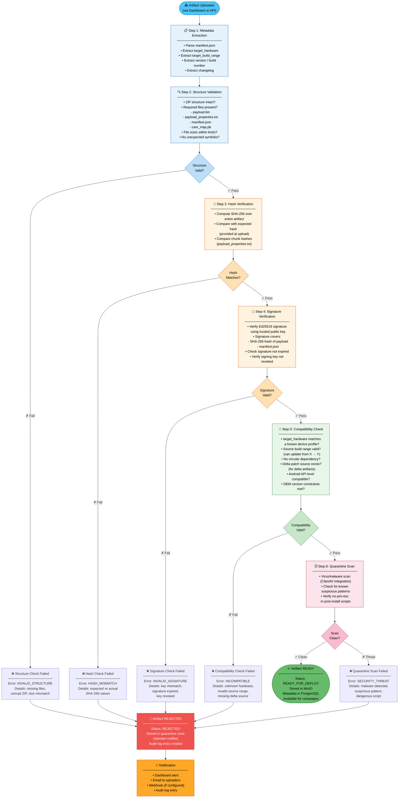

# Helix OTA — Artifact Validation Pipeline

## Overview

This flowchart details the **multi-stage artifact validation pipeline** that every OTA update artifact must pass through before it can be deployed to devices. The pipeline enforces structural integrity, cryptographic authenticity, and device compatibility — ensuring that only verified, correctly-targeted artifacts reach the device fleet.

---

## Diagram

## Validation Pipeline Stages

| Step | Check | Pass Criteria | Failure Action |
|---|---|---|---|
| **1. Metadata Extraction** | Parse manifest.json | All required fields present | — |
| **2. Structure Validation** | ZIP integrity, required files | Valid ZIP, all files present, sizes within limits | REJECT — INVALID_STRUCTURE |
| **3. Hash Verification** | SHA-256 of entire artifact | Computed hash matches declared hash | REJECT — HASH_MISMATCH |
| **4. Signature Verification** | Ed25519 signature over hash + manifest | Valid signature from trusted key, not expired, key not revoked | REJECT — INVALID_SIGNATURE |
| **5. Compatibility Check** | Hardware, build range, dependencies | Target HW known, source range valid, no circular deps | REJECT — INCOMPATIBLE |
| **6. Quarantine Scan** | Malware scan, pattern check | Clean scan result | REJECT — SECURITY_THREAT |

## Key Design Decisions

1. **Order matters**: Checks run cheapest → most expensive. Structure validation is fast; signature verification and quarantine scans are slower.
2. **Fail-fast**: The pipeline stops at the first failure — no point checking signatures on a structurally corrupt file.
3. **Quarantine zone**: Rejected artifacts are moved to a separate MinIO bucket (quarantine zone) for forensic analysis, not deleted.
4. **Re-validation**: If the trusted key set changes (key rotation), all READY artifacts are re-validated against the new keys.
5. **Delta artifacts**: Delta (incremental) patches require an additional check that the source artifact exists and is itself in READY state.
