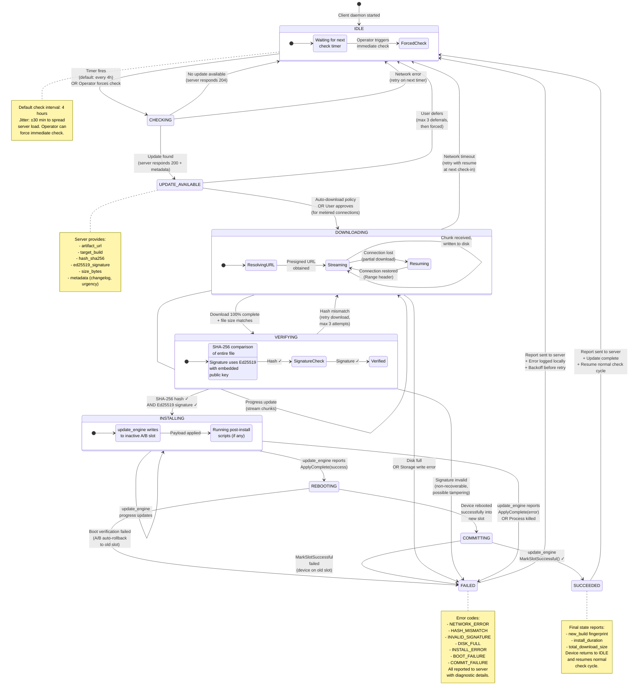

# Helix OTA — Client State Machine

## Overview

This state diagram models the **complete lifecycle of an update on the device side**. The Helix OTA Client (C++ daemon on Android) transitions through well-defined states as it checks for, downloads, verifies, installs, and commits an update. Every transition is reported to the server, and error paths lead to well-defined recovery behavior.

---

## Diagram

## State Descriptions

| State | Description | Duration (typical) | Server Report |
|---|---|---|---|
| **IDLE** | Waiting for next scheduled check or forced check | 0–4 hours | — |
| **CHECKING** | Sending device profile to server, awaiting response | 1–5 seconds | — |
| **UPDATE_AVAILABLE** | Server returned update metadata; awaiting download approval | 0–24 hours (defer) | — |
| **DOWNLOADING** | Streaming artifact from MinIO via presigned URL | 1–30 minutes | Progress % every 10% |
| **VERIFYING** | Computing SHA-256 hash and verifying Ed25519 signature | 10–60 seconds | State transition only |
| **INSTALLING** | update_engine writing payload to inactive A/B slot | 2–15 minutes | Progress % every 10% |
| **REBOOTING** | Device rebooting into new slot | 30–90 seconds | State transition only |
| **COMMITTING** | Marking new slot as successful (prevents rollback) | < 5 seconds | State transition only |
| **SUCCEEDED** | Update fully committed and reported to server | — | Final success report |
| **FAILED** | Update failed at any stage; error reported | — | Error code + details |

## Retry Policy

| Error Type | Max Retries | Backoff Strategy | Notes |
|---|---|---|---|
| **Network timeout** | 5 | Exponential: 1m, 2m, 4m, 8m, 16m | Resumes partial download |
| **Hash mismatch** | 3 | Linear: immediate retry | Full re-download required |
| **Invalid signature** | 0 | No retry | Security halt — alert operator |
| **Disk full** | 0 | No retry | User intervention needed |
| **Install error** | 1 | 30 min delay | A/B slot automatically recovered |
| **Boot failure** | 0 | No retry | A/B auto-rollback; report to server |
| **Commit failure** | 1 | Immediate retry | Rare; usually transient |

## Deferral Policy

- **Metered connections**: User may defer update up to **3 times**
- **Critical/Security updates**: Deferral limited to **7 days** maximum
- **After 3 deferrals**: Update is force-downloaded on next check (regardless of network type)
