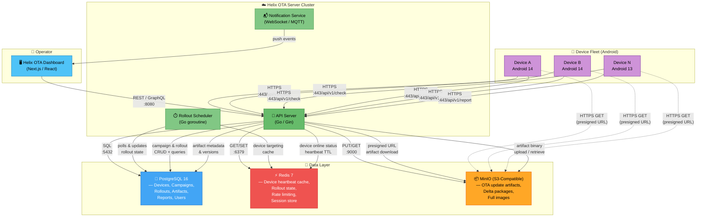

# Helix OTA — High-Level Architecture

## Overview

This diagram illustrates the top-level system architecture of the Helix OTA platform. The **Helix OTA Server** is the central component that orchestrates update campaigns, serves artifacts, and manages device state. It is supported by three data stores — **PostgreSQL** for persistent relational data, **Redis** for caching and real-time state, and **MinIO** (S3-compatible) for binary artifact storage. Operators interact with the system through the **Dashboard** (web UI), while **Android Devices** communicate with the server over HTTPS to check for, download, and report on updates.

---

## Diagram

## Component Summary

| Component | Technology | Purpose |
|---|---|---|
| **API Server** | Go + Gin | REST API for devices and dashboard; authentication, artifact management, campaign control |
| **Rollout Scheduler** | Go (goroutine) | Periodically evaluates active campaigns and selects devices for the next rollout stage |
| **Notification Service** | WebSocket / MQTT | Pushes real-time rollout progress and device status events to the dashboard |
| **Dashboard** | Next.js / React | Web UI for operators to create campaigns, monitor rollouts, and manage devices |
| **PostgreSQL** | PostgreSQL 16 | Primary data store — all persistent entities (devices, campaigns, artifacts, reports, users, audit log) |
| **Redis** | Redis 7 | In-memory store — device heartbeat/online cache, rollout state machine, rate limiting, session tokens |
| **MinIO** | MinIO (S3-compatible) | Object store — OTA update artifacts (.zip, .img, A/B payload), delta packages, full images |
| **Android Devices** | Helix OTA Client (C++) | On-device daemon that checks, downloads, verifies, installs (via `update_engine`), and reports results |

## Key Data Flows

1. **Operator creates campaign** → Dashboard → API Server → PostgreSQL (persist) → Scheduler picks up
2. **Device checks for updates** → API Server → Redis (online heartbeat) → PostgreSQL (eligible campaigns) → responds with update info or no-update
3. **Device downloads artifact** → API Server generates presigned MinIO URL → Device downloads directly from MinIO
4. **Device reports result** → API Server → PostgreSQL (report record) → Redis (update device cache) → Dashboard (via notifier)
5. **Scheduler advances rollout** → Scheduler → PostgreSQL (update rollout stage) → Notifier → Dashboard
