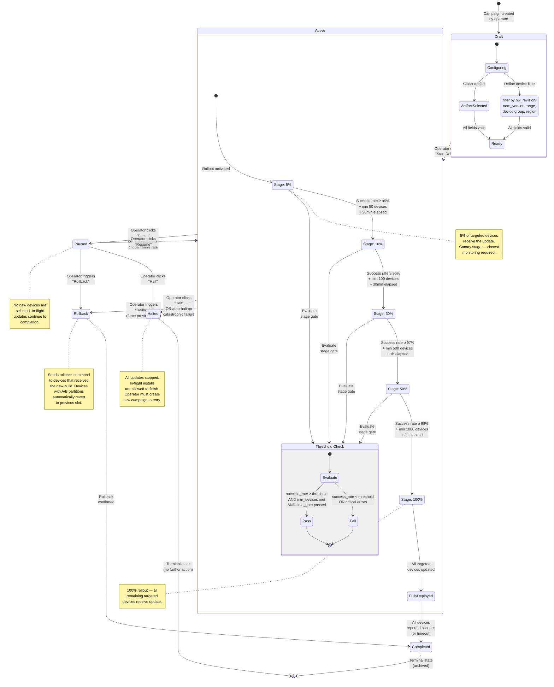

# Helix OTA — Rollout Flow

## Overview

This state diagram illustrates the **complete lifecycle of a rollout campaign** in Helix OTA. A rollout progresses through graduated stages (5% → 10% → 30% → 50% → 100%) with built-in controls for pausing, resuming, halting, and rolling back. Each stage gates advancement on success-rate thresholds before exposing more devices to the update.

---

## Diagram

## Stage Gate Criteria

| Stage | Success Rate Threshold | Min Devices | Min Time Elapsed | Description |
|---|---|---|---|---|
| **5%** → 10% | ≥ 95% | 50 | 30 min | Canary — early detection of systemic issues |
| **10% → 30%** | ≥ 95% | 100 | 30 min | Expanded canary — broader device diversity |
| **30% → 50%** | ≥ 97% | 500 | 1 hour | Growing confidence — significant fleet coverage |
| **50% → 100%** | ≥ 98% | 1000 | 2 hours | Final push — remaining devices |

## Auto-Pause / Auto-Halt Conditions

| Condition | Action | Trigger |
|---|---|---|
| **Success rate < 90%** at any stage | Auto-pause | Immediate threshold breach |
| **Any CRITICAL severity report** | Auto-pause | Single critical error (boot loop, bricked device) |
| **Success rate < 70%** | Auto-halt | Severe failure — stop all new deployments |
| **> 5 devices boot-looping** | Auto-halt | Catastrophic — immediate full stop |

## Rollback Mechanism

1. **A/B Partition Fallback**: Devices with uncommitted new slots automatically boot back to the old slot
2. **Explicit Rollback Command**: Server sends `POST /api/v1/devices/{id}/rollback` → device marks old slot as active
3. **Forced Rollback**: For already-committed updates, a separate rollback campaign can be created targeting affected devices with the previous artifact version

## State Transition Table

| From | To | Trigger | Side Effects |
|---|---|---|---|
| Draft | Active | Operator starts rollout | Scheduler begins selecting devices |
| Active (5%) | Active (10%) | Gate criteria met | Next 5% of devices selected |
| Active | Paused | Operator / auto-pause | No new device selections |
| Paused | Active | Operator resumes | Scheduler resumes selections |
| Active/Paused | Halted | Operator / auto-halt | Campaign frozen, in-flight continues |
| Active/Paused | Rollback | Operator triggers | Rollback command sent to updated devices |
| Active (100%) | Completed | All devices reported | Campaign archived |
| Rollback | Completed | Rollback confirmed | Campaign archived |
