# Helix OTA — Security Layers (Defense-in-Depth)

## Overview

This diagram illustrates the **defense-in-depth security architecture** of the Helix OTA platform. Multiple independent security layers protect the system — if one layer is compromised, subsequent layers continue to provide protection. Security is applied at every boundary: network, transport, application, data, and device levels.

---

## Diagram

```mermaid
flowchart TB
    subgraph OuterMost["🛡️ LAYER 1: Network Perimeter"]
        WAF["🔥 Web Application Firewall<br/>────────────────────<br/>• Rate limiting (100 req/min/IP)<br/>• IP allowlisting (operator access)<br/>• DDoS protection<br/>• Geo-blocking (if enabled)<br/>• Request size limits"]
        LB["⚖️ Load Balancer / Reverse Proxy<br/>────────────────────<br/>• TLS 1.3 termination<br/>• HSTS headers enforced<br/>• X-Forwarded-For stripping<br/>• Connection pooling"]
    end

    subgraph Transport["🔐 LAYER 2: Transport Security"]
        MTLS["🔑 Mutual TLS (mTLS)<br/>────────────────────<br/>• Device certificates validated<br/>• Server certificate pinned<br/>• Certificate rotation (90-day)<br/>• CRL / OCSP checking"]
        HTTPS["🔒 HTTPS Everywhere<br/>────────────────────<br/>• TLS 1.3 minimum<br/>• Strong cipher suites only<br/>• No HTTP fallback<br/>• Certificate pinning on device"]
    end

    subgraph Application["🧱 LAYER 3: Application Security"]
        AUTH["👤 Authentication & Authorization<br/>────────────────────<br/>• JWT with RS256 (15min access)<br/>• Refresh tokens (7-day rotation)<br/>• API key authentication (devices)<br/>• RBAC: admin/operator/viewer<br/>• Organization isolation"]
        INPUT["✅ Input Validation<br/>────────────────────<br/>• Schema validation (all endpoints)<br/>• SQL injection prevention (ORM)<br/>• Path traversal blocking<br/>• Content-Type enforcement<br/>• Payload size limits"]
        RATE["⏱️ Rate Limiting<br/>────────────────────<br/>• Per-device: 1 check/5min<br/>• Per-IP: 100 req/min<br/>• Per-API-key: 1000 req/hr<br/>• Redis-backed token bucket"]
    end

    subgraph Data["💾 LAYER 4: Data Security"]
        ENCRYPT_DB["🗄️ Database Encryption<br/>────────────────────<br/>• AES-256 encryption at rest<br/>• TLS for DB connections<br/>• Column-level encryption (secrets)<br/>• Encrypted backups (S3 SSE)"]
        ENCRYPT_OBJ["📦 Object Storage Encryption<br/>────────────────────<br/>• MinIO server-side encryption<br/>• AES-256-GCM per object<br/>• Separate encryption keys<br/>• Presigned URL time-limited (1h)"]
        SECRETS["🗝️ Secrets Management<br/>────────────────────<br/>• HashiCorp Vault integration<br/>• Key rotation (90-day schedule)<br/>• Signing key revocation list<br/>• Database credentials rotation"]
    end

    subgraph Artifact["📜 LAYER 5: Artifact Integrity"]
        HASH["#️⃣ Hash Verification<br/>────────────────────<br/>• SHA-256 on upload<br/>• SHA-256 on download<br/>• Chunk-level hash verification<br/>• Hash stored in DB (signed)"]
        SIG["✍️ Code Signing<br/>────────────────────<br/>• Ed25519 signatures<br/>• Signing key per organization<br/>• Key rotation without disruption<br/>• Signature covers hash + manifest"]
        QUAR["🦠 Quarantine Pipeline<br/>────────────────────<br/>• Malware scanning (ClamAV)<br/>• Suspicious pattern detection<br/>• Rejected → quarantine bucket<br/>• Forensic analysis support"]
    end

    subgraph Device["📱 LAYER 6: Device Security"]
        VERIFIED["✅ Verified Boot<br/>────────────────────<br/>• Android Verified Boot (AVB)<br/>• Boot image signature check<br/>• Rollback protection<br/>• dm-verity for system partition"]
        AB["🔄 A/B Partition Safety<br/>────────────────────<br/>• Dual-slot system partition<br/>• Failed boot → auto-rollback<br/>• Explicit commit required<br/>• Max 3 boot attempts on new slot"]
        CLIENT_CERT["🎫 Device Identity<br/>────────────────────<br/>• Unique device certificate<br/>• Hardware-backed keystore<br/>• Device ID bound to cert<br/>• Certificate revocation support"]
        SELINUX["🛡️ SELinux / Sandboxing<br/>────────────────────<br/>• OTA client in restricted domain<br/>• Minimal file access<br/>• No shell escape<br/>• update_engine SELinux policy"]
    end

    subgraph Monitoring["📊 LAYER 7: Monitoring & Response"]
        AUDIT["📋 Audit Logging<br/>────────────────────<br/>• All API calls logged<br/>• All state changes tracked<br/>• Immutable audit trail<br/>• 90-day retention minimum"]
        ALERT["🚨 Anomaly Detection<br/>────────────────────<br/>• Unusual failure rate alerts<br/>• Geographically anomalous requests<br/>• Repeated auth failures<br/>• Artifact tampering attempts"]
        INC["🔄 Incident Response<br/>────────────────────<br/>• Auto-pause on critical events<br/>• Emergency halt capability<br/>• Rollback procedures<br/>• Key revocation workflow"]
    end

    WAF --> LB --> MTLS --> HTTPS
    HTTPS --> AUTH --> INPUT --> RATE
    RATE --> ENCRYPT_DB --> ENCRYPT_OBJ --> SECRETS
    SECRETS --> HASH --> SIG --> QUAR
    QUAR --> VERIFIED --> AB --> CLIENT_CERT --> SELINUX
    SELINUX --> AUDIT --> ALERT --> INC

    style WAF fill:#E53935,stroke:#B71C1C,color:#fff
    style LB fill:#E53935,stroke:#B71C1C,color:#fff
    style MTLS fill:#F57C00,stroke:#E65100,color:#fff
    style HTTPS fill:#F57C00,stroke:#E65100,color:#fff
    style AUTH fill:#FDD835,stroke:#F57F17,color:#000
    style INPUT fill:#FDD835,stroke:#F57F17,color:#000
    style RATE fill:#FDD835,stroke:#F57F17,color:#000
    style ENCRYPT_DB fill:#43A047,stroke:#1B5E20,color:#fff
    style ENCRYPT_OBJ fill:#43A047,stroke:#1B5E20,color:#fff
    style SECRETS fill:#43A047,stroke:#1B5E20,color:#fff
    style HASH fill:#1E88E5,stroke:#0D47A1,color:#fff
    style SIG fill:#1E88E5,stroke:#0D47A1,color:#fff
    style QUAR fill:#1E88E5,stroke:#0D47A1,color:#fff
    style VERIFIED fill:#8E24AA,stroke:#4A148C,color:#fff
    style AB fill:#8E24AA,stroke:#4A148C,color:#fff
    style CLIENT_CERT fill:#8E24AA,stroke:#4A148C,color:#fff
    style SELINUX fill:#8E24AA,stroke:#4A148C,color:#fff
    style AUDIT fill:#546E7A,stroke:#263238,color:#fff
    style ALERT fill:#546E7A,stroke:#263238,color:#fff
    style INC fill:#546E7A,stroke:#263238,color:#fff
```

## Security Layer Summary

| Layer | Name | Protects Against | Key Controls |
|---|---|---|---|
| **1** | Network Perimeter | DDoS, unauthorized access, brute force | WAF, rate limiting, IP allowlisting, TLS termination |
| **2** | Transport Security | MITM, eavesdropping, replay attacks | mTLS, TLS 1.3, certificate pinning, HSTS |
| **3** | Application Security | Injection, auth bypass, abuse | JWT/RBAC, input validation, per-endpoint rate limits |
| **4** | Data Security | Data breach, credential leak | AES-256 at rest, TLS in transit, Vault secrets, key rotation |
| **5** | Artifact Integrity | Tampered updates, malware, supply chain | SHA-256, Ed25519 signing, malware scan, quarantine |
| **6** | Device Security | Persistent compromise, boot attacks | AVB, A/B partitions, hardware keystore, SELinux |
| **7** | Monitoring & Response | Slow compromise, insider threats | Audit log, anomaly detection, auto-pause, incident response |

## Threat Model Summary

| Threat | Layer(s) Mitigating | Residual Risk |
|---|---|---|
| **Man-in-the-middle** | Layer 2 (mTLS, pinning) | Low — requires compromised CA + device key |
| **Malicious update** | Layer 5 (signing + hash + scan) | Very low — requires compromised signing key |
| **Server compromise** | Layer 4 (encryption at rest) + Layer 7 (audit) | Medium — data encrypted, but memory accessible |
| **Device cloning** | Layer 6 (hardware keystore) | Low — requires physical access + TEE exploit |
| **Supply chain attack** | Layer 5 (signing) + Layer 4 (key management) | Low — signing keys in Vault, rotation policy |
| **Insider threat** | Layer 3 (RBAC) + Layer 7 (audit) | Medium — admin access is broad; audit provides detection |
| **DDoS** | Layer 1 (WAF, rate limit) | Low — absorbed at perimeter |
| **Zero-day in update_engine** | Layer 6 (A/B rollback, SELinux) | Medium — blast radius limited by sandboxing |

## Compliance Considerations

- **SOC 2 Type II**: Audit logging (Layer 7), access control (Layer 3), encryption (Layer 4)
- **ISO 27001**: Risk assessment, key management, incident response
- **Common Criteria (EAL4+)**: Verified boot, secure update chain (Layers 5–6)
