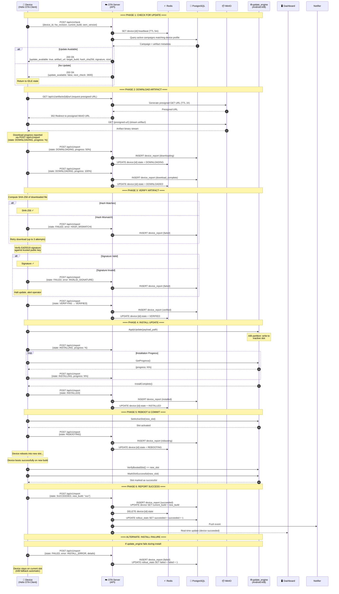

# Helix OTA — Update Flow

## Overview

This sequence diagram traces the **complete end-to-end update flow** from the moment a device checks for updates through download, verification, installation, reboot, commit, and final success reporting. It covers both the happy path and key error/retry scenarios.

---

## Diagram

## Flow Summary

| Phase | Device Action | Server Action | Duration (typical) |
|---|---|---|---|
| **1. Check** | POST /check | Query campaigns, generate presigned URL | < 2s |
| **2. Download** | GET artifact (streamed) | Log progress, update device state | 1–30 min (artifact size) |
| **3. Verify** | SHA-256 + Ed25519 check | Log verification result | 10–60s |
| **4. Install** | Call update_engine (A/B) | Log progress, update state | 2–15 min |
| **5. Reboot** | Set active slot, reboot | Mark rebooting state | 30–90s |
| **6. Commit** | Mark slot successful | Final success report, update stats | < 5s |

## Error Handling

| Error | Detection | Recovery |
|---|---|---|
| **Hash mismatch** | Post-download SHA-256 comparison | Retry download (max 3 attempts) |
| **Invalid signature** | Ed25519 signature verification | Halt, report failure, alert operator |
| **Install error** | update_engine error code | Automatic A/B slot fallback, report failure |
| **Boot failure** | Boot verification after reboot | A/B auto-rolls back to previous slot |
| **Network loss** | HTTP timeout / connection error | Exponential backoff retry, resume partial download |
| **Server unreachable** | All API calls fail | Queue reports locally, retry on connectivity restore |
