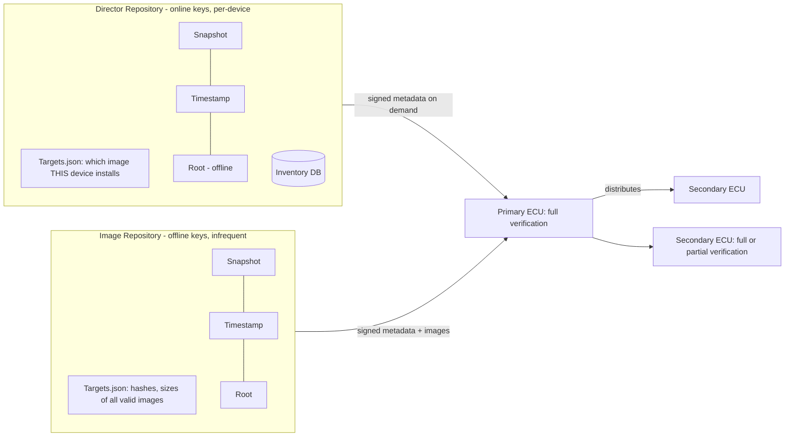

# Uptane — Research Note (Helix OTA)

| Field | Value |
|-------|-------|
| Revision | 1 |
| Created | 2026-06-07 |
| Last modified | 2026-06-07 |
| Status | active |
| Status summary | Initial deep-dive on Uptane as an automotive/embedded security framework on top of TUF. Evaluated for relevance to Helix OTA (Android 15 first, native A/B, custom Go control plane). Conclusion: adopt Uptane's *metadata/security model* selectively; do not adopt it as the primary update transport/mechanism. |
| Issues | (1) No first-class Android/AOSP `update_engine` integration exists in the Uptane ecosystem — UNVERIFIED that any production Android+Uptane stack ships today. (2) Primary reference client `aktualizr` is C++/Yocto-oriented, last tagged release Feb 2020 (see §6) — language/runtime mismatch with Helix's Go control plane and Android client. (3) Primary/Secondary ECU model maps awkwardly onto a fleet of independent Android devices. |
| Fixed | N/A (research note, no code changes) |
| Continuation | Decide scope of Uptane adoption: (a) full framework, (b) "TUF/Uptane-inspired" metadata layer over Helix's own Go server, or (c) none. Cross-reference with the TUF research note and the Mender decision in `additions/initial_research.md`. Prototype a Director-style metadata signer in Go and validate against the conformance suite. |

---

## Table of Contents

1. [Scope & Question](#1-scope--question)
2. [What Uptane Is](#2-what-uptane-is)
3. [Standard, Versions & Governance](#3-standard-versions--governance)
4. [Architecture: Director + Image Repositories](#4-architecture-director--image-repositories)
5. [Roles, Metadata & Verification (Full vs Partial)](#5-roles-metadata--verification-full-vs-partial)
6. [Primary / Secondary ECU Model](#6-primary--secondary-ecu-model)
7. [Threat Model](#7-threat-model)
8. [Reference Implementations & Ecosystem](#8-reference-implementations--ecosystem)
9. [Relevance to Helix OTA (Android Fleet)](#9-relevance-to-helix-ota-android-fleet)
10. [Recommendation](#10-recommendation)
11. [Sources Consulted](#11-sources-consulted)
12. [Confidence & Verification Notes](#12-confidence--verification-notes)

---

## 1. Scope & Question

Helix OTA targets Android 15 first, uses native A/B (`update_engine`) for atomic installs, and runs a custom Go control plane (see `docs/research/main_specs/additions/initial_research.md`, which currently leans toward wrapping Mender). The question: **is Uptane relevant — as a transport, as a security/metadata layer, or as a model worth borrowing — and how does its automotive ECU model map onto a fleet of independent Android devices?**

Uptane is **not** a competing OTA *delivery* engine like Mender/RAUC/SWUpdate/`update_engine`. It is a **security framework** that specifies how update *metadata* is signed, distributed, and verified so the system stays resilient even when parts of the update infrastructure are compromised. This is the lens to evaluate it through.

## 2. What Uptane Is

Uptane is "the first compromise-resilient software update security system for the automotive industry" (uptane.org). It extends **TUF (The Update Framework)** — the same role/metadata model used by PyPI, Docker/Notary, and Sigstore's root-of-trust — with automotive-specific concepts: a **Director repository**, an **inventory database**, and a **Primary/Secondary ECU** distribution topology.

Key point for Helix: Uptane is a *specification*, not a server product. You implement (or adopt an implementation of) repositories that emit signed metadata, and clients that verify it. The binary delivery mechanism (A/B, delta, full image) is orthogonal — Uptane secures *which* image is authorized and *that* it is authentic/fresh; it does not mandate how bytes are written to flash.

## 3. Standard, Versions & Governance

- **Latest standard: Uptane Standard for Design and Implementation 2.1.0**, released **June 27, 2023** (per uptane.org search metadata; the rendered doc body itself does not print a date — date is UNVERIFIED against an in-document statement but is consistent across uptane.org listing and Wikipedia).
- Version lineage available on uptane.org: 1.0.0, 1.1.0, 1.2.0, 2.0.0, 2.1.0. IEEE/ISTO published **IEEE-ISTO 6100.1.0.0** (the 1.0.0 standard) on **July 31, 2019**.
- **Governance:**
  - July 2018 — adopted into **IEEE-ISTO** as the non-profit **Uptane Alliance**.
  - After 1.0.0 — affiliated with the **Linux Foundation** as a **Joint Development Foundation** project ("Joint Development Foundation Projects, LLC, Uptane Series"), overseen by a Steering Committee under published bylaws.
  - Current Steering Committee (per uptane.org/learn-more/about): Justin Cappos (NYU Tandon), Ira McDonald (High North Inc.), Andre Weimerskirch (Lear Corp. / UMTRI).
- **Origins:** developed by NYU Secure Systems Lab with UMTRI and Southwest Research Institute (SwRI). The about page names NYU and UMTRI in leadership; the specific tri-institution founding (NYU + UMTRI + SwRI) is well documented historically but the about page does not enumerate all three — treat the SwRI attribution as widely reported but UNVERIFIED from the single page I fetched.

**Maturity:** A formally governed, multi-version ISO/IEEE-style standard with ~7 years of standardization history and real automotive backing — high on the maturity scale for *spec* maturity. Implementation maturity is more uneven (see §8).

## 4. Architecture: Director + Image Repositories

Uptane mandates (at minimum) **two repositories** (Best Practices 2.1.0 and Standard 2.1.0):

- **Image repository** — stores binary images and their signed metadata. "Primarily controlled by human actors, and updated relatively infrequently." Keys (Root, Targets, delegations) **SHOULD be kept offline**. This is the source of truth for *what valid images exist*.
- **Director repository** — "Instructs ECUs as to which images will be installed by producing signed metadata on demand." "Mostly controlled by automated, online processes" and connected to an **inventory database** of vehicles/ECUs. Director **Timestamp/Snapshot/Targets SHOULD use online keys** (so an automated process can mint fresh metadata per-device); Director **Root SHOULD use offline keys**.

The split is the heart of Uptane's compromise resilience: an attacker who breaks the *online* Director still cannot forge a valid image because the Image repository's Targets metadata (offline-signed) must also match. An attacker who breaks the Image repo signing still cannot target a *specific* malicious image at a device without the Director. **Security degrades only if BOTH are compromised.**

Key-management guidance (Best Practices 2.1.0): use threshold signing for Root (example: 5-of-8 admin keys); Image-repo Snapshot/Timestamp may use small thresholds (e.g., 1-of-2). More than two repositories is permitted for conformant implementations.

## 5. Roles, Metadata & Verification (Full vs Partial)

Inherited from TUF, each repository carries four top-level roles (Standard 2.1.0):

| Role | Responsibility |
|------|----------------|
| **Root** | "Distributes public keys for verifying all the other roles' metadata" and revocations. Root of trust; ideally offline keys. |
| **Targets** | Signs "metadata used to verify the image, such as cryptographic hashes and file size." Authorizes specific images. |
| **Snapshot** | Signs "metadata that indicates which images the repository has released at the same time." Prevents mix-and-match. |
| **Timestamp** | Signs metadata "indicating whether there are new metadata or images on the repository." Provides freshness / anti-freeze. |

**Verification modes:**

- **Full verification** — the client cross-checks that **Director Targets metadata matches Image-repository Targets metadata** for the same image. This is what delivers resilience to single-repository key compromise. The **Primary ECU SHALL perform full verification.** Full verification also enables key rotation.
- **Partial verification** — the client checks **only the Director's Targets metadata** (and Root to bootstrap). Cheaper (RAM/flash/compute), but a partial-verifier cannot rotate keys without a firmware update and is less resilient. A Secondary ECU "SHOULD perform full verification" but "SHALL, at the very least, perform partial verification."

For Helix: an Android device has ample CPU/RAM, so it would always do **full verification** — partial verification is a concession to tiny microcontrollers we don't have.

## 6. Primary / Secondary ECU Model

In a vehicle, one **Primary ECU** (gateway/head-unit class) has the network connection. It downloads metadata + images, performs full verification, and **distributes** images and metadata to multiple **Secondary ECUs** over the internal vehicle bus. Secondaries may be too constrained to talk to the cloud or to do full verification, hence the partial-verification fallback and the Primary acting as a caching/forwarding hub.

**Mapping to Helix's device model — this is the awkward part:**

- Helix's fleet is **many independent, internet-connected, full-power devices** (Orange Pi 5 Max / Android 15). There is no in-vehicle bus, no constrained downstream microcontroller that depends on a gateway.
- The natural mapping is **"each Helix device == a Primary ECU"** that does its own full verification directly against the Director + Image repositories. The Secondary-ECU tier is largely **vacuous** for Helix today.
- The Secondary model *would* become relevant only if Helix later manages sub-components behind a gateway device (e.g., peripheral MCUs, multi-board appliances). Worth keeping as a future extension hook, not a v1 concern.
- The Director's **per-device targeting** (one Director `targets.json` minted per ECU/device, backed by an inventory DB) maps cleanly and usefully onto Helix's **granular staged rollout** requirement (5/10/30/.../100%): the control plane already needs per-device "what should this device install" decisions, which is exactly the Director's job.

## 7. Threat Model

Uptane (Standard 2.1.0) explicitly defends against:

- **Rollback attacks** (forcing an older, vulnerable image) — via Timestamp/Snapshot version pinning.
- **Freeze attacks** (withholding updates so a device stays vulnerable) — via Timestamp freshness/expiry.
- **Mix-and-match attacks** (assembling an inconsistent set of images) — via Snapshot.
- **Arbitrary software / malicious image attacks** — via Targets hashes + the Director/Image cross-check.
- **Denial of service** and **eavesdropping**.

Core assumption: "attackers could compromise either a Director or Image repository server... but not both." This dual-root design is the differentiator vs. a single-signing-key OTA system (which is what most off-the-shelf OTA tools, including basic Mender setups, effectively are unless hardened).

## 8. Reference Implementations & Ecosystem

- **aktualizr** (github.com/uptane/aktualizr) — the primary **C++** Uptane client. License **MPL-2.0**. ~83% C++. Repo not archived and shows commit history, **but the latest tagged release shown is February 2020** — i.e., effectively low release cadence; treat as mature-but-quiet. Tightly coupled to **Yocto + OSTree** via the `meta-updater` layer. Originated from ATS/HERE OTA Connect (`advancedtelematic`).
- **meta-updater** (github.com/uptane/meta-updater) — Yocto layer wiring aktualizr + OSTree for Uptane updates. Embedded-Linux-centric.
- **OTA Connect / HERE** — commercial server side historically implementing the Director + Image repos (docs.ota.here.com). Now largely superseded by **Torizon (Toradex)** for embedded Linux.
- **Torizon Updates (Toradex)** — productized Uptane-based OTA for embedded Linux/containers (developer.toradex.com).
- **Automotive Grade Linux (AGL)** — incorporates Uptane via aktualizr (widely reported; specific current AGL version integration status is UNVERIFIED).
- **Rust implementation ("uptane-rs")** — I searched but **did not find** an authoritative, current Rust reference implementation. Mark as **UNVERIFIED — needs confirmation**; do not assume one exists.
- **Android / AOSP** — Android's `update_engine` (A/B "seamless" updates, since Android Nougat / API 24) is the native install mechanism, but it is **not Uptane-aware**. I found **no** first-class Uptane client for AOSP. Any Helix Android+Uptane integration would be **bespoke**: a Go/JNI or native verifier that performs Uptane full verification and then hands the verified payload to `update_engine`. **UNVERIFIED that any production Android+Uptane stack ships today.**

## 9. Relevance to Helix OTA (Android Fleet)

**What is genuinely valuable to borrow:**

1. **Dual-repository (Director + Image) compromise resilience.** This is the strongest reason to care. Helix's Go control plane is online and a juicy single point of failure; an attacker who pops the control-plane signing key should not be able to ship arbitrary firmware. Splitting authorization (online Director) from image authenticity (offline Image-repo Targets) is a directly applicable, high-value hardening.
2. **TUF role model (Root/Targets/Snapshot/Timestamp) + threshold/offline keys.** Gives rollback/freeze/mix-and-match resistance for free if implemented correctly.
3. **Per-device Director targeting + inventory DB** maps onto Helix's staged-rollout and per-device telemetry needs.
4. **Full verification** semantics are a clear, testable security bar for the Android client.

**What does NOT fit / is overhead:**

1. **Primary/Secondary ECU topology** — vacuous for a fleet of independent full-power devices (see §6). Don't build the Secondary tier in v1.
2. **aktualizr / meta-updater** — C++/Yocto/OSTree-centric; mismatched with Helix's Go server + Android `update_engine`. Not a drop-in client.
3. **Uptane as a transport** — it isn't one. It does not replace Mender/`update_engine`; it would sit *in front of / alongside* whatever delivery engine Helix picks.

**Integration sketch (if adopted):** Helix Go control plane implements a **Director repository** (online keys, per-device `targets.json` driven by the rollout engine). A separate **Image repository** (offline-signed Targets, in CI/release pipeline) lists every valid build. The Android client performs **full verification** (cross-check Director vs Image Targets, validate Snapshot/Timestamp freshness, Root chain), then passes the verified payload to `update_engine` for the atomic A/B install. This layers cleanly over a Mender-or-custom delivery path.

## 10. Recommendation

**Adopt the Uptane *security model* selectively; do not adopt Uptane (or aktualizr) as the OTA mechanism.**

Concretely:
- **Do** implement a **TUF/Uptane-inspired metadata layer in Go** (Director + Image repos, four roles, offline/online key split, full verification on the Android client). This is option (b) from the Continuation field — the best cost/benefit.
- **Do not** pull in aktualizr/meta-updater or build the Primary/Secondary ECU tier for v1 — language/runtime/topology mismatch.
- **Keep** the A/B / `update_engine` delivery path; Uptane verification gates it, it does not replace it.
- **Revisit full Uptane conformance** only if Helix later needs automotive certification or a gateway-with-constrained-subcomponents topology.

This keeps Helix's "zero corruption, 100% safe, revertible, staged" guarantees while adding nation-state-grade compromise resilience that a single-key OTA server lacks — without taking on an embedded-Linux C++ client that doesn't fit Android.

## 11. Sources Consulted

- Uptane Standard for Design and Implementation 2.1.0 — https://uptane.org/docs/2.1.0/standard/uptane-standard (roles, repositories, full/partial verification, threat model, Primary/Secondary SHALL/SHOULD language).
- Uptane Best Practices 2.1.0 — https://uptane.org/docs/latest/deployment/best-practices (offline/online key guidance, thresholds, two-repository model, constrained-ECU partial verification).
- About / Governance — https://uptane.org/learn-more/about (IEEE-ISTO 2018, Linux Foundation/JDF affiliation, Steering Committee members).
- IEEE-ISTO 6100.1.0.0 listing — https://uptane.org/papers/ieee-isto-6100.1.0.0.uptane-standard.html (July 31, 2019 IEEE/ISTO release).
- aktualizr repo — https://github.com/uptane/aktualizr (MPL-2.0, C++, latest tag Feb 2020).
- meta-updater — https://github.com/uptane/meta-updater (Yocto + OSTree integration).
- HERE OTA Connect docs — https://docs.ota.here.com/ota-client/latest/uptane.html (Director vs Image repo, online keys).
- Torizon Updates Technical Overview — https://developer.toradex.com/torizon/torizon-platform/torizon-updates/torizon-updates-technical-overview/ (productized Uptane).
- Android update_engine — https://android.googlesource.com/platform/system/update_engine/ ; A/B since API 24 — https://android.googlesource.com/platform/bootable/recovery/+/master/updater_sample/README.md.
- Wikipedia (Uptane) — https://en.wikipedia.org/wiki/Uptane (cross-check of dates/governance; secondary source).

## 12. Confidence & Verification Notes

**Overall confidence: HIGH** on the framework's architecture, roles, verification semantics, repository split, threat model, and governance lineage — these are taken directly from the primary uptane.org standard and best-practices documents (2.1.0).

**MEDIUM/UNVERIFIED items, explicitly flagged:**
- Exact publication date of Standard 2.1.0 (June 27, 2023) — from listing/secondary metadata, not an in-document date string. UNVERIFIED.
- SwRI as a third founding institution — widely reported historically but not confirmed on the single about-page fetched. UNVERIFIED here.
- Existence of a current Rust ("uptane-rs") reference implementation — **not found**; do not assume it exists.
- Any shipping production **Android + Uptane** integration — **not found**; assume bespoke work required.
- aktualizr "actively maintained" — repo is open and has history, but the latest *tagged release* dates to Feb 2020; characterize as mature/low-cadence, not abandoned. Re-verify before depending on it.
- Current AGL Uptane integration version/status — UNVERIFIED.

No stars, download counts, or adoption figures are asserted because I could not verify specific numbers; none were fabricated.
